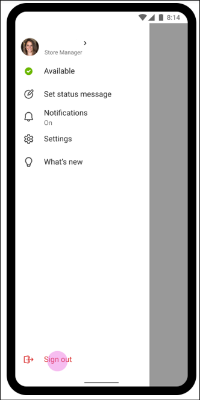

# Sign out of Microsoft Teams

It's a good idea to remain signed in to Microsoft Teams to ensure you don't miss incoming calls, chat messages, meeting starts, and other notifications. The new Teams desktop app supports multiple accounts side-by-side, removing the need to sign out and sign back in. [Learn more about New Teams](/microsoftteams/new-teams-desktop-admin).

However, there are times where users might need to sign out of Teams, for example when they’re using a device that is shared with another person. Signing out should always be initiated by end-users, from inside the Teams app, and Microsoft recommends against using custom scripts that attempt to programmatically sign out users. Things are a bit different for [Shared Device Mode: Global sign-in and sign-out for Frontline](#shared-device-mode-global-sign-in-and-sign-out-for-frontline) which is described later in this article.

## Sign out of Teams on the web

To sign out of Teams in a browser, users should select their profile picture at the top of the app, then select **Sign out**. They'll be signed out from all Microsoft 365 applications in a given browser profile. The next time they sign in to Teams or other Microsoft 365 applications, their username will be shown on the sign-in page. In most cases, they'll need to reenter their credentials, and can remove their account from the list by clicking “Forget”.  

If this is a shared computer and you don’t want usernames to be visible to others, we recommend using browsers in InPrivate/Incognito mode.

## Sign out of Teams on desktop (Windows or macOS)

To sign out of the Teams desktop app, users should select their profile picture at the top of the app, and then select **Sign out**. If multiple accounts were added, they'll need to sign out of each account individually.

### Account sharing between apps

Modern operating systems allow sharing of accounts between different apps on a device. This is referred to as single sign-on (SSO), and it’s designed to help users seamlessly navigate between different apps with the same account.  
SSO has an important impact on sign out: when users sign out of the Teams desktop app, the data associated with their account is removed from the Teams app but the account itself isn’t removed from the device. Users will need  to reenter their credentials if they sign back in to Teams with the same account, but other apps on the device may continue to have access to their account. This means that signing out of Teams doesn't prevent other users from accessing the data associated with your account.

### “This app only” mode on Windows

On Windows, users may see an option to sign in to “this app only”. When this option is selected, and users later sign out of Teams, their account is removed from the PC. However, their username may continue to be shown on sign-in pages.

**Note:** when users select “this app only” when signing in to Teams, other apps on the PCs won’t be able to use this account. Practically, this means that links to files or websites clicked in Teams may not properly open in Microsoft 365 apps or in the browser, and users may be prompted to sign in again. In other words, “this app only” prevents SSO from working correctly between Windows, Teams and other applications, and as such isn't recommended when signing in to Teams.

### Best practices for multiple users on a shared desktop device

If a desktop computer is shared by different users, we recommend setting it up with separate accounts to sign in to Windows or macOS and training users to lock the computer when they walk away. This allows each user to enjoy SSO between apps in a given operating system session and keep their account and data separated from other users'.

In cases where a single desktop computer is shared between multiple Frontline Workers, we recommend using Cloud PCs, as described here: [Frontline worker for Windows devices in Microsoft Intune](/mem/solutions/frontline-worker/frontline-worker-overview-windows).

## Sign out of Teams on mobile devices

On mobile, users can sign out of Teams by tapping their profile icon, selecting **Settings**, and then **Sign out**. Once signed out, they'll need to reenter their credentials the next time they launch Teams.

## Shared Device Mode: Global sign-in and sign-out for Frontline

Microsoft’s Shared Device Mode (SDM) allows mobile devices to be optimized for fast check-in/check-out by Frontline Workers. When a device is enabled for SDM, sign-out work differently on Teams.

With SDM, users can pick any device from a shared device pool and sign in as usual to "make it theirs" for the duration of their shift. At the end of the shift, they should tap on Sign out as usual, but with SDM a global sign-out will be initiated on the device, which should remove the user's  account and data from the device, so it can be returned to the device pool.

**Android**: To learn how to set up android devices in Shared Device Mode, see [How to use a shared device mode in Android](/azure/active-directory/develop/tutorial-v2-shared-device-mode#set-up-an-android-device-in-shared-mode).

**iOS**: To set up Shared Device Mode on iOS, see [How to use shared device mode on iOS](/azure/active-directory/develop/msal-ios-shared-devices).

