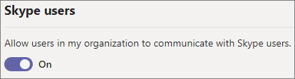

# Manage external meetings and chat with people not managed by an organization

You can configure external meetings and chat with Teams users not managed by an organization and Skype users by using the *external access* feature in Teams. External access is a way for people from outside your organization to find, call, chat, and set up meetings with you in Teams.

If you want to configure meetings and chat with people from other Microsoft 365 organizations, see [Configure trusted organizations for external meetings and chat](trusted-organizations-meetings-chat.md). If you want to limit external meetings and chat to specific users in your organization, see [Limit external meetings and chat to specific users](limit-external-meetings-chat-to-specific-users.md).

> [!NOTE]
> The capabilities discussed in this article aren't available in GCC, GCC High, or DOD deployments, or in private cloud environments.

## Manage chat with external Teams users not managed by an organization

You can choose to enable or disable communications with external unmanaged Teams users (those not managed by an organization, such as Microsoft Teams (free)). If enabled, you can also control if people with unmanaged Teams accounts can start chats with people in your organization.

To allow chat with unmanaged Teams accounts
1. In the Teams admin center, go to **Users** > **External access**.
1. Turn on the **People in my organization can communicate with Teams users whose accounts aren't managed by an organization** setting.
1. If you want to allow external users to start the conversation, select the **External users with Teams accounts not managed by an organization can contact users in my organization** checkbox.
1. Select **Save**.

Note that if **External users with Teams accounts not managed by an organization can contact users in my organization** is turned off, unmanaged Teams users will not be able to search by email address to find people in your organization. All communications with unmanaged Teams users must be initiated by people in your organization.

To prevent chat with unmanaged Teams accounts
1. In the Teams admin center, go to **Users** > **External access**.
1. Turn off the **People in my organization can communicate with Teams users whose accounts aren't managed by an organization** setting.
1. Select **Save**.

## Manage chat and calls with Skype users

Follow these steps to let Teams users in your organization chat with and call Skype users. Teams users can then search for and start a one-on-one text-only conversation or an audio/video call with Skype users and vice versa.

To configure chat and calls with Skype users
1. In the Teams admin center, go to **Users** > **External access**.
1. Turn the **Allow users in my organization to communicate with Skype users** setting on or off.
1. Select **Save**.

To learn more about the ways that Teams users and Skype users can communicate, including limitations that apply, see [Teams and Skype interoperability](teams-skype-interop.md).

## Configure settings by using PowerShell

Chat with Teams users not managed by an organization and Skype users can be configured by using the [Set-CSTenantFederationConfiguration](/powershell/module/skype/set-cstenantfederationconfiguration) cmdlet.

The following table shows the cmdlet parameters used for configuring chat with Skype and unmanaged Teams users.

|Configuration|Parameter|
|:-------|:--------|
|Enable/disable chat with Teams users that are not managed by an organization|`-AllowTeamsConsumer`|
|Enable/disable Teams users not managed by an organization initiating conversations|`-AllowTeamsConsumerInbound`|
|Enable/disable chat with Skype users|`-AllowPublicUsers`|

Before you can run these cmdlets you must be connected to Microsoft Teams PowerShell. For more information, see [Manage Teams with Microsoft Teams PowerShell](/microsoftteams/teams-powershell-managing-teams).

## Related topics

[Use guest access and external access to collaborate with people outside your organization](communicate-with-users-from-other-organizations.md)