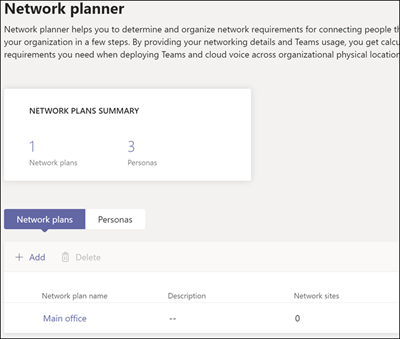
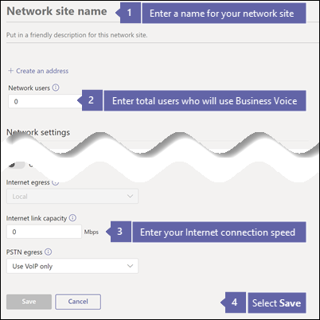

# What kind of Internet connection do I need?

Business Voice is located in the cloud with Microsoft 365. Every computer and device that uses Microsoft Teams and Business Voice needs a connection to the Internet. To get the best experience with Business Voice, you need a broadband Internet connection that can support the expected number of phone calls that will be made at any one time. This article helps you determine whether your Internet connection is fast enough for the number of people who need to make phone calls, host video conferences, and so on. You'll enter some information about your organization and get back a report with recommendations.

To follow these steps, you need to have a tenant with one of the following subscriptions:

* Office 365 Business Essentials
* Office 365 Business Premium
* Office 365 E1
* Office 365 E3
* Office 365 F1
* Microsoft 365 A1
* Microsoft 365 A3
* Microsoft 365 E3
* Microsoft 365 Business

You don't need a Business Voice license to follow these steps.

Before you start, you need to know the following information:

- The speed of your Internet connection.
- How many people will use Business Voice mainly from your office.
- How many people will use Business Voice mainly from a remote location, such as a home office.

## Create a report

Here's what you need to do:

1. Open a browser and go to https://admin.teams.microsoft.com and sign in with an account that has Global Administrator permissions. The account you used to sign up for Office 365 has these permissions.
1. Open **Org-wide settings** and then select **Network planner**.
1. Under **Network plans**, select **Add**. Give your plan a name, and then select **Apply**. Your network plan should look like this:

    
1. Click on your network plan's name (**Main office** in the picture above).
1. On the next page, select **Add a network site** under the **Network sites** tab.
1. Fill out the following information and then select **Save**.

    
1. Under the **Report** tab, select **Start a report**.
1. Fill out the following information and then select **Generate report**

    

## Understand the report

When you select **Generate report**, Office 365 creates a report that looks like this: 

The highlighted number shows how much of your Internet connection Teams and Business Voice will use. We recommend that this number be no more than 30% of your total Internet connection speed. For example, if your Internet connection is 60Mbps, Teams and Business Voice should take up no more than 18Mbps. 

You can find your minimum Internet connection speed by doing this calculation: `<highlighted number> / .3`. Using the highlighted number in the picture above, the calculation would be `4.6875 / .3 = 15.6`. This means your minimum Internet connection speed needs to be at least 15.6Mbps.

