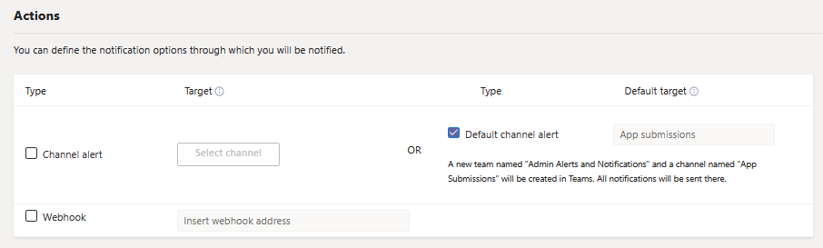

# Publish a custom app submitted through the Teams App Submission API

## Overview

> [!NOTE]
> When you publish a custom Teams app, it's available to users in your organization's app store. There are two ways to publish a custom app and the way that you use depends on how you get the app. **This article focuses on how to approve and publish a custom app that a developer submits through the Teams App Submission API**. The other method, uploading a custom app, is used when a developer sends you an app package in .zip format. To learn more about that method, see [Publish a custom app by uploading an app package](/microsoftteams/upload-custom-apps). The approve app widget isn't available in GCC tenants.

> [!IMPORTANT]
> This method is not currently available for GCC environments. You must use the *uploading a custom app* method.

This article provides end-to-end guidance for how to take your Teams app from development to deployment to discovery. You'll get an overview of the connected experiences that Teams provides across the app lifecycle to streamline how to develop, deploy, and manage custom apps in your organization's app store.

We'll cover each step of the lifecycle, including how developers can use the Teams App Submission API to submit custom apps directly to the Microsoft Teams admin center for you to review and approve, how to set policies to manage apps for users in your organization, and how your users discover them in Teams.

This guidance focuses on the Teams aspects of the app and is intended for admins and IT pros. For information about developing Teams apps, see the [Teams developer documentation](/microsoftteams/platform).

## Develop

### Create the app

The Microsoft Teams developer platform makes it easy for developers to integrate your own apps and services to improve productivity, make decisions faster, and create collaboration around existing content and workflows. Apps built on the Teams platform are bridges between the Teams client and your services and workflows, bringing them directly into the context of your collaboration platform. For more information, go to the [Teams developer documentation](/microsoftteams/platform).

### Submit the app

When the app is ready for use in production, the developer can submit the app using the Teams App Submission API, which can be called from [Graph API](/graph/api/teamsapp-publish?view=graph-rest-beta&tabs=http#example-2-upload-a-new-application-for-review-to-an-organizations-app-catalog&preserve-view=true), an integrated development environment (IDE) such as Visual Studio Code, or a platform such as Power Apps and Power Virtual Agents. Doing this makes the app available on the [Manage apps](/microsoftteams/manage-apps) page of the Teams admin center, where you can review and approve it.

The Teams App Submission API, [built on Microsoft Graph](/graph/api/teamsapp-publish?tabs=http&view=graph-rest-beta#example-2-upload-a-new-application-for-review-to-an-organizations-app-catalog&preserve-view=true), allows your organization to develop on the platform of your choice and automates the submission-to-approval process for custom apps on Teams.

Here's an example of what this app submission step looks like in Visual Studio Code:

Keep in mind that this doesn't publish the app to your organization's app store yet. This step submits the app to the Teams admin center where you can approve it for publishing to your organization's app store.

For more information about using the Graph API to submit apps, see [here](/graph/api/teamsapp-publish?tabs=http&view=graph-rest-beta#example-2-upload-a-new-application-for-review-to-an-organizations-app-catalog&preserve-view=true).

## Notify

You can turn on notifications so you know when developers submit a new application for review and approval. You'll also get notifications when developers submit app updates. To enable app submission notifications in the Teams admin center, go to [**Notifications & alerts** > **Rules** > **App submissions**](https://admin.teams.microsoft.com/notifications/rules), and activate the rule by changing the status to **Active**. By default, this setting is turned off. You must be a Global admin or Teams admin to turn on this setting.

After you turn on this setting, you'll get notifications in the **Admin Alerts and Notifications** team under a new channel named **App submissions**. Alternatively, you can choose an existing team and channel to get notifications delivered to a specified team and channel. To do this, follow these steps:

1. In the **App submissions** rule, select the **Channel alert** checkbox under **Actions**.
1. Choose the **Select channel** button.
1. Search for a team to add.
1. Search for a channel to add.
1. Select **Apply**.

    

> [!NOTE]
> Select the **Default channel alert** checkbox to receive notifications to the **Admin Alerts and Notifications** team in the **App Submissions** channel.

You can also set up notifications to an external webhook by specifying a public webhook URL after you select the **Webhook** checkbox. A JSON notification payload will be sent to your webhook URL.

After you set up the app submissions rule, you can review notification cards in the specified channel to see app details and select **View details** to open apps in the Teams admin center.

## Validate

The [Manage apps](/microsoftteams/manage-apps) page in the Teams admin center (in the left navigation, go to [**Teams apps** > **Manage apps**](https://admin.teams.microsoft.com/manage-apps)), gives you a view into all Teams apps for your organization. The **Pending approval** widget at the top of the page lets you know when a custom app is submitted for approval.

In the table, a newly submitted app automatically shows a **Publishing status** of **Submitted** and **Status** of **Blocked**. You can sort the **Publishing status** column in descending order to quickly find the app.

Click the app name to go to the app details page. On the **About** tab, you can view details about the app, including description, status, submitter, and app ID.

For more information about using the Graph API to check the **Publishing status**, see [here](/graph/api/appcatalogs-list-teamsapps?tabs=http&view=graph-rest-beta#example-3-find-application-based-on-the-teams-app-manifest-id&preserve-view=true).

## Publish

When you're ready to make the app available to users, publish the app.

1. Login to [Teams admin center](https://admin.teams.microsoft.com/dashboard).
1. In the left pane, go to **Teams apps** > **Manage apps**.
1. Select the app name to go to the app details page, and then in the **Publishing status** box, select **Publish**.

    

After you publish the app, the **Publishing status** changes to **Published** and the **Status** automatically changes to **Allowed**.

## Set up and manage

### Control access to the app

By default, all users in your organization can access the app in your organization's app store. To restrict and control who has permission to use the app, you can create and assign an app permission policy. To learn more, see [Manage app permission policies in Teams](teams-app-permission-policies.md).

### Pin and install the app for users to discover

By default, for users to find the app they have to go to your organization's app store and browse or search for it. To make it easy for users to get to the app, you can pin the app to the app bar in Teams. To do this, create an app setup policy and assign it to users. To learn more, see [Manage app setup policies in Teams](teams-app-setup-policies.md).

### Search the audit log for Teams app events

You can search the audit log to view Teams apps activity in your organization. To learn more about how to search the audit log and to see a list of Teams activities that are logged in the audit log, see [Search the audit log for events in Teams](audit-log-events.md).

Before you can search the audit log, you have to first turn on auditing in the [Security & Compliance Center](https://sip.protection.office.com/). To learn more, see [Turn audit log search on or off](/microsoft-365/compliance/turn-audit-log-search-on-or-off?view=o365-worldwide&preserve-view=true). Keep in mind that audit data is only available from the point at which you turned on auditing.

## Discover and adopt

Users who have permissions to the app can find it in your organization's app store. Go to **Built for *Your Organization Name*** on the Apps page to find your organization's custom apps.

If you created and assigned an app setup policy, the app is pinned to the app bar in Teams for easy access for those users who were assigned the policy.

## Update

To update an app, developers should continue to follow the steps in the [Develop](#develop) section.

When the developer submits an update to a published custom app, you'll get notified in the **Pending approval** widget of the [Manage apps](/microsoftteams/manage-apps) page. In the table, the **Publishing status** of the app will be set to **Update submitted**. You'll also be notified in the **Admin Alerts and Notifications** team under the **App submission** channel if you turned on app submission notifications. The notification card will have a link to take you directly to the app in the Teams admin center. For more information on how to turn on app submission notifications, see [Notify](#notify).

To review and publish an app update:

1. In the left navigation of the Teams admin center, go to **Teams apps** > **Manage apps**.
2. Click the app name to go to the app details page, and then select **Update available** to review details of the update.

    
3. When you're ready, select **Publish** to publish the update. Doing this replaces the existing app, updates the version number, and changes the **Publishing status** to **Published**. All app permission policies and app setup policies remain enforced for the updated app.

    If you reject the update, the earlier version of the app remains published.

Keep in mind the following:

- When an app is approved, any one can submit an update to the app. This means other developers, including the developer who originally submitted the app, can submit an update to the app.
- When a developer submits an app and the request is pending, only that same developer can submit an update to the app. Other developers can submit an update only after the app is approved.

For more information about using the Graph API to update apps, see [here](/graph/api/teamsapp-update?view=graph-rest-1.0&tabs=http&preserve-view=true).

## Related topics

- [Publish a custom app by uploading an app package](upload-custom-apps.md)
- [Manage your apps in the Microsoft Teams admin center](manage-apps.md)
- [Manage custom app policies and settings in Teams](teams-custom-app-policies-and-settings.md)
- [Manage app permission policies in Teams](teams-app-permission-policies.md)
- [Manage app setup policies in Teams](teams-app-setup-policies.md)
- [Teams monitoring and alerting](alerts/teams-admin-alerts.md)
- [Microsoft Graph API for Teams apps](alerts/teams-admin-alerts.md)
