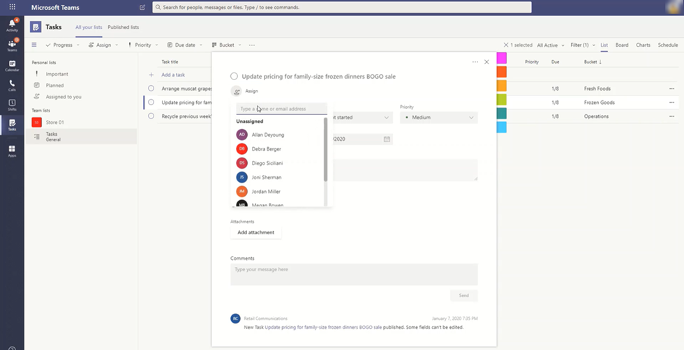
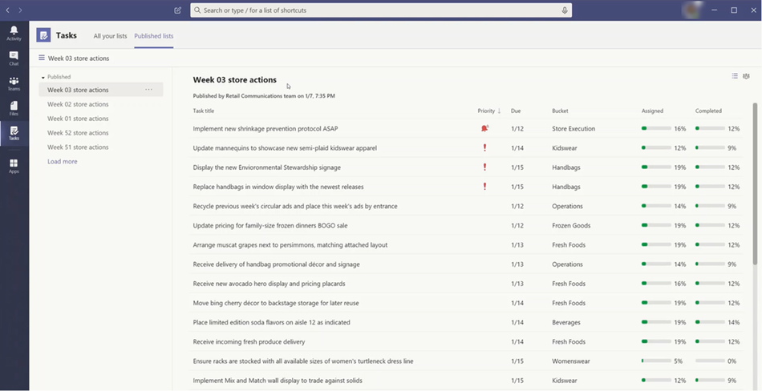

# Manage the Tasks app for your organization in Microsoft Teams

[!INCLUDE [preview-feature](../includes/preview-feature.md)]

## Overview of Tasks

The Tasks app brings a cohesive task management experience to Microsoft Teams, integrating personal tasks powered by To Do and team tasks powered by Planner in one place. Users can access Tasks as an app on the left side of Teams and as a tab within individual teams. The **Personal lists** and **Team lists** in Tasks let users view and manage all their personal and team tasks and prioritize work.

> [!NOTE]
> As we roll out the Tasks experience, on Teams desktop clients, the app name will initially appear as **Planner** to users. The name will then temporarily change to **Tasks by Planner and To Do**, and later on, it will be renamed to **Tasks**. On Teams mobile clients, users will always see the app name as **Tasks**.

[PLACEHOLDER FOR SCREENSHOT of Tasks app]

For organizations who want to streamline task management for Firstline Workers, Tasks also includes capabilities that enable you to target, publish, and track tasks at scale across your Firstline Workforce. For example, corporate and regional leadership can create and publish task lists targeted to relevant locations, such as specific retail stores, and track progress through real-time reports. Managers can assign tasks to their staff and direct activities within their stores, and Firstline Workers have a prioritized list of their assigned tasks. To enable [tasks publishing](#tasks-publishing), you'll first need to set up a team targeting hierarchy for your organization, which defines how all teams in the hierarchy are related to each other.

## What you need to know about Tasks

Tasks is available as an app and as a tab within individual teams. Keep in mind that the app comprises all personal tasks from To Do and team tasks from Planner whereas the tab shows only team tasks.

With Tasks, users get a desktop, web, and mobile experience. If Tasks is installed on the Teams desktop client, users will also see it on their Teams web and mobile clients. The exception is guest users. It's important to know that guests can only access Tasks from the Teams mobile client. Guests won't see Tasks on Teams desktop or web clients.

Personal lists show tasks  ???. Team lists show tasks that the whole team is working on. If you don't want users to see Personal lists, you can hide it. To do this, [remove the user's Exchange Online license](https://docs.microsoft.com/microsoft-365/admin/manage/remove-licenses-from-users). Note that after you remove an Exchange Online license, the user no longer has access to their mailbox. Mailbox data is held for 30 days, after which the data will be removed and can't be recovered unless the mailbox is placed on [In-Place Hold or Litigation Hold](https://docs.microsoft.com/exchange/security-and-compliance/in-place-and-litigation-holds).

## Set up Tasks

### Enable or disable Tasks in your organization

Tasks is enabled by default for all Teams users in your organization. You can turn off or turn on the app at the org level on the [Manage apps](../manage-apps.md) page in the Microsoft Teams admin center.

1. In the left navigation of the Microsoft Teams admin center, go to **Teams apps** > **Manage apps** .
2. In the list of apps, do one of the following:

    - To turn off Tasks for your organization, search for the Tasks app, select it, and then click **Block**.
    - To turn on Tasks for your organization, search for the Tasks app, select it, and then click **Allow**.

### Enable or disable Tasks for specific users in your organization

To allow or block specific users in your organization from using Tasks, make sure Tasks is turned on for your organization on the [Manage apps](../manage-apps.md) page, and then create a custom app permission policy and assign it to those users. To learn more, see [Manage app permission policies in Teams](../teams-app-permission-policies.md).

### Use an app setup policy to pin Tasks to Teams

App setup policies let you customize Teams to highlight the apps that are most important for users in your organization. The apps you set in a policy are pinned to the app bar&mdash;the bar on the side of the Teams desktop client and at the bottom of the Teams mobile clients&mdash;where users can quickly and easily access them.

To pin the Tasks app for your users, you can edit the global (Org-wide default) policy or create and assign a custom app setup policy. To learn more, see [Manage app setup policies in Teams](../teams-app-setup-policies.md).

## Tasks publishing

With tasks publishing, your organization can publish task lists targeted to specific locations (teams) across your organization to define and share a work plan to be completed at those locations.

- People on the publishing team, such as corporate or regional leadership, can create task lists and publish them to specific teams. 
    
- Managers on the recipient teams can review the published task lists and assign individual tasks to team members. 
    
- Publishers and managers can view reports to see assignment and completion status of tasks at each level, including by location (team), task list, and individual task. 
    

Users create, manage, and publish task lists on the **Published lists** tab in the Tasks app. This tab only shows for a user if your organization set up a team targeting hierarchy and the user is on a team that's defined in the hierarchy. This means that the user can publish or receive task lists and view reporting for received lists.

### Example scenario

Here's an example of how task publishing works.

Contoso is rolling out a new food takeout and delivery promotion. To maintain a consistent brand experience, they need to coordinate consistent execution of the rollout across over 300 store locations.

The Marketing team shares the promotion details and tasks with the Retail Communications Manager. The Retail Communications Manager, who serves as the gatekeeper for stores, reviews the information, creates a task list for the promotion, and then  creates a task for each unit of work that needs to be performed. She then needs to choose the stores that the promotion applies to. In this case, the promotion only applies to stores in the United States that have a in-store restaurant. In Tasks, she filters the store list by hierarchy and attributes to select the targeted store locations, and then publishes the tasks list to those stores.

Store managers at each location receive a copy of the published task list and assign the tasks to their team members. Firstline Workers at each store location now have a prioritized list of their work in Tasks on their mobile device. When they finish a task, they mark it complete. Some may even choose to upload and attach a photo to the task to show their work.

Contoso headquarters and intermediate managers can view reporting to see the assignment and completion status of tasks at each store and across stores. They can also drill down to a specific task to see the status within different stores and view attachments if store employees uploaded photos. As the launch date gets closer, they can spot any abnormalities and check in with their teams as needed. This visibility allows Contoso to improve the efficiency of the rollout and provide a more consistent experience across their stores.

### Set up your team targeting hierarchy

To enable tasks publishing in your organization, you have to first set up your team targeting schema in a .CSV file. The schema defines how all the teams in your hierarchy are related to each other and the attributes used to filter and select teams. After you create the schema, upload it to Teams to apply it to your organization. Members of the publishing team, such as the Retail Communications Manager in the example scenario, can then filter teams by hierarchy, attributes, or a combination of both to select the relevant teams that should receive the task lists, and then publish the task lists to those teams.

For steps on how to set up your team targeting hierarchy, see [Set up your team targeting hierarchy](set-up-your-team-hierarchy.md).

## Power Automate and Graph API

Tasks supports Power Automate for To Do and Graph APIs for Planner. To learn more, see:

- [Planner tasks and plans API overview](https://docs.microsoft.com/graph/planner-concept-overview)
- [Using Microsoft To Do with Power Automate](https://support.office.com/article/using-microsoft-to-do-with-power-automate-526e8f75-217b-46e0-9e06-44780b72c295)
