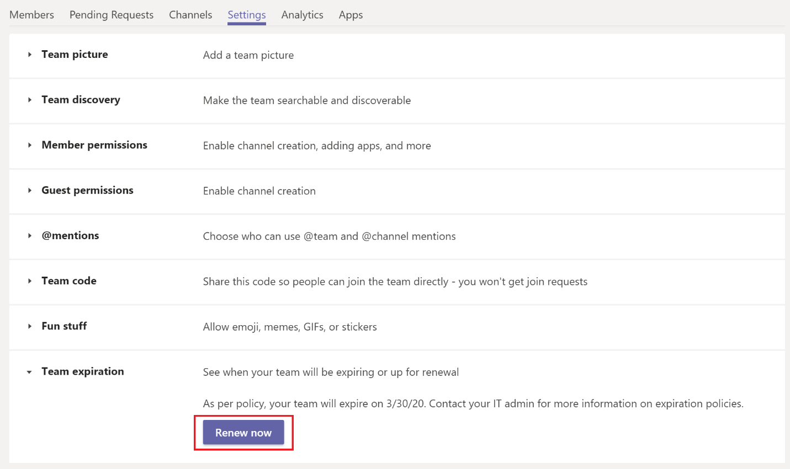

# Team expiration and renewal in Microsoft Teams

Organizations with a large number of teams often have teams that are never actually used. This can happen because of several reasons including product experimentation, short-term team collaboration, or team owners leaving the organization. Over time, such teams can accumulate and create a burden on tenant resources.  

To curb the number of unused teams, as an admin, you can use [Microsoft 365 group expiration policy](/microsoft-365/admin/create-groups/office-365-groups-expiration-policy) to automatically clean up unused teams. Because teams are backed by groups, group expiration policies automatically apply to teams as well.

When you apply an expiration policy to a team, a team owner receives a notification for team renewal 30 days, 15 days and 1 day before the team's expiration date. When the team owner receives the notification, they can click **Renew now** in team settings to renew the team.

If the team owner doesn't renew the team and there is no further activity on the team until the end of the expiration policy, the team is put in a "soft-deleted" state, which means it can be restored within the next 30 days.

## Team auto-renewal

There can be times when a team owner is unable to renew the team perhaps because they forgot to renew or were away when renewal was due. In these scenarios, a team in active use can get deleted because of expiration policies that apply to the team.  

To prevent accidental deletion, auto-renewal is automatically enabled for a team in the group expiration policy. When the group expiration policy is set up, any team that has at least one channel visit from any team member before its expiration date is automatically renewed without any manual intervention from the team owner.

## Known issues

**Expiration date of team and underlying group don't match**

Before a team is renewed, the group that backs the team is renewed first. As part of renewal, a new expiry date is set on the group for a future date. This new date may not be immediately visible in Teams. It can take up to 24 hours to sync. If you see a discrepancy between the expiry date for a team and its underlying group, wait 24 hours before seeking further support.