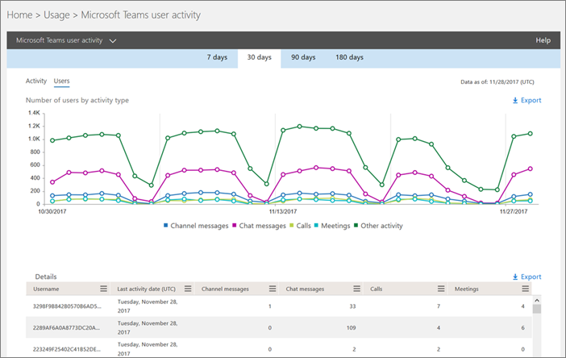
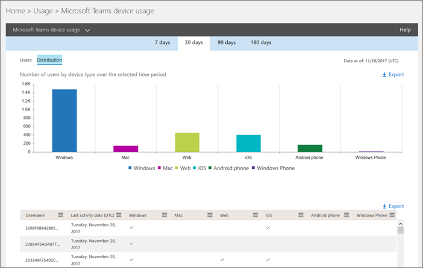
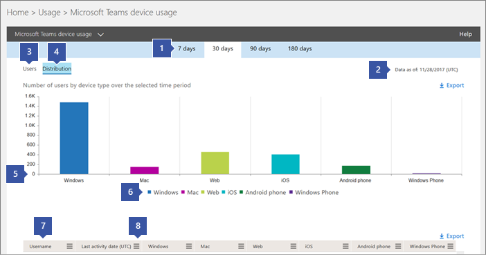
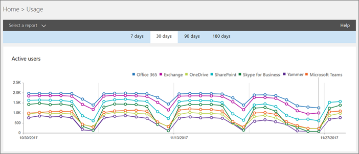
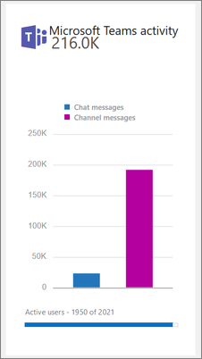

Use activity reports for Microsoft Teams 
========================================

You can use activity reports in the Microsoft 365 admin center to see how users in your organization are using Microsoft Teams. For example, if some don’t use Microsoft Teams yet, they might not know how to get started or understand how they can use Teams to be more productive and collaborative. Your organization can use the activity reports to decide where to prioritize training and communication efforts.

## How to view the Teams reports in the Reports dashboard

1. In the [Microsoft 365 admin center](https://portal.office.com/adminportal/home), select **Reports** > **Usage**.
 
2. On the **Usage** page, choose **Select a report**, and then under **Microsoft Teams** in the list of reports, choose the report you want to view.

## Teams activity reports that are available

There are currently two activity reports you can view:

- [Microsoft Teams user activity report](#microsoft-teams-user-activity-report) 
- [Microsoft Teams device usage report](#microsoft-teams-device-usage-report) 

### Microsoft Teams user activity report

The Teams user activity report gives you a view of the most common activities that your users perform in Teams. This includes how many people engage in a chat in a channel, how many communicate via private chat message, and how many participate in calls or meetings. You can see this information for your whole organization, as well as for each individual user.

#### Interpret the Microsoft Teams user activity report

You can get a view into Teams user activity by looking at the **Activity** and **Users** charts.

|Callout |Description  |
|--------|-------------|
|**1**   |The Teams user activity report can be viewed for trends over the last 7 days, 30 days, 90 days, or 180 days. However, if you click into a particular time range in the report, the table (7) will show data for 30 days, up to the date (2) for when the report was generated. |
|**2**   |Each report has a date for when this report was generated. The reports usually reflect a 24 to 48 hour latency from time of activity. |
|**3**   |The **Activity** view shows you the number of Microsoft Teams activities by activity type. The activity types are number of team chat messages, private chat messages, calls, and meetings. |
|**4**   |The **Users** view shows you the number of users by activity type. The activity types are number of team chat messages, private chat messages, calls, and meetings. |
|**5**   |The X axis on the charts is the selected date range for the specific report. <ul><li>On the **Activity** chart, the Y axis is the count of the specified activity.</ul></li> <ul><li>On the **Users** chart, the Y axis is the number of users participating in teams chats, private chats, calls, or meetings.</ul></li> |
|**6**   |You can filter the series you see on the chart by clicking on an item in the legend. For example, on the **Activity** chart, click or tap **Channel messages**, **Chat messages**, **Calls**, or **Meetings** to see only the info related to each one. Changing this selection doesn’t change the information in the grid table. |
|**7**   |The list of active teams across the widest (180-day) reporting time frame.  The activity count will vary according to the date selection.    To see the following information the table, make sure you add the columns to the table. <ul><li>**Username** is the email address of the user. You can display the actual email address or make this field anonymous.</ul></li> <ul><li>**Last Activity Date (UTC)** refers to the last date that the user participated in a Microsoft Teams activity.</ul></li> <ul><li>**Channel messages** is the number of unique messages that the user posted in a team chat during the specified time period.</ul></li> <ul><li>**Chat messages** is the number of unique messages that the user posted in a private chat during the specified time period.</ul></li> <ul><li>**Calls** is the number of calls that the user participated in during the specified time period.</ul></li> <ul><li>**Meetings** is the number of online meetings that the user participated in during the specified time period.</ul></li> <ul><li>**Other activity** is the number of other team activities by the user some of which include, and not limited to: liking messages, apps, working on files, searching, following teams and channel and favoriting them.</ul></li> <ul><li>**Deleted** indicates if the team is deleted. If the team is deleted, but had activity in the reporting period, it will show up in the grid with deleted set to true.</ul></li> <ul><li>**Deleted date** is the date that the user was deleted.</ul></li> <ul><li>**Product assigned** is the list of products that are assigned to the user.</ul></li>If your organization's policies prevents you from viewing reports where user information is identifiable, you can change the privacy setting for all these reports. Check out the **How do I hide user level details?** section in the [Activity Reports in the Microsoft 365 Admin Center Preview](https://support.office.com/article/activity-reports-in-the-office-365-admin-center-0d6dfb17-8582-4172-a9a9-aed798150263).</ui> |
|**8**   |Click or tap **Columns** to add or remove columns in the table. |
|**9**   |Click or tap **Export** to export report data to an Excel .csv file. This exports data of all users and enables you to do simple sorting and filtering for further analysis. If you have less than 2,000 users, you can sort and filter within the table in the report itself. If you have more than 2,000 users, you will have to export the data to filter and sort the report. 

### Microsoft Teams device usage report

The Teams device usage report provides you with information about how your users connect to Teams, including mobile apps. The report helps you understand which devices are popular in your organization and how many users work on the go.

### Interpret the Microsoft Teams device usage report

You can get a view into Teams device usage by looking at the **Users** and **Distribution** charts.

|Callout |Description  |
|--------|-------------|
|**1**   |The Teams device report can be viewed for trends over the last 7 days, 30 days, 90 days, or 180 days. However, if you click into a particular time range in the report, the table (7) will show data for 30 days, up to the date (2) for when the report was generated. |
|**2**   |Each report has a date for when this report was generated. The reports usually reflect a 24 to 48 hour latency from time of activity. |
|**3**   |The **Users** view shows you the number of daily users by device type. |
|**4**   |The **Distribution** view shows you the number of users by device over the selected time period.  |
|**5**   | <ul><li>On the **Users** chart, the X axis is the selected date range for the report and the Y axis is the number of users by device type.</ul></li> <ul><li>On the **Distribution** chart, the X axis shows the different devices used to connect to Teams and the Y axis is the number of users using the device.</ul></li> |
|**6**   |You can filter the series you see on the chart by clicking on an item in the legend. For example, on the **Distribution** chart, click or tap **Windows**, **Mac**, **Web**, **iOS**, or **Android** to see only the info related to each one. Changing this selection doesn’t change the information in the grid table. |
|**7**   |The list of active teams across the widest (180-day) reporting time frame.  The activity count will vary according to the date selection.    To see the following information in the table, make sure you add the columns to the table. <ul><li>**Username** is the email address of the user. You can display the actual email address or make this field anonymous.</ul></li> <ul><li>**Last Activity Date (UTC)** refers to the last date that the user participated in a Teams activity.</ul></li> <ul><li>**Deleted** indicates if the team is deleted. If the team is deleted, but had activity in the reporting period, it will show up in the grid with deleted set to true.</ul></li><ul><li>**Deleted date** is the date that the user was deleted.</ul></li> <ul><li>**Windows**  is selected if the user was active in the Teams desktop client on a Windows-based computer.</ul></li> <ul><li>**Mac** is selected if the user was active in the Teams desktop client on a macOS computer.</ul></li>  <ul><li>**Web** is selected if the user was active on the Teams web client.</ul></li> <ul><li>**iOS** is selected if the user was active on the Teams mobile client for iOS.</ul></li> <ul><li>**Android phone**  is selected if the user was active on the Teams mobile client for Android.</ul></li></li> <ui>If your organization's policies prevents you from viewing reports where user information is identifiable, you can change the privacy setting for all these reports. Check out the **How do I hide user level details?** section in the [Activity Reports in the Microsoft 365 Admin Center Preview](https://support.office.com/article/activity-reports-in-the-office-365-admin-center-0d6dfb17-8582-4172-a9a9-aed798150263).</ui> |
|**8**   |Click or tap **Columns** to add or remove columns in the table. |
|**9**   |Click or tap **Export** to export report data to an Excel .csv file. This exports data of all users and enables you to do simple sorting and filtering for further analysis. If you have less than 2,000 users, you can sort and filter within the table in the report itself. If you have more than 2,000 users, you will have to export the data to filter and sort the report. 

## Who can access the Teams activity reports

The activity reports can be accessed by users that are assigned:

- Office 365 global admin role
- Product-specific admin role (Exchange, Skype for Business, or SharePoint)
- Reports reader role

### Reports reader role

You can assign the *Reports reader* role to non-IT staff who you want to have access to these reports. By assigning this role to training managers or business stakeholders, you can make sure that they have access to the insights that are helpful to drive and track adoption of Teams.

## Other information on the Reports dashboard

### At-a-glance activity widget

The Reports dashboard includes the usage data from Teams in the at-a-glance activity widget, which gives you a cross-product view of how users communicate and collaborate using the other various services in Office 365.

### Teams activity card

The Teams activity card on the Reports dashboard gives you an overview of the activity in Teams, including the number of active users, so that you can quickly understand how many users are using the service. Clicking the activity card on the dashboard takes you to the Teams user activity report. 

