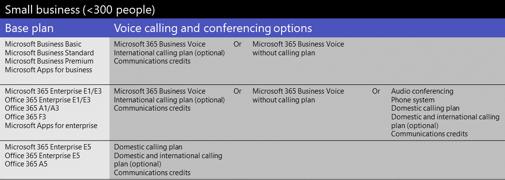
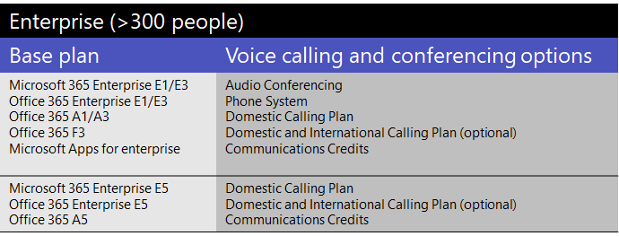
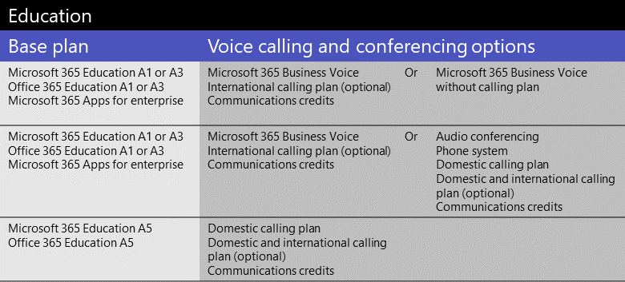
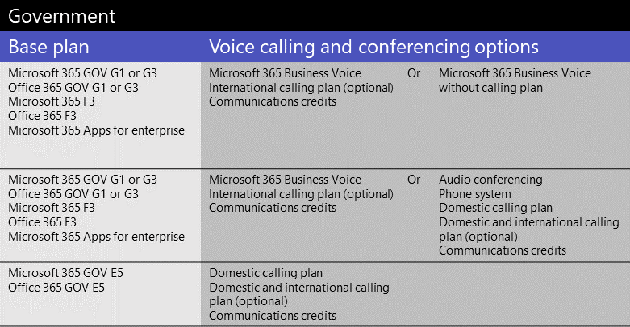
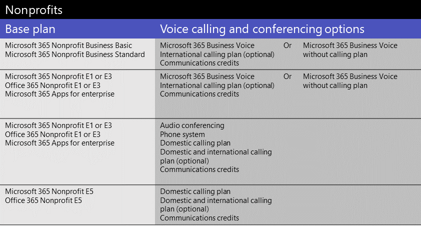

# Microsoft Teams add-on licenses

## What are add-on licenses?

Add-on licenses are licenses for specific Microsoft Teams features. They give you the flexibility to add features only for users in your organization who need them. To add a feature, buy one add-on license for each user who will use it.

## What features can I get with add-on licenses?

Here's a list of features that you can add with Teams add-on licenses. The add-on licensing options available to you depend on the Microsoft 365 or Office 365 plan you have.

|||||
|:-----|:-----|:-----|:-----|
|**Feature**   |**Description**   |**Small business (<300 users)**|**Large business (>300 users)**|
**Microsoft 365 Business Voice**   | [Business Voice](../business-voice/whats-business-voice.md) is a telephony solution designed for small and medium businesses of up to 300 users that bundles Phone System, Audio Conferencing, a Domestic Calling Plan, and more. Phone System capabilities that you'll get include voicemail, caller ID, call park, call forwarding, auto attendants, and call queues.   To find out whether Business Voice is available in your country or region, see [Country and region availability for Business Voice](../business-voice/country-region-availability.md). For pricing info, see [Pricing for Business Voice](https://go.microsoft.com/fwlink/?linkid=2127221).   |&#x2713;||
|**Audio Conferencing**   |Sometimes people in your organization will need to use a phone to call in to a Teams meeting instead their computer. Set up [Audio Conferencing](../audio-conferencing-in-office-365.md) for users who schedule or leads meetings.   To find out whether Audio Conferencing is available in your country or region, see [Country and region availability for Audio Conferencing and Calling Plans](../country-and-region-availability-for-audio-conferencing-and-calling-plans/country-and-region-availability-for-audio-conferencing-and-calling-plans.md). For pricing info, see [Pricing for Audio Conferencing](https://go.microsoft.com/fwlink/?linkid=799762).    |&#x2713;1|&#x2713;|
|**Toll free numbers** |If you want toll-free numbers for Audio Conferencing, auto attendants, or call queues, you must [set up Communications Credits](../set-up-communications-credits-for-your-organization.md).   |&#x2713;|&#x2713;|
|**Phone System**   |[Phone System](../what-is-phone-system-in-office-365.md) is a hosted telephone service that gives you call control and Private Branch Exchange (PBX) capabilities, with options for connecting to the Public Switched Telephone Network (PSTN). Phone System features include cloud voicemail, caller ID, call park, call forwarding, auto attendants, call queues, call transfer, caller ID, and more.  To learn more, see [Here's what you get with Phone System](../here-s-what-you-get-with-phone-system.md). For pricing info, see [Pricing for Phone System](https://go.microsoft.com/fwlink/?linkid=799763).    |&#x2713;1|&#x2713;|
|**Calling Plans**   |If you want users to be able to call phone numbers outside your organization, get a [Calling Plan](../calling-plans-for-office-365.md). There are Domestic Calling Plans and Domestic and International Calling Plans. For pricing info, see [Pricing for Calling Plans](https://go.microsoft.com/fwlink/?linkid=799761 ).    |&#x2713;1|&#x2713;|
|**Microsoft Teams Rooms**   |[Microsoft Teams Rooms](../rooms/index.md) isn't an add-on, but a feature that brings video, audio, and content sharing to conference rooms. See [Teams Meeting Room Licensing](../rooms/rooms-licensing.md).    |&#x2713;|&#x2713;|

1 If you're a small or medium-sized business who has a Microsoft 365 Enterprise plan, you can still buy add-on licenses for these voice features, however, we recommend that you consider a [Microsoft 365 Business](https://www.microsoft.com/microsoft-365/compare-all-microsoft-365-products?&activetab=tab:primaryr2) plan and [Business Voice](https://www.microsoft.com/microsoft-365/business/business-voice).

## What voice features are available with my plan?

See what add-on licenses you need to get voice features in Teams, depending on the plan you have.

Depending on the voice features that you want, we recommend comparing whether it's more cost effective for you to switch to a plan that includes those features. For example, for most large organizations, buying a bundle of software in a Microsoft 365 Enterprise plan will result in lower overall cost. Typically, when you buy several add-on licenses individually instead of as part of a plan, you may end up with a higher combined cost.

#### [**Small business**](#tab/small-business/)

If you're a small or medium-sized business (less than 300 users), you have four ways to get voice features:

- Buy a Microsoft 365 Business plan and Microsoft 365 Business Voice.
- Buy an Enterprise E1 or E3 plan and Microsoft 365 Business Voice.
- Buy an Enterprise E1 or E3 plan and add voice features individually.
- Buy an Enterprise E5 plan, which includes voice features.

For Microsoft 365 Business Voice, you have two options to choose from:

- **Microsoft 365 Business Voice with a Calling Plan**: Get this if you want all phone number management and billing to be handled by Microsoft.
- **Microsoft 365 Business Voice without a Calling Plan (Direct Routing)**: Get this if you want all phone number management and billing to be handled by your third-party telephone provider. You'll need to set up and deploy [Direct Routing](../direct-routing-landing-page.md) to connect your on-premises Session Border Controllers (SBCs) to Microsoft 365 or Office 365.

To learn more, see [What do I need to buy to use Microsoft 365 Business Voice?](../business-voice/what-to-buy.md).

Here's a summary, based on licensing plan.

  

If Audio Conferencing isn't supported in your country or region, you have the option to get a Microsoft 365 Enterprise E5 without Audio Conferencing plan or an Office 365 Enterprise E5 without Audio Conferencing plan.

If you already have a Microsoft 365 Enterprise or Office 365 Enterprise plan, you can still buy add-on licenses for individual voice features. However, you have the option to switch to a [Microsoft 365 Business](https://www.microsoft.com/microsoft-365/compare-all-microsoft-365-products?&activetab=tab:primaryr2) plan and [Microsoft 365 Business Voice](https://www.microsoft.com/microsoft-365/business/business-voice). In some cases, depending on the features that you want, it might be more cost effective to get a Microsoft 365 Business plan with Microsoft 365 Business Voice.

> [!NOTE]
> If you need to use a third-party telephone service, [Direct Routing](../direct-routing-landing-page.md) is deployed in your organization, or if Calling Plans aren't available in your country or region, you need to use Direct Routing for voice features.

#### [**Enterprise**](#tab/enterprise/)

If you're a large business or enterprise organization (more than 300 users), you have two ways to get voice features:

- Buy an Enterprise E1 or E3 plan and add voice features individually.
- Buy an Enterprise E5 plan, which includes voice features.

Here's a summary, based on licensing plan.

  

If Audio Conferencing isn't supported in your country or region, you have the option to get a Microsoft 365 Enterprise E5 without Audio Conferencing plan or an Office 365 Enterprise E5 without Audio Conferencing plan.

To learn more, see [Microsoft 365 Enterprise plans](https://www.microsoft.com/microsoft-365/compare-microsoft-365-enterprise-plans) and [Office 365 Enterprise plans](https://www.microsoft.com/microsoft-365/business/compare-more-office-365-for-business-plans).

> [!NOTE]
> If you need to use a third-party telephone service, [Direct Routing](../direct-routing-landing-page.md) is deployed in your organization, or if Calling Plans aren't available in your country or region, you need to use Direct Routing for voice features.

#### [**Education**](#tab/education/)

For schools and other academic organizations, you have three ways to get voice features.

- Buy an EDU A1 or A3 plan and Microsoft 365 Business Voice.
- Buy an EDU A1 or A3 plan and add voice features individually.
- Buy an EDU A5 plan, which includes voice features.

Here's a summary, based on licensing plan.

  

  1 Only available for organizations with less than 300 users.

To learn more, see [Microsoft 365 Education](https://www.microsoft.com/education/buy-license/microsoft365) and [Office 365 Education plans](https://www.microsoft.com/microsoft-365/academic/compare-office-365-education-plan).

> [!NOTE]
> If you need to use a third-party telephone service, [Direct Routing](../direct-routing-landing-page.md) is deployed in your organization, or if Calling Plans aren't available in your country or region, you need to use Direct Routing for voice features.

#### [**Government**](#tab/government/)

For US government organizations (GCC only), there are three ways to get voice features.

- Buy a GOV G1 or G3 plan and Microsoft 365 Business Voice.
- Buy a GOV G1 or G3 plan and add cloud voice features individually.
- Buy a GOV G5 plan, which includes voice features.

Here's a summary, based on licensing plan.

  

  1 Only available for organizations with less than 300 users.

To learn more, see [Microsoft 365 Government](https://www.microsoft.com/microsoft-365/government/) and [Office 365 Government plans](https://www.microsoft.com/microsoft-365/government/compare-office-365-government-plans).

> [!NOTE]
> If you need to use a third-party telephone service, [Direct Routing](../direct-routing-landing-page.md) is deployed in your organization, or if Calling Plans aren't available in your country or region, you need to use Direct Routing for voice features.

#### [**Nonprofit**](#tab/nonprofit/)

If you're a nonprofit organization, you have four ways to get voice features.

- Buy a Microsoft 365 Nonprofit Business Basic or Microsoft 365 Nonprofit Business Standard plan and Microsoft 365 Business Voice.
- Buy a Nonprofit E1 or E3 plan and Microsoft 365 Business Voice.
- Buy a Nonprofit E1 or E3 plan and add voice features individually.
- Buy a Nonprofit E5, which includes voice features.

Here's a summary, based on licensing plan.

  

  1 Only available for organizations with less than 300 users.

To learn more, see [Microsoft 365 and Office 365 Nonprofit offers](https://www.microsoft.com/microsoft-365/nonprofit/office-365-nonprofit-plans-and-pricing).

> [!NOTE]
> If you need to use a third-party telephone service, [Direct Routing](../direct-routing-landing-page.md) is deployed in your organization, or if Calling Plans aren't available in your country or region, you need to use Direct Routing for voice features.

#### [**Trial offers**](#tab/trial/)

### Trial offers for licensing plans

In response to an increased need for people to work remotely (or work from home), Microsoft has several free Teams trial offers for government, educational, and non-profit organizations. Trials are available for these plans:

- Office 365 Enterprise [E1 trial](../e1-trial-license.md), E3 trial, and E5 trial
- Office 365 Education [A1 trial](../teams-edu-licensing.md)
- Office 365 Government [G1 trial](../g1-trial-license.md)

To sign up for a trial offer, see [Sign up for a trial offer](https://transform.microsoft.com/customer-trials?tab=requestnewtrial).

### Trial offers for voice features

Here's a summary of voice feature trial offers.

  

 Your base plan doesn't have to be a trial offer to use any of these trials for voice features. You can use a Microsoft 365 Business plan or an Enterprise, Government, Education, or Nonprofit plan with any of the trial offers for voice features. To see available trial offers and add-ons, in the Microsoft 365 admin center, go to **Billing** > **Purchase services**, select **Other categories that might interest you**, and then select **Add-ons**.

  For each these voice and conferencing options, [Communications Credits](../set-up-communications-credits-for-your-organization.md) are required if you have toll-free numbers or if you need to add additional minutes for users to dial out from meetings or for users to make domestic and international PSTN calls.

 Also, check out:

- [Free version of Teams](../manage-freemium.md)
- [Teams Exploratory experience](../teams-exploratory.md) - currently there are no trial offers for voice features for use with the Teams Exploratory experience.
- [Microsoft Phone System - Virtual User](virtual-user.md) license

* * *

## Need help?

Need to talk to someone about the add-on options? [Contact support for business products - Admin Help](https://support.office.com/article/32a17ca7-6fa0-4870-8a8d-e25ba4ccfd4b).

## Related topics

- [Assign Teams add-on licenses](assign-teams-add-on-licenses.md)
- [Manage user access to Teams](../user-access.md)
- [Teams service description](https://docs.microsoft.com/office365/servicedescriptions/teams-service-description)
