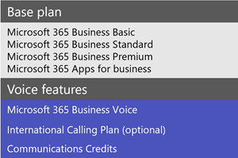
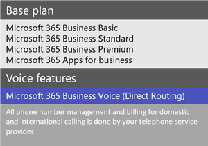
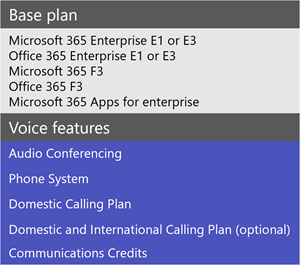
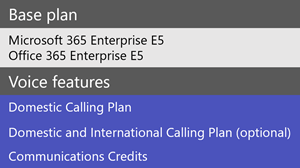
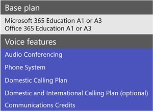
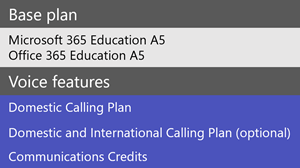
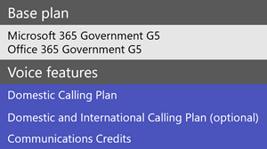
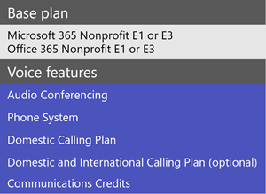
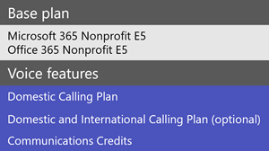

# Microsoft Teams add-on licenses

## What are add-on licenses?

Add-on licenses are licenses for specific Microsoft Teams features. They give you the flexibility to add features only for users in your organization who need them. To add a feature, buy one add-on license for each user who will use it.

## What features can I get with add-on licenses?

Here's a list of features that you can add with Teams add-on licenses. The add-on licensing options available to you depend on the Microsoft 365 or Office 365 plan you have.

|||||
|:-----|:-----|:-----|:-----|
|**Feature**   |**Description**   |**Small business (<300 users)**|**Large business (>300 users)**|
**Microsoft 365 Business Voice**   | [Business Voice](../business-voice/whats-business-voice.md) is a telephony solution designed for small and medium businesses of up to 300 users that bundles **Phone System, Audio Conferencing, a Domestic Calling Plan, and more**. Phone System capabilities that you'll get include voicemail, caller ID, call park, call forwarding, auto attendants, and call queues. For pricing info, see [Pricing for Business Voice](https://go.microsoft.com/fwlink/?linkid=2127221).    |&#x2713;||
|**Audio Conferencing**   |Sometimes people in your organization will need to use a phone to call in to a Teams meeting instead their computer. Set up [Audio Conferencing](../audio-conferencing-in-office-365.md) for users who schedule or leads meetings.   To find out whether Audio Conferencing is available in your country or region, see [Country and region availability for Audio Conferencing and Calling Plans](../country-and-region-availability-for-audio-conferencing-and-calling-plans/country-and-region-availability-for-audio-conferencing-and-calling-plans.md). For pricing info, see [Pricing for Audio Conferencing](https://go.microsoft.com/fwlink/?linkid=799762).    |&#x2713;1|&#x2713;|
|**Toll free numbers** |If you want toll-free numbers for Audio Conferencing, auto attendants, or call queues, you must [set up Communications Credits](../set-up-communications-credits-for-your-organization.md).   |&#x2713;|&#x2713;|
|**Phone System**   |[Phone System](../what-is-phone-system-in-office-365.md) is a hosted telephone service that gives you call control and Private Branch Exchange (PBX) capabilities, with options for connecting to the Public Switched Telephone Network (PSTN). Phone System features include cloud voicemail, caller ID, call park, call forwarding, auto attendants, call queues, call transfer, caller ID, and more. To learn more, see [Here's what you get with Phone System](../here-s-what-you-get-with-phone-system.md).    For pricing info, see [Pricing for Phone System](https://go.microsoft.com/fwlink/?linkid=79976).    |&#x2713;1|&#x2713;|
|**Calling Plans**   |If you want users to be able to call phone numbers outside your organization, get a [Calling Plan](../calling-plans-for-office-365.md). There are Domestic Calling Plans and Domestic and International Calling Plans. For pricing info, see [Pricing for Calling Plans](https://go.microsoft.com/fwlink/?linkid=799761 ).    |&#x2713;1|&#x2713;|
|**Microsoft Teams Rooms**   |[Microsoft Teams Rooms]](../rooms/index.md) isn't an add-on, but a feature that brings video, audio, and content sharing to conference rooms. See [Teams Meeting Room Licensing](../rooms/rooms-licensing.md).    |&#x2713;|&#x2713;|

1 If you're a small or medium-sized business who has a Microsoft 365 Enterprise plan, you can still buy add-on licenses for these cloud voice features, however, we recommend that you consider a [Microsoft 365 business](https://www.microsoft.com/microsoft-365/compare-all-microsoft-365-products?&activetab=tab:primaryr2) plan and [Business Voice](https://www.microsoft.com/microsoft-365/business/business-voice).

## What voice features are available with my plan?

See what add-on licenses you need to get voice features in Teams, depending on the plan you have.

Depending on the voice features that you want, we recommend comparing whether it's more cost effective for you to switch to a plan that includes those features. For example, for most large organizations, buying a bundle of software in a Microsoft 365 Enterprise plan will result in lower overall cost. Typically, when you buy several add-on licenses individually instead of as part of a plan, you may end up with a higher combined cost.

#### [**Business**](#tab/small-business/)

For small and medium sized businesses, there are two ways to get voice features. If you're new and have less than 300 users, you'll want to get [Microsoft 365 Business Voice](https://www.microsoft.com/microsoft-365/business/business-voice). If you already have an Enterprise E1 or E3 plan, you can buy voice features as individual add-ons.

If you have less than 300 users, there are two Business Voice plans to choose from.

- Microsoft 365 Business Voice with a Calling Plan
- Microsoft 365 Business Voice without a Calling Plan

If you want all phone number management and billing for voice features to be delivered from Microsoft, get Business Voice with a Calling Plan. If you already get your telephone service from a third-party telephone provider, get Business Voice without a Calling Plan. For this, you'll need to set up and deploy Direct Routing to connect your on-premises Session Border Controllers (SBCs) to Microsoft 365.

**Business Voice with a Calling Plan**

**Business Voice without a Calling Plan**

Keep in mind that [Microsoft 365 Business Voice](https://www.microsoft.com/microsoft-365/business/business-voice) is designed for small and medium-sized businesses who have up to 300 users.

If you're a small or medium-sized business (less than 300 users) who already has a Microsoft 365 Enterprise (or EDU, GOV or Nonprofit) plan, you can still buy add-on licenses for these voice features. However, you have the option to move from that license and buy and assign a [Microsoft 365 Business](https://www.microsoft.com/microsoft-365/compare-all-microsoft-365-products?&activetab=tab:primaryr2) plan and [Microsoft 365 Business Voice](https://www.microsoft.com/microsoft-365/business/business-voice). In some cases, depending on the features that you want, it might be more cost effective to get a Microsoft 365 Business plan with Microsoft 365 Business Voice.

****

#### [**Enterprise**](#tab/enterprise/)

Here are the add-on options available to you if you have any of these [Microsoft 365 Enterprise](https://www.microsoft.com/microsoft-365/compare-microsoft-365-enterprise-plans) or [Office 365 Enterprise plans](https://www.microsoft.com/microsoft-365/business/compare-more-office-365-for-business-plans) plans. 

For larger businesses (more than 300 users), you have two options.
- Enterprise E1 or E3 (and then add Cloud Voice features individually - OR -
- Enterprise E5 (that includes Cloud Voice features)

For larger business (more than 300 users), you can also buy a Microsoft or Office 365 F3 or Microsoft Apps for enterprise licenses. 

These plans both include most Microsoft Teams features however, if you want Cloud Voice features like audio conferencing and voice calling, you will need to add them on separately. Or, you can purchase an Enterprise E5 license that includes a long list of features including Cloud Voice. To see more, [Enterprise E5 features](https://www.microsoft.com/en-us/microsoft-365/enterprise-e5-business-software?activetab=pivot%3aoverviewtab).

**Adding Cloud Voice to Enterprise E1 or E3 plans**

**Enterprise E5 including Cloud Voice**

These E5 plans include most Teams features. There's a few additional options that you can add. To learn more, see [Microsoft 365 E5](https://www.microsoft.com/microsoft-365/enterprise-e5-business-software) and [Office 365 E5](https://www.microsoft.com/microsoft-365/business/office-365-enterprise-e5-business-software). 

If your organization has less than 300 users and you have a Microsoft 365 Enterprise plan, you can reduce overall cost if you switch to a [Microsoft 365 Business](https://www.microsoft.com/microsoft-365/compare-all-microsoft-365-products?&activetab=tab:primaryr2) plan and [Microsoft 365 Business Voice](https://www.microsoft.com/microsoft-365/business/business-voice).

If you're a small or medium-sized business (less than 300 users) but who has already bought Microsoft 365 Enterprise (or EDU, GOV or Nonprofit) licenses, you can still buy add-on licenses for these voice features. You have the option of moving from that license and buying and assigning a [Microsoft 365 Business](https://www.microsoft.com/microsoft-365/compare-all-microsoft-365-products?&activetab=tab:primaryr2) plan and [Microsoft 365 Business Voice](https://www.microsoft.com/microsoft-365/business/business-voice). In some cases, depending on the features that you want, it might be less expensive to get a Business plan with Microsoft Business Voice to get all of the Cloud Voice features. 

****
#### [**Education**](#tab/education/)

For schools, there are two ways to get Cloud Voice features.

- **If you have less than 300 students and/or faculty**  You will want to buy Microsoft Business Voice because all of the Cloud Voice features are included. However, if you decide you want more features, you still have the option to buy A1, A3 or A5 licenses.
- **If you have more than 300 students and/or faculty**  You must buy A1 or A3 licenses and add Cloud Voice features separately or it may make sense to simply buy an A5 license that includes all of the Cloud Voice features. Choosing the right plan, will be deciding on the features you want included vs the cost for the licenses.

**Adding Cloud Voice to A1 or A3 EDU plans**

Here are the add-on options available to you if you have a [Microsoft 365 Education](https://www.microsoft.com/education/buy-license/microsoft365) or [Office 365 Education](https://www.microsoft.com/microsoft-365/academic/compare-office-365-education-plan) plan.

**Enterprise E5 with Cloud Voice**

EDU customers should use the [free Office 365 A1 license](../teams-edu-licensing.md).

#### [**Government**](#tab/government/)

For GCC, check out the [Office 365 G1 Trial](../g1-trial-license.md).

<!Note to Lana: we need to figure out the whole GCC vs non GCC flavors here. Serdar said that GCC doesn't get Business Voice or other voice features.>

#### [**Nonprofit**](#tab/nonprofit/)

To learn more about nonprofit plans, see [Microsoft 365 and Office 365 Nonprofit offers](https://www.microsoft.com/en-us/microsoft-365/nonprofit/office-365-nonprofit-plans-and-pricing).

#### [**Trial offers**](#tab/trial/)

In response to an increased need for people to work remotely (or work from home), Microsoft has several free Teams trial offers for government, educational, and non-profit organizations:

- [Office 365 E1 Trial](../e1-trial-license.md), which includes Teams, is a free 6-month E1 license for any customer that's managed by a Microsoft account rep. It's for organizations, including nonprofits, who haven't activated any other Office 365 E1 trials in the past.

- For GCC, check out the [Office 365 G1 Trial](../g1-trial-license.md).

- EDU customers should use the [free Office 365 A1 license](../teams-edu-licensing.md).

* * *

## Need help?

Need to talk to someone about the add-on options? [Contact support for business products - Admin Help](https://support.office.com/article/32a17ca7-6fa0-4870-8a8d-e25ba4ccfd4b).

## Related topics

- [Assign Teams add-on licenses](assign-teams-add-on-licenses.md)
- [Manage user access to Teams](../user-access.md)
- [Teams service description](https://docs.microsoft.com/office365/servicedescriptions/teams-service-description)