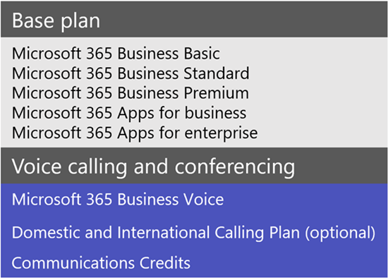
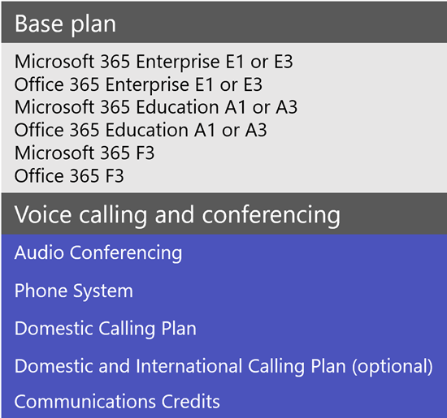
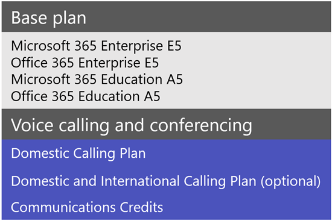

# Microsoft Teams add-on licenses

## What are add-on licenses?

Add-on licenses are licenses for specific Microsoft Teams features. They give you the flexibility to add features only for users in your organization who need them. To add a feature, buy one add-on license for each user who will use it.

## What features can I get with add-on licenses?

Here's a list of features that you can add with Teams add-on licenses. The add-on licensing options available to you depend on the Microsoft 365 or Office 365 plan you have.

|||||
|:-----|:-----|:-----|:-----|
|**Feature**   |**Description**   |**Small business (<300 users)**|**Large business (>300 users)**|
**Microsoft 365 Business Voice**   | Business Voice is a telephony solution designed for small and medium businesses of up to 300 users that bundles Phone System, Audio Conferencing, a Domestic Calling Plan, and more. Phone System capabilities that you'll get include voicemail, caller ID, call park, call forwarding, auto attendants, and call queues. To learn more, including availability in your country or region, see [What is Microsoft 365 Business Voice?](../business-voice/whats-business-voice.md). For pricing info, see [Pricing for Business Voice](https://go.microsoft.com/fwlink/?linkid=2127221).    |&#x2713;||
|**Audio Conferencing**   |Sometimes people in your organization will need to use a phone to call in to a Teams meeting instead their computer. Set up [Audio Conferencing](../audio-conferencing-in-office-365.md) for users who schedule or lead meetings.   To find out whether Audio Conferencing is available in your country or region, see [Country and region availability for Audio Conferencing and Calling Plans](../country-and-region-availability-for-audio-conferencing-and-calling-plans/country-and-region-availability-for-audio-conferencing-and-calling-plans.md). For pricing info, see [Pricing for Audio Conferencing](https://go.microsoft.com/fwlink/?linkid=799762).    |&#x2713;1|&#x2713;|
|**Toll free numbers** |If you want toll-free numbers for Audio Conferencing, auto attendants, or call queues, you must [set up Communications Credits](../set-up-communications-credits-for-your-organization.md).   |&#x2713;|&#x2713;|
|**Phone System**   |[Phone System](../what-is-phone-system-in-office-365.md) is a hosted telephone service that gives you call control and Private Branch Exchange (PBX) capabilities, with options for connecting to the Public Switched Telephone Network (PSTN). Phone System features include voicemail, caller ID, call park, call forwarding, auto attendants, call queues, call transfer, caller ID, and more. To learn more, see [Here's what you get with Phone System](../here-s-what-you-get-with-phone-system.md).    For pricing info, see [Pricing for Phone System](https://go.microsoft.com/fwlink/?linkid=79976).    |&#x2713;1|&#x2713;|
|**Calling Plans**   |If you want users to be able to call phone numbers outside your organization, get a [Calling Plan](../calling-plans-for-office-365.md). There are Domestic Calling Plans and Domestic and International Calling Plans. For pricing info, see [Pricing for Calling Plans](https://go.microsoft.com/fwlink/?linkid=799761 ).    |&#x2713;1|&#x2713;|
|**Microsoft Teams Rooms**   |[Microsoft Teams Rooms]](../rooms/index.md) isn't an add-on, but a feature that brings video, audio, and content sharing to conference rooms. See [Teams Meeting Room Licensing](../rooms/rooms-licensing.md).    |&#x2713;|&#x2713;|

1 If you're a small or medium-sized business who has a Microsoft 365 Enterprise licensing plan, you can still buy add-on licenses for these cloud voice features, however, we recommend that you consider a [Microsoft 365 business](https://www.microsoft.com/microsoft-365/compare-all-microsoft-365-products?&activetab=tab:primaryr2) plan and [Business Voice](https://www.microsoft.com/microsoft-365/business/business-voice).

## What calling and cloud voice add-on features are available with my plan?

See what add-on licenses you need to get calling and cloud voice features, depending on the plan you have. 

Depending on the add-on features that you want, we recommend comparing whether it's more cost effective for you to switch to a plan that includes those features already. For most large organizations, buying a bundle of software in a Microsoft 365 Enterprise plan will result in lower overall cost. Typically, when you buy several add-on licenses individually instead of as part of a plan, you may end up with a higher combined cost.

#### [**Business plans**](#tab/small-business/)

Here are the add-on options available to you if you have a [Microsoft 365 Business](https://www.microsoft.com/microsoft-365/compare-all-microsoft-365-products?&activetab=tab:primaryr2) plan. Keep in mind that Microsoft 365 Business Voice is designed for small and medium-sized businesses who have up to 300 users.

#### [**E1, E3, A1, A3, and F3 plans**](#tab/enterprise-1-3/)

Here are the add-on options available to you if you have any of these plans.  

To learn more about these plans, see Microsoft 365 E1, [Microsoft 365 E3](https://www.microsoft.com/microsoft-365/enterprise-e3-business-software), [Office 365 E1](https://www.microsoft.com/microsoft-365/business/office-365-enterprise-e1-business-software), [Office 365 E3](https://www.microsoft.com/microsoft-365/business/office-365-enterprise-e3-business-software), [Microsoft 365 A1](https://www.microsoft.com/education/buy-license/microsoft365), [Microsoft 365 A3](https://www.microsoft.com/education/buy-license/microsoft365), [Office 365 A1](https://www.microsoft.com/microsoft-365/academic/compare-office-365-education-plans), [Office 365 A3](https://www.microsoft.com/microsoft-365/academic/compare-office-365-education-plans), [Microsoft 365 F3](https://www.microsoft.com/microsoft-365/microsoft-365-enterprise-f3), and [Office 365 F3](https://www.microsoft.com/microsoft-365/business/office-365-f3).

#### [**E5 and A5 plans**](#tab/enterprise-5/)

These plans include most Teams features. There's a few additional options that you can add.

To lean more about what's included in these plans, see [Microsoft 365 E5](https://www.microsoft.com/microsoft-365/enterprise-e5-business-software), [Office 365 E5](https://www.microsoft.com/microsoft-365/business/office-365-enterprise-e5-business-software), [Microsoft 365 A5](https://www.microsoft.com/education/buy-license/microsoft365), [Office 365 A5](https://www.microsoft.com/microsoft-365/academic/compare-office-365-education-plans).  

* * *

## Need help?

Need to talk to someone about the add-on options? [Contact support for business products - Admin Help](https://support.office.com/article/32a17ca7-6fa0-4870-8a8d-e25ba4ccfd4b).

## Related topics

- [Assign Teams add-on licenses](assign-teams-add-on-licenses.md)
- [Manage user access to Teams](../user-access.md)
- [Teams service description](https://docs.microsoft.com/office365/servicedescriptions/teams-service-description)