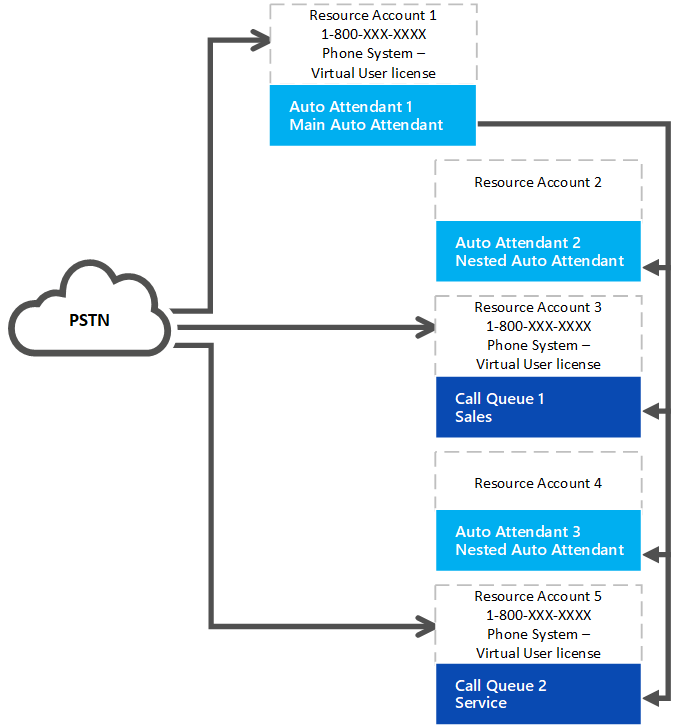

# Phone System — Virtual User license 

Starting July 2nd, 2019, an organization with Phone System licensed users can now obtain and assign either a free Phone System — Virtual User license or a paid Phone System user license to resource accounts. A Calling Plan is no longer required. All auto attendants or call queues require an associated resource account. Resource accounts that need a phone number need a free Phone System — Virtual User license or a paid Phone System user license before a phone number can be applied to the resource account.

> [!TIP]
> No license is needed for resource accounts that will be used with nested auto attendants or call queues that don't have a phone number assigned. See the following diagram for reference: 

## Virtual User license scaling

Your organization is allotted Phone System — Virtual User licenses depending on its overall size. There are 25 Virtual User licenses available to any organization that has at least one license that includes Phone System or has Phone System added. When you add 10 Phone System user licenses in your organization, one additional Phone System — Virtual User license becomes available.

> [!NOTE]
> Phone System is an add-on license available with Office 365 F1, E1, E3, and Office Premium licenses. Phone System is also included as part of Office 365 E5 licenses.

If your organization uses up the available free Phone System — Virtual User licenses in creating auto attendant or call queue nodes, you can still use the paid Phone system licenses with a resource account. Most organizations will have enough Virtual User licenses based on the scaling plan. 

### License scaling example

Contoso, Inc. purchased 600 Phone System licenses (one for each employee), so they are allotted an initial 25 and an additional 60 Phone System — Virtual User licenses. Contoso has a total of 85 Phone System — Virtual User licenses. Their organization has 90 call queues and auto attendants that have phone numbers, so they need to assign all the Phone System — Virtual User licenses and obtain 5 regular-priced Phone System licenses and assign them to the resource accounts linked to the remaining call queues and auto attendants requiring phone numbers. 

Contoso should consider redesigning the auto attendant and call queue system to use fewer phone numbers and more nested nodes that don't need a phone number or any license. Removing unecessary phone numbers will simplify the implementation and reduce costs. 

## How to acquire Phone System — Virtual User licenses 

1. Sign in to the Microsoft 365 admin center.
2. Go to **Billing** > **Purchase services** > **Add-on subscriptions**
3. Scroll to the end. You will see a **"Phone System — Virtual User"** license. Select **Buy now**.

> [!WARNING]
> Keep in mind you still need to **Buy** the license even though it has a cost of zero. 

## Change an existing resource account to use a Phone System — Virtual User license

If you decide to switch the licenses on your existing resource account from a Phone System license to a Phone System — Virtual User license, first you'll need to get the Phone System — Virtual User license, then follow the linked steps in the Microsoft 365 Admin center to [Move users to a different subscription](https://docs.microsoft.com/en-us/office365/admin/subscriptions-and-billing/assign-licenses-to-users?redirectSourcePath=%252farticle%252f997596b5-4173-4627-b915-36abac6786dc&view=o365-worldwide#move-users-to-a-different-subscription). 

> [!WARNING]
> Always remove a full Phone System License and assign the Phone System — Virtual User license in the same license activity. If you remove the old license, save the account changes, add the new license, and then save the account settings again, the resource account may no longer function as expected. If this happens, we recommend you create a new resource account for the Phone System — Virtual User license and remove the broken resource account. 

## Related information

[Auto Attendant and Call Queues Service Update](https://techcommunity.microsoft.com/t5/Microsoft-Teams-Blog/Auto-Attendant-and-Call-Queues-Service-Update/ba-p/564521)

[Manage resource accounts in Microsoft Teams](../manage-resource-accounts.md)
