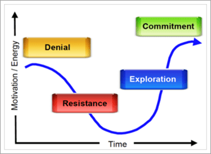

# How ready is your organization for Microsoft Teams?

Now that your project team has come together and you are beginning to see what Teams can do for your organization, it's important to assess your organization’s readiness for the Teams transition. To assess your readiness, you will need to:

1. Assess your stakeholders.
2. Identify early adopters.
3. Evaluate the organization's readiness for change. 

## Assess your stakeholders

List the core stakeholders and business leaders in your organization. For each individual, ask the following questions:
 
1. Is this leader friendly to new technology?
2. Rate this leader’s satisfaction with your current technology.
3. Is this leader willing to use unsanctioned technology to accelerate results or create a better experience for his/her team members?
4. Is this leader under a high degree of pressure to deliver key business results? 
5. Will this leader be willing to evangelize his/her experience with Teams to assist in the transition?
6. Does this leader have a positive relationship with key members of the existing project team?
7. Does this leader like to be viewed as an “agent of change” within the organization?  

You can add additional questions that are relevant to your organization. For your initial two phases (startup and experiment), you'll see leaders who are friendly to change, somewhat dissatisfied with current technology, and that you have a good relationship with. These leaders should be brought into the core project team as business advisors and may have projects that will be essential for your experimentation phase. It is important to select impactful, real world situations to experiment with, and avoid high risk projects for your initial experiments.
   
> [!NOTE]
> While it's possible to assign a score to this sort of questionnaire that would minimize the impact of the human element of relationships within your organization, driving change depends on the chemistry of the team as much as their technical skill or business acumen. Review this list with your team members to discuss the “fit” of your various leaders with this project as you select projects and staff for subsequent phases. 

## Identify early adopters

Early adopters share certain traits no matter what size or industry your organization may be. Typically, early adopters share these traits:

- Interested in technology
- Willing to be a part of change
- Seeking to make improvements
- Collaborative by nature
- Willing to share their observations and learnings with the group
- Are risk takers; that is, they're willing to try something to see if it works

Use a simple form in Office 365 to allow these individuals to opt into your early adopter program for Teams. Depending on the size and complexity of your organization, you may choose to enable some or all of these individuals for your experimentation phase. In this program, they are agreeing to actively participate in your experimentation phase and provide regular feedback to the project team. Avoid having individuals who simply want to test drive new technology. Let them know that by giving this active feedback, they are helping to craft the outcome of your project. You will use this list of people in [Phase 2 - experiment](teams-adoption-phase2-experiment.md).

Our Early Adopter Program Guide is a helpful resource for kicking off this program in your environment.  
 
## Assess your organization’s readiness for change

Change is a human process that has nothing to do with technology. There is behavioral psychology and neuroscience that educates us about the natural resistance to change. To make change acceptable, it's critical to anticipate the needs of your users, express your understanding of their situation, and create solutions that improve that situation. Even in doing so you will encounter natural resistance to change.  

Every organization approaches change differently, depending on region, work style, professional profile, and other elements of the organization. To assess your organization's readiness, see [Assess organizational change readiness](upgrade-org-change-readiness.md). Use the guidelines to answer the following questions:

1. What percentage of users fall into each bucket? (*Change resistance*)
    - **Early adopters**: request the solution before it's available.
	- **Informed users**: use the solution once its value is proven.
	- **Dissenters**: push back on any change.
	
   > [!TIP]
   > Early adopters make great pilot testers and peer champions. Users who are slow to adopt new tools require additional encouragement and more time to adjust. 

2. What is the users’ competency for change? (*Training*)
    - **Self starters** require only a link to a video.
    - **Team builders** do well with group training.
    - **One-to-one learners** require personal support.

    > [!TIP]
    > Tailor the type and amount of training to competency and personas. Keep training updated as new features come online.

3. In addition to this service deployment, how many other changes are happening? (*Adaptability*)  Changes could include Office/Windows upgrades, office moves, mergers, reorgs, and so on.
    - None
    - 1-3 changes
    - More than 3 changes
 
    > [!TIP] 
    > Too much change can impede acceptance and productivity. If more than 3 changes are underway, consider spacing them out or creating a theme to bundle changes together.  

Combine this data with the stakeholder profiles and employees who wish to opt in for the early adopter program. This will let you identify groups that are ready for and can absorb change alongside their existing duties. This method will allow you to create partners in change.

You can use internal champions to address the problem of having different change types. Here, feedback is the key to success: encourage people to share their challenges and needs. Embrace disrupters and dissenters by giving these individuals or groups a seat at the table during experimentation. This best practice will pave the way for a smoother broad deployment of your collaboration improvements.  

 Next: [Microsoft Teams adoption phase 2: Experiment](teams-adoption-phase2-experiment.md) 
