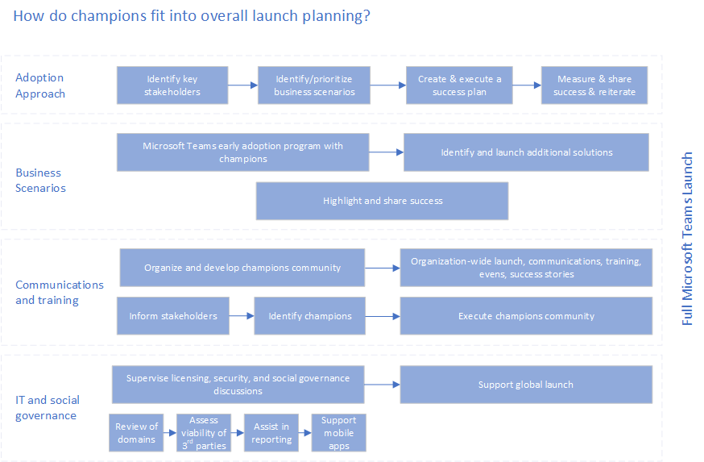

# Create your champions program for Microsoft Teams

Champions are essential to driving awareness, adoption, and education in your organization. A champion is a person, primarily motivated by helping others, who is interested in new technology (specifically Teams) and helping other employees use it in alignment with your best practices. Depending on the size of your organization you may have this as a formal part of the person’s role, but often employees take on this role themselves because of their core motivation to help others.

Champions will fit into your overall launch planning in a variety of ways as shown below.

Champions should:

- Be formally trained to increase their depth and breadth of knowledge
- Be encouraged and empowered to guide, teach, and train their peers
- Have consistent and positive reinforcement that affirms the impact of their efforts
- Have a clear plan to execute

Use our [Champions Program Guide](https://go.microsoft.com/fwlink/?linkid=854665) to build this program in your organization. Our best practices for this community are:

- Join the Office 365 Champions Program: Make sure that at a minimum the leaders of the champion program (and potentially all company champions) are members of the [Microsoft Office 365 Champion Program](https://aka.ms/O365Champions). This free, monthly community call will provide valuable information for running your own program and getting the most from Teams and other Office 365 services. Program materials can be reused in your own internal program.

- Use the Teamwork Champion team: Your champions should use the team you have setup for them for all program communications, feedback, and to find resources.  In doing this they will become increasingly familiar with the product and its benefits.

- Hold regular monthly meetings: Promote enthusiasm and cohesiveness of your community by holding regular monthly meetings. These can be a combination of in person and virtual meetings, but their consistency is key to having a thriving champions community.

    > [!TIP]
    > To help build your agendas, schedule your meetings for the week after the public community call. 

- Be clear about program requirements: Some champion programs require that members attend the monthly meetings, hold office hours for the group of users they support, and provide training to new users. Whatever your requirements, make sure that champions are clear on how to successfully participate in the program.

- Visibly reward your champions: Your champions will give you important insights into the progress and potential pitfalls of your project. Reward them often for their participation. Small gestures go a long way, and often employees are not looking for monetary gain but appreciate recognition for their contributions. Find appropriate and fun ways to thank your community. 

- Train champions early and often: Your program kick off and monthly meetings can be used to build skills in your champion community. Use these opportunities to bring them on board, conduct their initial training, encourage them to attend our courses, and make sure they are ready to support their employees as they move forward in the experimentation phase.  

 Next: [Complete the governance quick start](teams-adoption-governance-quick-start.md)

