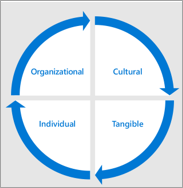
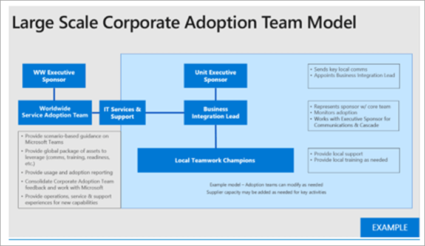

# Define outcomes and success for your Microsoft Teams adoption

For every business scenario or service you modernize, it is critical to define what success looks like for your business. You will have gathered that information for your initial scenarios as you mapped them in your prior phase. As you prepare for your scale implementation, you will need to revisit and expand these important success criteria.
  
What follows is a recommended strategy for mapping these criteria. There are many valid approaches to this step. You can follow our guide or follow the guide of the Microsoft partner you may be working with. Whatever method you choose, make sure that your business outcomes are supported by the technical implementation of your services and overall objectives of your organization.
  
There are four categories of outcomes that can be prioritized for your business. They are interconnected and form the foundation of the modernization and digital transformation that individual employees will experience.  

Example of outcomes in each category are:

- **Organizational**
   - Cultural transformation
   - Employee retention
   - Talent acquisition
   - Social engagement
   - Operational agility 

- **Cultural**
   - Employee sentiment
   - Employee recommendations
   - Customer feedback
   - Innovation measures (for example, idea forum contributions, hackathons, product innovation engagements)

- **Tangible**
   - Customer experience impacts (faster service, reduction in service incidents, customer referral/loyalty program participation)
   - Cost savings
   - Revenue generation
   - Data security
   - Process simplification
   - Retirement of legacy systems
   
- **Individual**
   - Use of desired tools
   - Employee morale
   - Employee productivity
   - Employee engagement
   - Idea generation
 
In general, you should think of these measures aggregating to create a change quotient for your company in this manner:

## Select a service enablement strategy

Teams is a transformative technology, so depending on the size of your organization and your existing technologies, you may take different approaches. Consider these strategies:

| Teams First | Teams Core | Teams Go Big | Skype Side by Side | Migration |
|------------ | ---------- | ------------ | ------------------ | --------- |
| Lead cloud deployment with Teams | Lead collaboration scenario enablement with Teams | All employees on Teams and organization-wide teams | Enable Teams and Skype for Business | Migrate users from Skype for Business to Teams |
| - Applicable to new or low usage Office 365 customers  - Lead with Teams in customer-specific scenario  - Highlight integrated user experience and accelerated time to value for Office 365  - Conduct planning workload enablement together to avoid serial implementation | - Enable Teams along with OneDrive and SharePoint Online  - Create a company intranet to share news resources and video with Microsoft Stream **Better together**:  Teams SharePoint Yammer Planner PowerApps |- For customers with less than 1000 seats (current limitation) - Enable cross organization collaboration with one team for all - Automate common tasks (vacation requests, employee surveys, executive engagement) |- Use Teams Core tactics to accelerate collaboration - Highlight meeting scenario guidance based on size and feature set required - Use Skype for Business for enterprise calling, interoperability, and hybrid scenarios - Use public roadmap for capability planning. |-	Plan move to Teams from Skype for Business by creating service strategy roadmap for the customer - Attach to feature release schedule - Recommend including Side by Side and Teams Core to ease transition

The following are our recommendations for most customer organizations. However, there are exceptions. To get guidance for any scenario not covered here, ask your questions in our Driving Adoption community or reach out to the FastTrack team or Microsoft partner network.

- **Choose Teams First or Teams Core**: Most organizations have an existing investment in Microsoft technology. You may be enabling more than one workload at a time, such as Exchange Online, OneDrive for Business, or SharePoint. In these cases, selecting Teams First or Teams Core is a wise choice. It will enable your users to get used to the enhanced collaboration experience of Teams. Your collaboration project team can then plan to roll out additional capabilities and the  training and support required for them to be successful. 

- **Choose Teams Go Big**: In new Office 365 customer organizations it is often best to take a Teams Go Big approach to minimize the change fatigue caused by learning new technology multiple times. You'll get the greatest benefit by enabling Teams for both core collaboration and meetings, SharePoint, OneDrive, Planner, and other workloads, and allowing your employees to learn about them in the context of your Teams deployment. 

    Teams Go Big is also the preferred enablement strategy for organizations under 1,000 employees who want to simplify their employee communication and engagement. Using the organization-wide team can bring people together to review common tasks and initiatives on any device. 

- **Choose Side by Side**: For organizations that are using Skype for Business for audio conferencing, support for conference room devices, or cloud voice capabilities, we recommend running Teams and Skype side by side to familiarize your employees with the core collaboration features, while planning your migration off of Skype for Business at a time that is convenient for your company. Note that running both clients side by side can introduce user confusion about which tool to use, so we recommend keeping this phase in your adoption journey short. 

- **Choose Migration**: Migrating from Skype for Business to Teams has additional components from a technical perspective, but the user adoption journey has the same components as a Teams Go Big implementation. In addition, you will be educating people about the Teams meeting experience and interface, the new persistent chat behavior, and other elements of the experience that are different from Skype for Business.

For each enablement strategy, it's essential to work closely with your technical readiness team to ensure that your environment will deliver a great employee experience. 

 Decision: Select an enablement strategy that will best support your business outcomes for Microsoft Teams and that can be enabled by your technical implementation team. This is a joint decision between IT leadership, program management leads, and user adoption specialists. This decision often rests with the executive stakeholder who is the ultimate success owner for Microsoft Teams or collaboration services in your organization.

Best Practice: Enablement strategies can be appropriate for a given phase of your project or divisional implementation schedule. Use key personas and their needs to make selections. Work closely with your technical implementation team to ensure a high-quality experience for your users.  

## Engage stakeholders

Communication and managing expectations are key elements in a successful change project. It's important to regularly communicate your overall vision and your progress toward that goal to your stakeholders and others in your organization. 

 Decision: Decide your rhythm and method for communicating with your stakeholders in alignment with your company culture. Target your communications to the various levels of engagement and interest across your organization. 

Option: To create an ongoing knowledge base of information about your project, consider using news pages in your SharePoint communication site. Your news page library (site pages in the SharePoint site associated with your planning team) can be made public so they can be shared with all interested parties.

## Expand your implementation team

In a large organization you should try to incorporate many different roles in your broad enablement phase. This may include additional business sponsors, IT support staff, additional members in your champion community, and in some cases formal change management or training personnel. The illustration below shows a large scale adoption team that allows for a separation of duties.

In a smaller organization one or more of these roles might be performed by a single individual, but the skills required remain the same.  Technical, communication and training skills are important in a successful change project. 

## Expand your governance and information management policies

Once you've selected your enablement strategy you'll be ready to revisit and scale governance decisions you made in Phase 1. Revisit decisions 1 through 6 from the [Governance quick start](teams-adoption-governance-quick-start.md) to expand these policies in alignment with the business users who will be using Teams. 

| Team level | Scope/purpose | Standard membership | Duration |
|----------- | ------------- | ------------------- | -------- |
|Level 1 | The authoritative team for a division or business unit | Usually restricted to official members of this division/unit | In perpetuity for as long as the division exists (for example, IT department, Human Resources, Marketing)|
| Level 2 | Project, service, or initiative teams with a smaller scope |  Normally cross-organizational and may include guests | For as long as that project or service is being worked on |
| Level 3 | Point in time projects | Small tight knit team with individual scope; may include guests | Short lifecycle tied to core deliverable |

Example team level provisioning and management best practices:

|Team level | Who creates? | Lavels and retention | Considerations |
| --------- | ------------ | -------------------- | -------------- |
| Level 1 - Divisional | IT or champion for that group to name it properly | Confidential with standard retention policy applied and 1 year renewal policy | Think of this like reserving a domain name. You want control of how division teams are named and what’s included.  Design the team before adding additional users.|
| Level 2 - Project/service | Project owner or champion | Confidential or highly confidential depending on content. May have a retention policy. 6 month renewal. | Before creating this, think just beyond the boundary of the project or service you are working on. Would it make more sense to combine forces with another team? Make every effort to minimize the number of teams individual users have to visit when working on the same project or service.|
| Level 3 – Small on-demand project team | Anyone in the organization | General label with standard retention and 6 month renewal. May include naming convention (prefix/suffix)| Self-service on demand teams. Frictionless provisioning. These facilitate smooth collaboration and communications for small project teams looking to get immediate value from company provided services. |

## Streamline business engagement

An essential part of driving digital transformation and usage in Microsoft Teams is working with your business units to understand what needs, opportunities, and difficulties they have. While similar to the traditional IT to business conversation, your focus should be on what is needed. Listen before moving to technical requirements. In many cases, out of the box features in Teams will meet the needs of your organization.   

Best practice: Before you consider developing a custom solution, be sure that your organization is fully using the out of the box capabilities of Office 365. Custom solution development always incurs long term cost for your IT and support departments.
 
Take the following steps to streamline your work with business units.  Recognize that in very large, multi-national corporations this process may continue long after your first large scale deployment of Microsoft Teams:

1. Meet with key influencers within a business unit before engaging the executive to gain insight and alignment.
2. Understand their current solutions for common scenarios (email, SharePoint, Yammer, and other products).
3. Start small by selecting scenarios that map to high impact, low/medium difficulty as you scale,
4. Capture feedback and develop champions with business unit knowledge to support the transition,
5. Set up monthly check points to discuss progress and prioritize the backlog of additional projects.

 Next: [Optimize feedback and reporting](teams-adoption-optimize-feedback-and-reporting.md)
