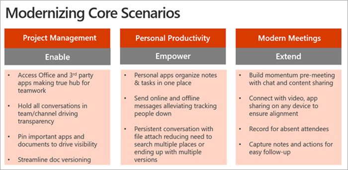
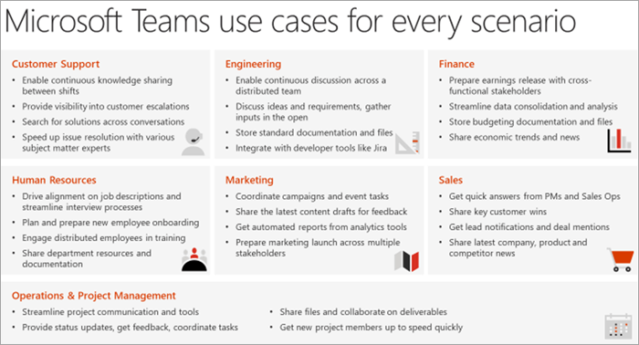
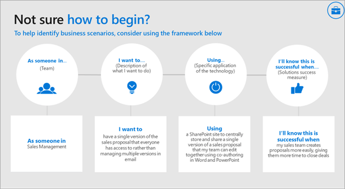
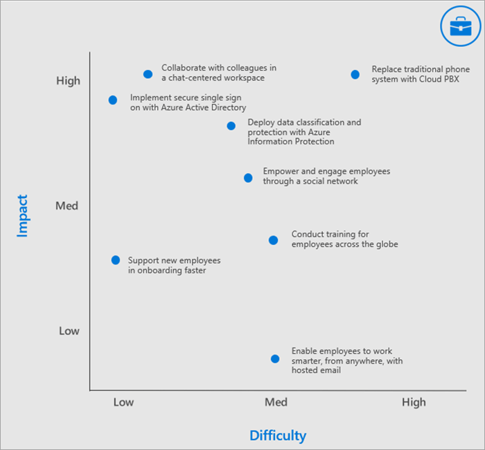

# Define usage scenarios for Microsoft Teams

Make sure that you understand the business projects (scenarios) that will be in scope for this phase of your implementation. Take a look at this list of example scenarios that are great candidates for an early adopter program. You can get started with easy wins such as:

- Personal productivity
- Modern project management
- Modern meetings

Additional scenarios to consider are:

- Employee engagement and communication
- Bring campaigns to market faster
- Increase sales productivity and grow revenue
- Streamline business reviews

Think of this scenario modernization motion as a cumulative process – get things going with more basic scenarios to create enthusiasm, familiarity, and credibility with this new way of working. Then move on to more ambitious areas of impact. As more impact with Microsoft Teams is demonstrated to your business colleagues, more of them will get engaged and momentum will build. For many of our customers, once they get this process going they find that business stakeholders approach them after learning how their colleagues got value from Microsoft Teams.

## Interview business stakeholders

To confirm the selection of these early projects we recommend meeting directly with the stakeholders you identified earlier in this process. Your goal at this point is to listen and learn additional information about their business. Consider the following questions to drive the conversation:

- What are some of the organization’s challenges or pain points related to communication and collaboration?
- What are the areas in which your organization would like to improve?
- What are the organization’s strategic initiatives or current transformation projects that Teams can support?
- What methods of communication and collaboration are typically better received by your organization than others?
- What is the process for drafting, distributing, and sharing information?

## Map and prioritize business scenarios

To be sure that you have the right information about the business scenario, consider using the following format to document the scenario from the perspective of the employee completing the work and the business owner of the process. Both perspectives are required to craft a successful path forward.

After speaking to one or more business stakeholders you can prioritize your scenarios based on impact vs. difficulty. (Your scenarios may be in addition to the scenarios we suggest above.) Appropriate candidates for your experimentation phase should have higher impact and low to medium difficulty. This will ensure your project isn't affected by scope creep or technical difficulties before you are able to show the value of your work. An example chart is shown below.

> [!Note]
> We are always eager to learn about how our customers use Teams in new an innovative ways. Share your #TeamsStories with us in our [Driving Adoption discussion forum]. Include the hashtag **#TeamsStories** in your post. We are always interested in how you use Teams in your organization.

 Next: [Onboard early adopters and gather feedback](teams-adoption-onboard-early-adopters.md).
