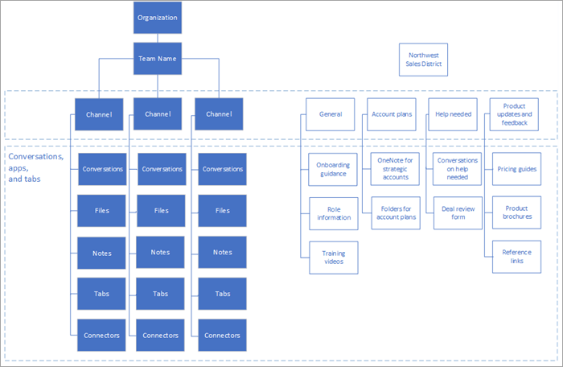

# Understand teams and channels in Microsoft Teams

The concepts of teams and channels are fundamental to a healthy, productive implementation of Microsoft Teams. 

- A team is a collection of people, content, and tools that work together to produce a business outcome for your company. Teams are built on Office 365 Groups, and changes to Office 365 group membership sync to the team. 

- Channels are the collaboration spaces within a team in which the actual work is done. 

To read more about teams and channels, see the [Overview of teams and channels in Microsoft Teams](teams-channels-overview.md). For comprehensive Teams adoption guidance, get the [Teams Adoption Guide](https:aka.ms/teamstoolkit). To learn more about Teams and Office 365 Groups, see [Office 365 Groups and Microsoft Teams](office-365-groups.md) and [Learn more about Office 365 Groups](https://support.office.com/article/Learn-about-Office-365-groups-b565caa1-5c40-40ef-9915-60fdb2d97fa2).

|  |  |
|---------|---------|
| View this short video   | <iframe width="350" height="200" src="https://www.youtube.com/embed/hjJWtoaRJeE" frameborder="0" allowfullscreen></iframe>   |

Team access types determine who can join a team:

- *Private* teams are restricted to team members approved by the team owner(s). This is a typical setting for project teams and virtual teams in a large organization.

- *Public* teams are open to anyone in the organization, and users can join them directly. Public teams are useful for collaboration on topics of general interest to people in different departments or to people who are working on different projects. This is a good default setting for smaller organizations.

## Use Teams to drive cross-organization collaboration

It's a best practice to use teams to improve cross-organization collaboration, and many projects will lend themselves to this model. In addition, leaders or divisions inside of an organization might want a dedicated team for their own people. Consider the organizational and project models shown in the following illustration.

In an organizational team (shown on the left), key information about the way that organization runs its business, team events, core strategies, and other operational information, such as business reviews, might be shared. For the team shown on the right, the district's information is broken down into channels that represent the categories of work that are being accomplished by that team. Members of this team may or may not report to the same person, but they are all engaged in driving the results for the district.
  
You will work more on the structure of your teams in [phase 2](teams-adoption-phase2-experiment.md) of your implementation.

 Next: [Create your first teams](teams-adoption-your-first-teams.md)
