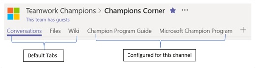

# Create your first teams in Microsoft Teams

The best way to drive adoption of Teams is to use the product. We recommend that you manage your Office 365 deployment with Teams. You should also create a community of employees who are focused on teamwork and productivity. (These initial teams may change over time.) Some suggested teams are:

| Team name | Proposed channel names |
| --------- | ---------------------- |
| Get to know Teams | General  Say hi  How do I? Feedback   Ideas for future teams   Support |
| Microsoft Teams Implementation | General   Awareness and Adoption   Business Engagement   Early Adopter Program   Feedback and Insights   Security and Compliance   Strategy and Planning   Service Health and Incidents   Training   Watercooler Chat |
| Teamwork Champions | General   Best Practices, Training, and How To   Champion Corner   Feedback and Support   Program Leads   Social Hub |

Within Microsoft Teams, the [tab gallery](https://docs.microsoft.com/en-us/microsoftteams/platform/concepts/tabs/tabs-overview) gives you access to all Office 365 and third-party apps that have been turned on by the administrator. To get the most value from your product, we suggest pinning key resources as tabs in each of the appropriate channels. See the example below.

In your initial teams, we suggest pinning the following items for easy reference in your team channels. These assets are in addition to your OneNote notebook sections. If you're working with our FastTrack team, they will assist you in configuring these first teams. 

|Team/Channel Name | Pinned Tab |
|----------------- | ---------- |
| **Microsoft Teams Deployment** ||
| General | Web tab: [Teams documentation](https://aka.ms/SuccessWithTeams) |
| Awareness and adoption | [Teams Adoption Hub](https://aka.ms/DriveTeamsAdoption) [Microsoft Teams Customer Success Kit](https://download.microsoft.com/download/A/E/9/AE984CD4-CF4B-41E7-9ABD-6735E3F01897/MicrosoftTeamsCustomerSuccessKit.zip)|
| Business engagement | Wiki – Engagement guidance Form – Request for Teams consultation List – Engagement requests |
|Early adopters | Pinned feedback community   OneNote for FAQ and common themes |
| Feedback and reporting | Pinned Office 365 usage report (for Office 365 admins only) |
| Security and compliance | Microsoft Trust Portal   [Security and compliance documentation](https://docs.microsoft.com/en-us/office365/securitycompliance/index)  [Roadmap](https://docs.microsoft.com/office365/securitycompliance/security-roadmap) |
| Strategy and planning | Collaboration North Star PowerPoint   Service Adoption Project Plan |
| Training | Custom learning training portal   [Teams online training](https://aka.ms/TeamsTraining) |
| **Teamwork Champions**|  |
| General | Use for program announcements   Pin champion program overview |
| Best practices | Best practices for teams, channels, and chats PowerPoint   Team lifecycle |
| Champion Corner | Meeting notes and presentations |
| Social Hub | RSS connector: Teams blog and driving adoption blog |
| Training and How To | Your training portal link |

## Making the switch to Microsoft Teams

As you begin to use Teams, it will be important for you and the rest of the project team to commit to using Teams chat, channels, and resources to run your project. Your own usage of Teams is critical to the quality of your adoption project. We recommend that you resist fragmenting your project by continuing to have conversations with the core project team in email. By switching to Teams you will model the behavior you ultimately want your employees to embrace. Set the tone, go first, and begin to enjoy having your project information in one place!  

 Next: [How ready is your organization for Microsoft Teams?](teams-adoption-assess-readiness.md)
