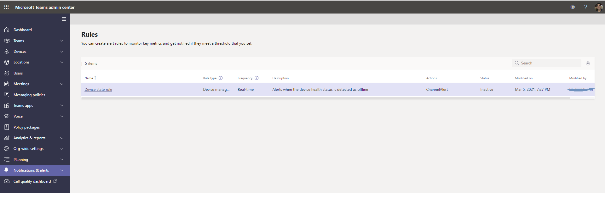
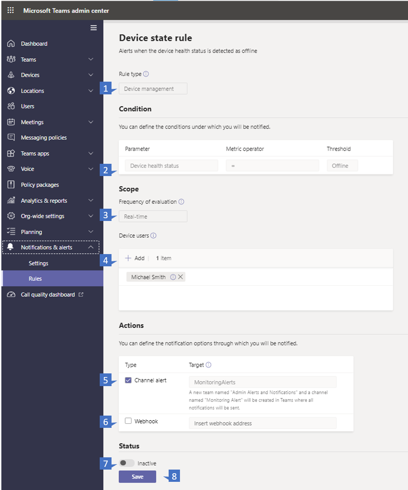
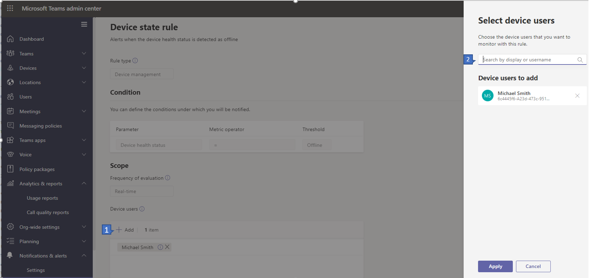
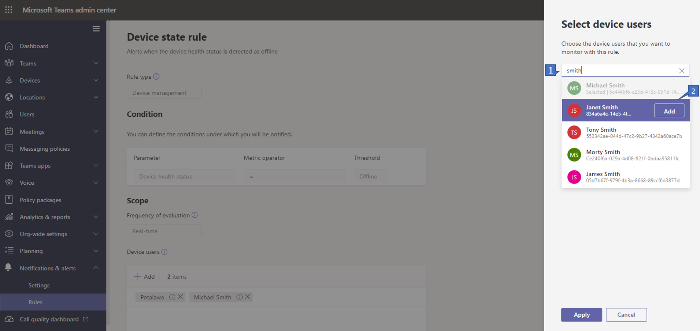
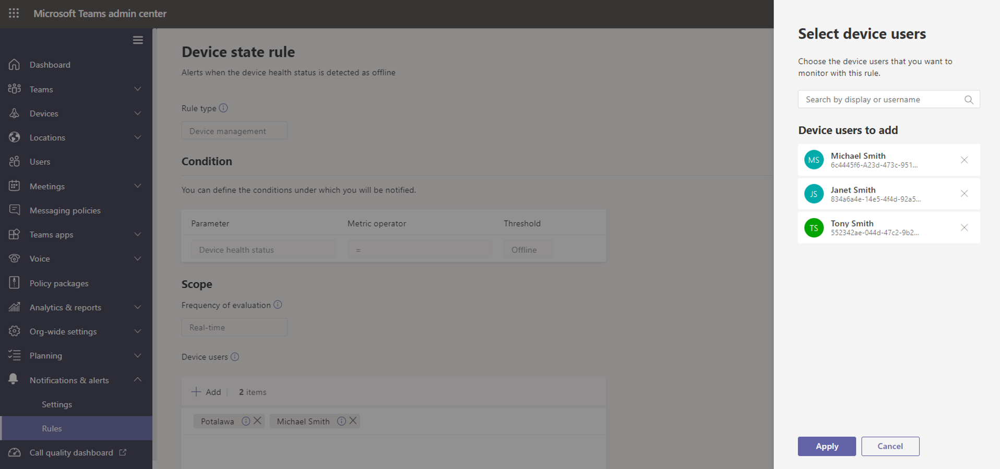
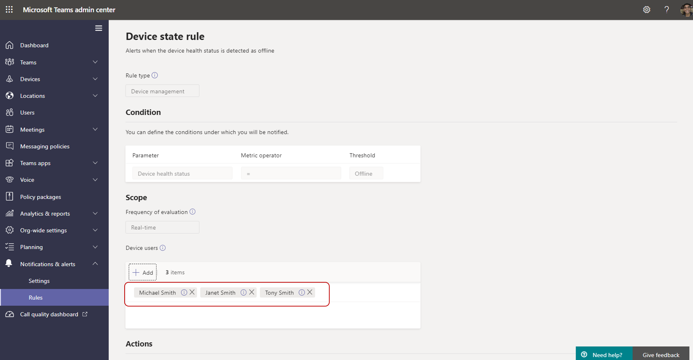
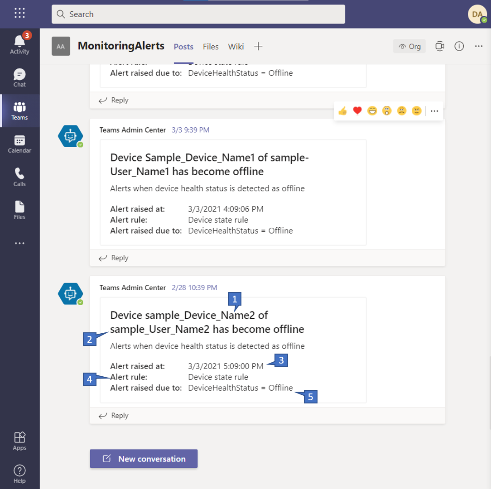

# Microsoft Teams device health monitoring

Device health monitoring in the Microsoft Teams admin center gives you an ability to proactively monitor the health of various Teams devices. With an ability to monitor the 'offline' state of a device,  you can get alerted in real-time if the monitored device in your organization goes offline.  

> **Prerequisite :**
> An admin configuring this rule should have teams/channel creation permissions in his tenant. [Learn More](https://docs.microsoft.com/en-us/microsoft-365/solutions/manage-creation-of-groups?view=o365-worldwide)

## Configure device state rule

1. In the left navigation of the Microsoft Teams admin center, click **Notifications & alerts** > **Rules**. On the **Rules** Page, select **Device state rule**.

    
    
2. Once clicked, the device state rule needs to be configured in detail before enabling it for alerts. Please follow the below guide to interpret each section. 

    

## Interpret the rule configuration
|Callout |Description  |
|--------|-------------|
|**1**   |The device state rule helps you effectively manage Teams devices and is classified as a device management type. In the future, more rules of device management type will be available to monitor other related capabilities (examples may include: unhealthy device, Sign-in status of device).|
|**2**   |You can monitor the health of devices if they go offline. [Learn more](https://docs.microsoft.com/en-us/microsoftteams/devices/device-management) about device management in Teams admin center. |
|**3**   |You can specify how frequently you want to monitor device health status by mentioning the rule evaluation frequency. By default teams devices will be monitored in near real-time if they go offline. |
|**4**   |You can specify which devices needs proactive offline statue monitoring by selecting them based on signed-in users. Please refer to [Select devices for configuration](#Select-devices-for-configuration) for more details. |
|**5**   |In the Actions section, you can specify teams channels you want to get alerts for. Currently, a default team named **'Admin Alerts and Notifications'** and channel named **'MonitoringAlerts'** will be created where notifications will be delivered to.     Global administrators and Teams administrators in your tenant will be automatically added to this default team.|
|**6**   |You can also get notifications via external webhook (optional). An external public webhook URL needs to be specified in the webhook section where a JSON notification payload will be sent.      The notification payload, via webhooks, can be integrated with other systems in your organization to create custom workflows.   **JSON payload schema for webhook:**    <pre lang="json">{      "type": "object",     "properties": {        "AlertTitle": { "type": "string "} ,       "DeviceLoggedInUserId": { "type": "string" } ,       "DeviceId": { "type": "string" } ,        "MetricValues": {              "type": "object",             "properties": {                   "DeviceHealthStatus": { "type": "string"}              }         } ,        "RuleName": { "type": "string"} ,        "RuleDescription": { "type": "string"} ,        "RuleFrequency": { "type": "string"} ,        "RuleType": { "type": "string"} ,        "TenantId": { "type": "string"} ,         "RuleCondition": { "type": "string"} ,         "AlertRaisedAt": { "type": "string"}      }  } </pre>   **Sample JSON payload** :    <pre lang="JSON">    {        "AlertTitle":"*sample_device_name* of *User_Name* has become offline",       "DeviceLoggedInUserId": *User_GUID* ,       "DeviceId": *Device_GUID* ,        "MetricValues": {           DeviceHealthStatus": "offline"              },                  "RuleName": "Device state rule" ,        "RuleDescription": ":"Alerts when device health status is detected as offline" ,        "RuleFrequency": "Real-time" ,        "RuleType": "Device Management" ,        "TenantId": *Tenant_GUID* ,         "RuleCondition": "DeviceHealthStatus = Offline" ,         "AlertRaisedAt": "2020-02-28T12:49:06Z"      }  </pre>   | 
 

## Select devices for configuration

1. You can select Teams devices you want to monitor by selecting users signed in to those devices. Click on **Add** in **Device users** section

    

2. Select one or more users for which you want to monitor device health state 

    

    

3. Selected list of users will be shows in **Device users** section. You can modify this list by adding or removing users.

    

4. All the sign-in devices used by the selected list of users will be monitored for the offline health state.

## Notifications in Teams client

The notifications will be delivered in the auto-created **MonitoringAlerts** channel of the **Admin Alerts and Notifications** Team.

Sample device offline notifications : 
    
   

## Interpret the device offline notifications 
|Callout |Description  |
|--------|-------------|
|**1**   |The device name that's offline. |
|**2**   |The user of the offline device. |
|**3**   |What time the device went offline. (Currently, the time is presented in UTC) |
|**4**   |The type of rule that raised the alert. |
|**5**   |Why an alert is raised. |
