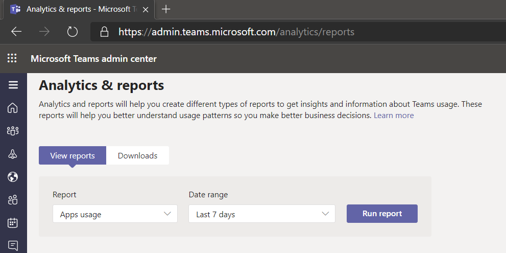
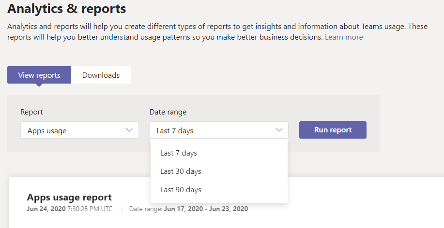
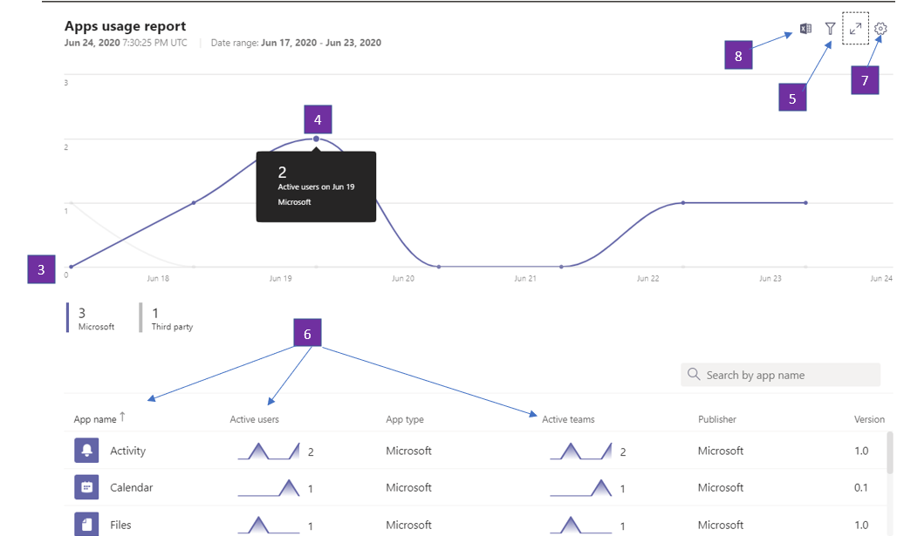
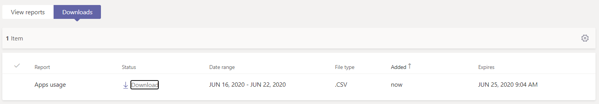

# Microsoft Teams app usage report

The Teams app usage report in the Microsoft Teams admin center provides you with information about which apps users are using in Teams.  

## View the App Usage report

1.  In the left navigation of the admin center at <https://admin.teams.microsoft.com>, click **Analytics & reports** \> **Usage reports**. On the **View reports** tab, under **Report**, select **Apps Usage**.

     :::image type="content" source="media/app-usage-report1.png" alt-text="Screenshot of the Usage Reports menu item":::

2.  Under **Date range**, select a range, and then click **Run report**.

      :::image type="content" source="media/app-usage-report2.png" alt-text="Screenshot of the Apps Usage report":::

## Interpret the report

|Callout |Description  |
|--------|-------------|
|**1**   |The Teams Apps usage report can be viewed for trends over the last 7, 30 or 90 days. |
|**2**   |Each report has a date for when the report was generated. The reports usually reflect a 24-hour latency from the time an app was opened.   |
|**3**    | <ul><li>The X axis on the charts is the selected date range for the specific report.</li><li>The Y axis is the number of users who for the given day hovered over in chart, those users have opened an app at least once and by doing so are considered an Active User and accrue towards the total seen on mouse hover over.</li></ul>|
|**4**   |Hover over the dot representing an Apps Usage on a given date to see the number of instances of that App’s Total Active Users on that given date.  |
|**5**   |All Apps will be included but by choosing the Filter icon, additional filters are available.  |
|**6**   |The table gives you a breakdown of active users and teams by App name. <ul><li>**App name** is the display name of the app used in Teams.</li><li>**Active users** is the number of users who opened the app at least once during the specified time period.</li><li>**App type** is a static value of either “Microsoft” or “Third Party”.</li><li>**Active teams** is the number of teams who have opened the App by at least one member of the team and during the specified time periods.</li><li>**Publisher** is the software publisher of the app.</li><li>**Version** is the software version of the app, from the app publisher.</li></ul><b> Note :</b> Currently, 'Active users' and 'Active teams' are calculated for apps used in channels only.     

   |
|**7**  |Select **Edit columns** to add or remove columns in the table.    |
|**8**  |You can export the report to a CSV file for offline analysis. Click **Export to Excel**, and then on the **Downloads** tab, click **Download** to download the report when it's ready.   |
|**9**   |When you view the report in Excel, you'll also see an **Id** column, which represents the app ID. A team ID is typically an alphanumeric string. If the **Id** column shows as **\n****, this means that a user requested their information to be deleted.   |

## Related topics

- [Teams analytics and reporting](teams-reporting-reference.md)