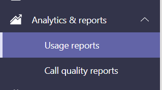

# Microsoft Teams app usage report

The Teams app usage report in the Microsoft Teams admin center provides you with information about which apps users are using in Teams.  

## View the App Usage report

1. In the left navigation of the admin center at <https://admin.teams.microsoft.com>, click **Analytics & reports** > **Usage reports**.  
2. On the **View reports** tab, under **Report**, select **Apps Usage**.

3. Under **Date range**, select a range, and then click **Run report**. The Teams Apps usage report can be viewed for trends over the last 7, 30 or 90 days.  

## Interpret the report

 

1. Each report has a date at the upper left that shows when the report was created. Reports usually reflect a 24-hour latency from the time an app was opened.
2. The Y axis on the chart is the number of users who for the date you selected by hovering over the chart are considered active users because the have opened an app at least once.
3. The X axis on the chart is the date range that you selected for the report.
4. Hover over the dot representing an app's usage on any date to see the total number of that app’s active users on that date.
5. To select other apps, at the upper right, click the **Filter** icon, select or type new criteria, and then click **Apply**.
6. The table at the bottom of the report shows active users and teams by app name. <ul><li>**App name** is the display name of the app used in Teams.</li><li>**Active users** is the number of users who opened the app at least once during the specified time period.</li><li>**App type** is a static value of either “Microsoft” or “Third Party”.</li><li>**Active teams** is the number of teams who have opened the app by at least one member of the team and during the specified time periods.</li><li>**Publisher** is the software publisher of the app.</li><li>**Version** is the software version of the app, from the app publisher.</li></ul><b> Note:</b> **Active users** and **Active teams** are calculated for apps used in channels only.
7. To add or remove columns in the table, at the upper right, click the **Edit columns** icon, on the **Edit columns** tab, select new criteria, and then click **Apply**.
8. To export the report to a CSV file for offline analysis, at the upper right, select the **Export to Excel** icon, and then on the **Downloads** tab under **Status**, click **Download**.  
9. When you view the report in Excel, you'll also see an **Id** column, which represents the app ID, typically an alphanumeric string. If the **Id** is **\n****, this means that a user asked that their information be deleted.  

## Related topics

- [Teams analytics and reporting](teams-reporting-reference.md)
