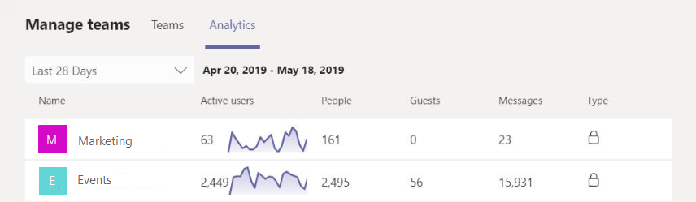
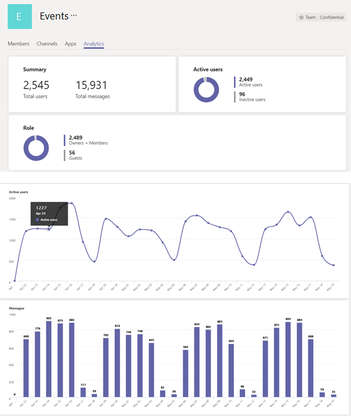

# View cross-team and per-team analytics in Teams

In Microsoft Teams, users can view analytics for teams that they are members or owners of. This information gives users insight into usage patterns and activity on their teams. They can see data such as the number of active users, guests, and messages in each team.

Cross-team analytics gives users a broad overview of usage data for all teams that they are a member or owner of in a single list view. This includes active user and message counts and trend lines for team activity.  

Per-team analytics gives users a more granular view of usage data for a specific team. This includes temporal-based charts for active user and message counts plus deeper breakdowns of user types and activity trends.

## View analytics for all teams that you're a member or owner of

1. In Teams, at the bottom of the teams list, next to **Join or create a team**, click **Manage teams**.
2. On the **Analytics** tab, select a date range to show usage data for all teams that you're a member or owner of.

    

    |Item |Description  |
    |--------|-------------|
    |**Name**   |Name of the team. |
    |**Active users**   |Number of active users on the team and trend line of team activity during the specified time period.
    |**People**   |Total number of people on the team in the specified time period. This includes team owners, team members, and guests.|
    |**Guests**   |Number of guests on the team during the specified time period. |
    |**Messages**   |Number of unique messages posted in team chat during the specified time period. |
    |**Type**   |Whether the team is a private team or public team.|

## View analytics for a team that you're a member or owner of

1. In Teams, go to the team that you want, click **More options (...)**, and then click **Manage team**.  
2. On the **Analytics** tab, select a date range to show usage data for that team.  

    

    |Item |Description  |
    |--------|-------------|
    |**Summary**   |Summary of team activity including the following:<ul><li>Total users on the team</li> <li> Total number of unique messages posted in team chat </li> </ul> |
    |**Active users**   |Number of active and inactive users on the team.|
    |**Role**   |Numbers of users on the team by role, including team owners, team members, and guests.|
    |**Active users** chart  |Number of active users on the team by date. Hover over the dot on a given date to see the number of active users on that date.|
    |**Messages** chart  |Number of unique messages posted in team chat by date. Hover over the dot on a given date to see the number of unique messages posted on that date.|
   

## Related topics

- [Teams analytics and reporting](teams-reporting-reference.md)
- [Teams usage report](teams-usage-report.md)
- [Teams user activity report](user-activity-report.md)
- [Teams device usage report](device-usage-report.md)
