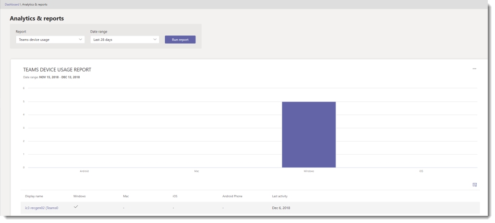

# Microsoft Teams device usage report

The Teams device usage report in the Microsoft Teams & Skype for Business Admin Center provides you with information about how users connect to Teams. You can use the report to see the devices that are used across your organization, including how many use Teams when on-the-go.  

## View the report

1. Go to the Microsoft Teams & Skype for Business Admin Center, in the left navigation, click **Analytics & reports**, and then under **Report**, select **Teams device usage**. 
2. Under **Date range**, select a range, and then click **Run report**. 

## Interpret the report

  ADD NEW SCREEN SHOT WITH CALLOUTS

|Callout |Description  |
|--------|-------------|
|**1**   |The Teams device usage report can be viewed for trends over the last 7 days or 28 days.  |
|**2**   |Each report has a date for when the report was generated. The reports usually reflect a 24 to 48 hour latency from time of activity. |
|**3**   |The X axis on the chart represents the different devices (**Windows**, **Mac**, **iOS**, **Android Phone**) used to connect to Teams. Hover over the bar representing a device to see the number of users using the device to connect to Teams. The Y axis is the number of users using the device over the selected time period.|
|**4**   |The table gives you a breakdown of device usage by user. <ul><li>**Display name** is the display name of the user. You can click the display name to go to the user's setting page in the Microsoft Teams & Skype for Business Admin Center. </li><li>**Windows** is selected if the user was active in the Teams desktop client on a Windows-based computer.</li><li>**Mac** is selected if the user was active in the Teams desktop client on a macOS computer. </li> <li>**iOS** is selected if the user was active on the Teams mobile client for iOS.</li><li>**Android phone** is selected if the user was active on the Teams mobile client for Android. <li>**Last activity** is the last date (UTC) that the user participated in a Teams activity.</li> </ul> To see the information that you want in the table, make sure to add the columns to the table. |
|**5**   |Select **Edit columns** to add or remove columns in the table. |
|**6**   |Select **˙˙˙**, and then **Print chart** to print the chart. |

## Related topics
- [Teams analytics and reporting](teams-reporting-reference.md)
- [Teams usage report](teams-usage-report.md)
- [Teams user activity report](user-activity-report.md)