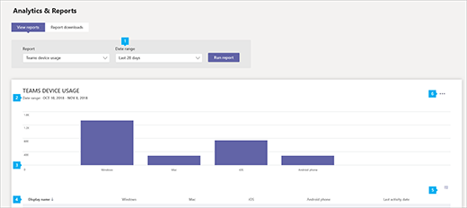

# Microsoft Teams device usage report

The Teams device usage report in the Microsoft Teams admin center provides you with information about how users connect to Teams. You can use the report to see the devices that are used across your organization, including how many use Teams from their mobile devices when on-the-go.  

## View the device usage report

You must be either a global admin, global reader, or Teams service admin to view reports in Teams admin center. See [Use Teams administrator roles to manage Teams](../using-admin-roles.md) to read about getting admin roles and permissions.

1. In the left navigation of the Microsoft Teams admin center, click **Analytics & reports** > **Usage reports**. On the **View reports** tab, under **Report**, select **Teams device usage**.
2. Under **Date range**, select a range, and then click **Run report**.

    

## Interpret the report

|Callout |Description  |
|--------|-------------|
|**1**   |The Teams device usage report can be viewed for trends over the last 7, 30, 90, and 180 days.  |
|**2**   |Each report has a date for when the report was generated. The reports usually reflect a 24-48 hour latency from the time of activity. |
|**3**   |<ul><li>The X axis on the chart represents the different devices (**Windows**, **Mac**, **Linux**, **iOS**, **Android Phone**, **Web**) used to connect to Teams. </li><li>The Y axis is the number of users using the device over the selected time period.</li> </ul>Hover over the bar representing a device to see the number of users using the device to connect to Teams.|
|**4**   |The table gives you a breakdown of device usage by user. <ul><li>**User name** is the display name of the user. You can click the display name to go to the user's setting page in the Microsoft Teams admin center. </li><li>**Windows** is selected if the user was active in the Teams desktop client on a Windows-based computer.</li><li>**Mac** is selected if the user was active in the Teams desktop client on a macOS computer. </li> <li>**Linux** is selected if the user was active in the Teams desktop client on a Linux computer. </li> <li>**iOS** is selected if the user was active on the Teams mobile client for iOS.</li><li>**Android phone** is selected if the user was active on the Teams mobile client for Android.</li><li>**Chrome OS** is selected if the user was active in the Teams desktop client on a ChromeOS computer.</li><li>**Web** is selected if the user was active on the Teams web client. <li>**Last activity** is the last date (UTC) that the user participated in a Teams activity.</li> </ul> Note that if a user account no longer exists in Azure AD, the user name is displayed as "--" in the table.   To see the information that you want in the table, make sure to add the columns to the table. |
|**5**   |Select **Edit columns** to add or remove columns in the table. |
|**6**   |Export the report to a CSV file for offline analysis. Select **Export to Excel** icon, and the report will be downloaded within your browser.|
|**7** |Time series data represented in the top graph show different usage metrics aggregated for the entire tenant|
|**8** |Tabular data represented in the botton half shows different usage metrics aggregated per user|

## Make the user specific data anonymous

To make the data in Teams user activity report anonymous, you have to be a global administrator. Global administrator can hide identifiable information (using MD5 hashes) such as display name, group name, email, and AAD ID in report and their export.

1. In Microsoft 365 admin center, go to the **Settings** \> **Org Settings**, and under **Services** tab, choose **Reports**.
    
2. Select **Reports**, and then choose to **Display concealed user, group, and site names in all reports**. This setting gets applied both to the usage reports in Microsoft 365 admin center as well as Teams admin center.
  
3. Select **Save changes**.

> [!NOTE]
> Enabling this setting will de-identify user, group & sitename information in [Teams user activity report](user-activity-report.md), [Teams device usage report](device-usage-report.md) and [Teams usage report](teams-usage-report.md) reports. Starting September 1, 2021, this setting is by default enabled for everyone as part of our ongoing commitment to help protect important information and enable companies support their local privacy laws. 
>This setting also applies to Microsoft 365 usage reports in Microsoft 365 admin center, Microsoft Graph and Power BI.

## Related topics

- [Teams analytics and reporting](teams-reporting-reference.md)
