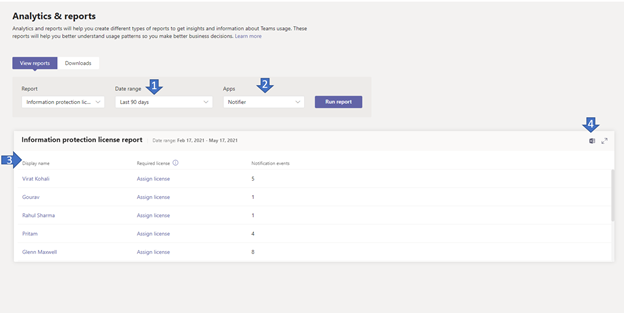

# Microsoft Teams Information protection license report

The Teams Info protection license report gives insight into the apps which has [subscribed](https://docs.microsoft.com/en-us/graph/api/resources/subscription?view=graph-rest-1.0) for [change notification](https://docs.microsoft.com/en-us/graph/api/resources/webhooks?view=graph-rest-1.0) events to listen to create, update or delete of messages at tenant level (i.e. /teams/getAllMessage or /chats/getAllMessages). A change notification corresponding to message is sent successfully only when user has the [required license](https://docs.microsoft.com/en-us/graph/teams-licenses).  You can see how many change notifications was triggered by a given user.

> **Note** : This report is currently available in private preview only.

## View the information protection License report report

You must be a Teams service admin to make these changes. See [Use Teams administrator roles to manage Teams](../using-admin-roles.md) to read about getting admin roles and permissions.

1. In the left navigation of the Microsoft Teams admin center, select **Analytics & reports** > **Usage reports**. On the **View reports** tab, under **Report**, select **information Protection License**.
2. Under **Date range**, select a range.
3. Under **Apps** select an app and then select **Run report**.

    

## Interpret the report

|Callout |Description  |
|--------|-------------|
|**1**   |The Information Protection License report can be viewed for trends over the last 7 days, 30 or 90 days. |
|**2**   |App Name will display list of all apps which has subscribed to change notification event of message in last n day as selected in date range. |
|**3**   |The table gives you a breakdown of usage by per user for the selected app.<ul><li>**Display name** is the display name of the user. Select the display name to go to the user details page in the Microsoft Teams admin center.</li><li>**Has Required License** is yes if user has one of the required license as define here. If user does not have required license, then Assign license link is displayed which navigated to user license detail page in Microsoft admin center[Users->Active Users->click on username].</li><li>**License Protected Events** is the number of unique change notification event sent to the app again a message which is created by that user.</li></ul> |
|**4**   |Export the report to a CSV file for offline analysis. Select **Export to Excel**, and then the **Downloads** tab, select **Download** to download the report when it's ready. |
|**5**   |Export the report to a CSV file for offline analysis. Select **Export to Excel**, and then the **Downloads** tab, select **Download** to download the report when it's ready.When you view the report in Excel, you'll also see an **Id** and **email** column, which represents the User ID and email address of the user. |

## Make the user-specific data anonymous

To make the data in Teams user activity report anonymous, you have to be a global administrator. This will hide identifiable information such as display name, email, and AAD ID in report and their export.

1. In Microsoft 365 admin center, go to the **Settings** \> **Org Settings**, and under **Services** tab, choose **Reports**.
    
2. Select **Reports**, and then choose to **Display anonymous identifiers**. This setting gets applied both to the usage reports in Microsoft 365 admin center and Teams admin center.
  
3. Select **Save changes**.
