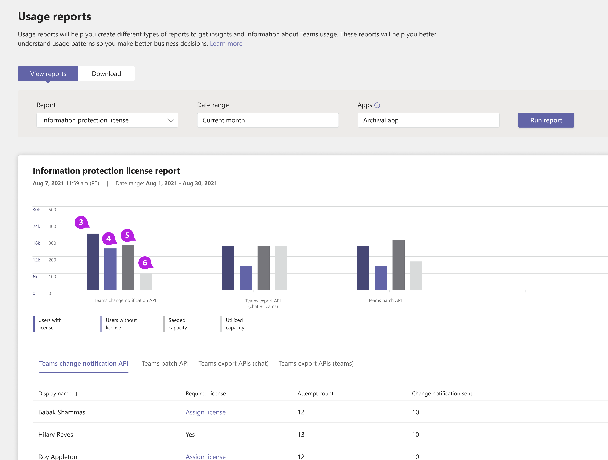
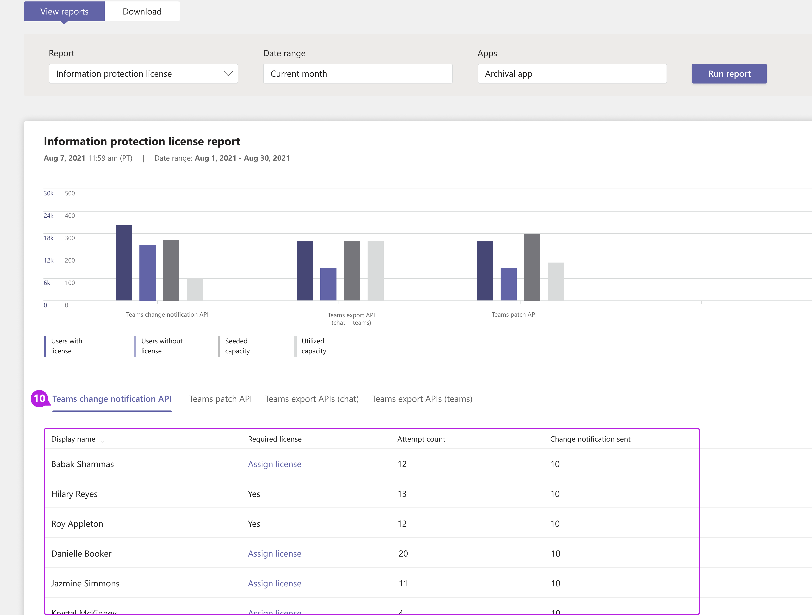

# Microsoft Teams information protection license report

Teams information protection license report gives API usage insight of [Microsoft Graph APIs that have license and payment requirements](/graph/teams-licenses). This report highlights all the apps that are using these APIs in [model=A](/graph/teams-licenses#modela-requirements). It does not show usage when APIs are used in [model=B](/graph/teams-licenses#modelb-requirements) or [evaluation mode](/graph/teams-licenses#evaluation-mode-default-requirements). 

## View the information protection license report

You must be a Teams service admin to make these changes. See [Use Teams administrator roles to manage Teams](../using-admin-roles.md) to read about getting admin roles and permissions.

1. In the left navigation of the Microsoft Teams admin center, select **Analytics & reports** > **Usage reports**. On the **View reports** tab, under **Report**, select **Information Protection License**.
2. Under **Date range**, select a range.
3. Under **Apps**, select an app and then select **Run report**.

    

4. For each category, metrics on users with license, users without license, seeded capacity, and utilized capacity can be viewed. 

    

5. The data can be exported by clicking on export button. The table data can be switched by clicking on the tabs for Teams change notification API, Teams patch API, Teams export APIs (chat), and Teams export APIs (teams). 

    

    

## Interpret the report

|Callout |Description  |
|--------|-------------|
|**1**   |The information protection license report can be viewed for trends over the last three months. |
|**2**   |App name will display a list of all apps that have used [Microsoft Graph API which has license and payment requirements](/graph/teams-licenses) during the selected time period.|
|**3**   |Number of users who have valid [licenses](/graph/teams-licenses#required-licenses-for-modela).  |
|**4**   |Number of users who do not have a valid [license](/graph/teams-licenses#required-licenses-for-modela).  |
|**5**   |Total API call volume allowed to an app beyond which a consumption fee per API call will be charged to the app. |
|**6**   |Total API call volume used by the app for the given date range. |
|**7**   |Export the report to a CSV file for offline analysis. Select **Export to Excel**, and then the **Downloads** tab. Select **Download** to download the report when it's ready. This export will export the currently selected tab only.|
|**8**   |Select any specific label to show or hide it in a chart. |
|**9**   |Each tab displays usage of a particular set of APIs, namely [change notification](/graph/api/resources/webhooks), [export API](/microsoftteams/export-teams-content), and [update message API](/graph/api/message-update). Select a tab to view usage details of that API. |
|**10**   |**Change Notification API Usage**<li>**Display Name** - Display name of the user against which a change notification was triggered.</li><li>**Required License** - Whether the given user has the required license to successfully send a change notification to the app.</li><li>**Attempted Count** - Total number of change notifications that were triggered because of this user.</li><li>**Change Notification Sent** - Total number of change notifications that were sent to the app. This will be less than the total change notifications triggered if the user doesn't have a valid license.</li>|
|**11**|**Patch API**<li>**Display Name** - Display name of the user where an attempt to update the message was done.</li> <li>**Required License** - Whether the given user has the required license for the message to get successfully updated.</li><li>**Attempted Count** - Total attempts to update messages.</li><li>**Message Patched** - Total messages that were successfully updated.</li>|
|**12**|**Chat Export API Usage**<li>**Display Name** - Display name of user where an attempt to export the user's chat message was done.</li><li>**Required License** - Whether the given user has the required license for the message to get successfully exported.</li><li>**Attempted Count** - Total attempts to export chat messages.</li><li>**Message Exported** - Total attempts where chat message was successfully exported.</li> |
|**13**|**Team Export API Usage**<li>**Display Name** - Display name of the team where an attempt to export that team's message was done.</li><li>**Attempted Count** - Total attempts to export team messages.</li><li>**Message Exported** - Total attempts where team message was successfully exported.</li> |

## Make the user-specific data anonymous

To make the data in the Teams user activity report anonymous, you have to be a global administrator. This will hide identifiable information such as display name, email, and Azure AD ID in reports and their exports.

1. In the Microsoft 365 admin center, go to **Settings** \> **Org Settings**, and under the **Services** tab, choose **Reports**.
    
2. Select **Reports**, and then choose to **Display anonymous identifiers**. This setting gets applied both to the usage reports in the Microsoft 365 admin center and the Teams admin center.
  
3. Select **Save changes**.