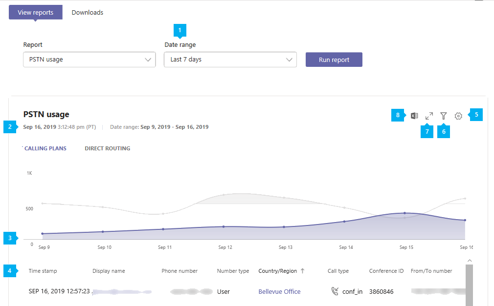
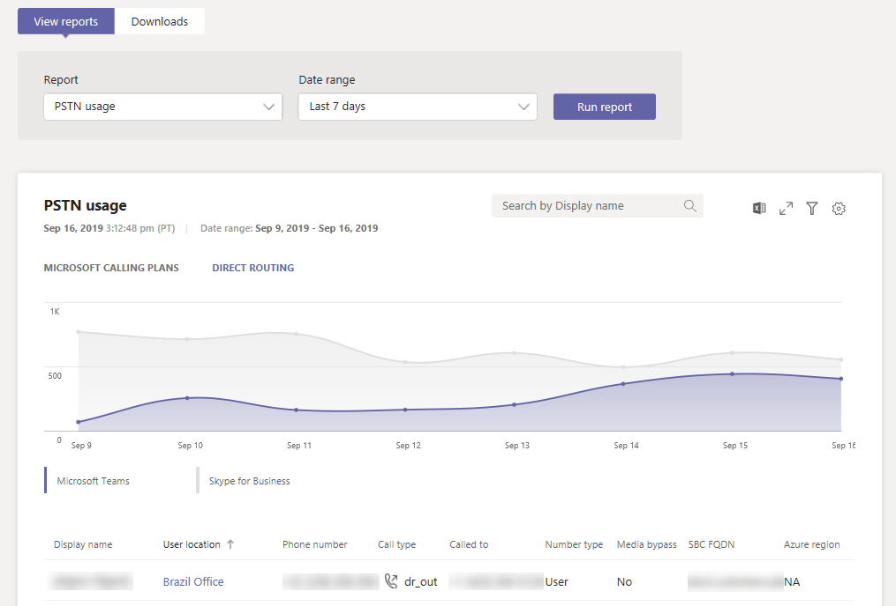

# Microsoft Teams PSTN usage report

The Teams PSTN usage report in the Microsoft Teams admin center gives you an overview of calling and audio conferencing activity in your organization. You can view detailed calling activity for Calling Plans if you use Microsoft as your telephony carrier and for Direct Routing if you use your own telephony carrier.

The **Calling Plans** tab shows information including the number of minutes that users spent in inbound and outbound PSTN calls and the cost of these calls. The **Direct Routing** tab shows you information including the SIP address and call start and end times. Use the information in this report to gain insight into PSTN usage in your organization and help you to investigate, plan, and make business decisions.

## View the report

1. In the left navigation of the Microsoft Teams admin center, click **Analytics & reports** > **Usage reports**. On the **View reports** tab, under **Report**, select **PSTN usage report**.
2. Under **Date range**, select a predefined range of 7 or 28 days, or set a custom range, and then select **Run report**.

## Interpret the report

### Calling Plans

|Callout |Description  |
|--------|-------------|
|**1**   |The report can be viewed for trends over the last 7 days, 28 days, or a custom date range that you set |
|**2**   |Each report has a date for when it was generated. The reports usually reflect a 24 to 48 hour latency from time of activity. |
|**3**   |The X axis is the selected date range for the specific report. The Y axis is the total number of calls over the selected time period.  Hover over the dot on a given date to see the total calls on that date.  |
|**4**   |The table gives you a breakdown of PSTN usage per call. <ul><li>**Time stamp (UTC)** is the time the call started.</li><li>**Display name** is the display name of the user. You can click the display name to go to the user's setting page in the Microsoft Teams admin center.</li><li>**Username** is the user's sign in name.</li><li>**Phone number** is the number that received the call for inbound calls or the number dialed for outbound calls.</li><li>**Call type** is whether the call was a PSTN outbound or inbound call and the type of call such as a call placed by a user or an audio conference. The calls types you may see include:  **Teams user call types**<ul><li>**user_in** - the user received an inbound PSTN call.</li><li>**user_out** - the user placed an outbound PSTN call</li><li>**user_out_conf** - the user added two or more PSTN participants to the call such as a three-way conference call</li><li>**user_out_transfer** - the user transferred the call to a PSTN number</li><li>**user_out_forwarding** - the user forwarded the call to a PSTN number</li><li>**conf_in** - an inbound call to the Audio Conferencing bridge</li><li>**conf_out** - an outbound call from the Audio Conferencing bridge usually to add a PSTN number to the conference</li></ul> **Teams bots call types**<ul><li>**ucap_in** - an inbound PSTN call to Teams bot such as auto attendant or call queue</li><li>**ucap_out** - an outbound PSTN call from a Teams bot such as auto attendant or call queue</li></ul> <li>**Called to** is the number dialed.</li><li>**To country or region** is the country or region dialed.</li><li>**Called from** is the number that placed the call.</li><li>**From country or region** is the country or region from where the call was placed.</li><li>**Charge** is the amount of money or cost of the call that's charged to your account. </li><li>**Currency** is the type of currency used to calculate the cost of the call. </li><li>**Duration** is how long the call was connected.</li><li>**Domestic/International** tells you whether the call was domestic (within a country or region) or international (outside a country or region) based on the user's location.</li><li>**Call ID** is the call ID for a call. It's a unique identifier for the call you can use when calling Microsoft Support.</li><li>**Number type** is the user's phone number type, such as a service of toll-free number. </li><li>**Country or region** is the usage location. </li> <li>**Conference ID** is the conference ID of the audio conference. </li><li>**Capability** is the license used for the call. The license types you may see include:<ul><li>**MCOPSTNPP** - Communications Credits</li><li>**MCOPSTN1** - Domestic Calling Plan (3000 min US / 1200 min EU plans)</li><li>**MCOPSTN2** - International Calling Plan</li><li>**MCOPSTN5** - Domestic Calling Plan (120 min calling plan)</li><li>**MCOPSTN6** - Domestic Calling Plan (240 min calling plan)</li><li>**MCOMEETADD** - Audio Conferencing</li><li>**MCOMEETACPEA** - Pay Per Minute Audio Conferencing</li></ul></li></ul> To see the information that you want in the table, make sure to add the columns to the table.|
|**5**   |Select **Edit columns** to add or remove columns in the table. |
|**6**   |Select **Filter** to filter the report by username or call type |
|**7**   |Select **Full screen** to view the report in full screen mode. |
|**8**   |You can export the report to a CSV file for offline analysis. Click **Export to Excel**, and then on the **Downloads** tab, click **Download** to download the report when it's ready.|

### Direct Routing

|Callout |Description  |
|--------|-------------|
|**1**   |The report can be viewed for trends over the last 7 days or 28 days. |
|**2**   |Each report has a date for when it was generated. The reports usually reflect a 24 to 48 hour latency from time of activity. |
|**3**   |The X axis is the selected date range for the specific report. The Y axis is the total number of calls over the selected time period. Hover over the dot on a given date to see the total calls on that date.  |
|**4**   |The table gives you a breakdown of PSTN usage per call. <ul><li>**Time stamp (UTC)** is the time the call started.</li><li>**Display name** is the display name of the user. You can click the display name to go to the user's setting page in the Microsoft Teams admin center. The name also can be name of a bot, for example the Call Queue or Cloud Auto Attendant </li><li>**SIP address** is the SIP address of the user or a bot who received or made the call.</li><li>**Caller number** is the number of the user or the bot who made the call. </li>><li>**Callee number** is the number of the user or the bot who recieved the call. On inbound to a Teams user call it will be the Teams user, on outbound from Teams user call it will be the PSTN User </li><li>**Call type** is whether the call was a PSTN outbound or inbound call and the type of call such as a call placed by a user or an audio conference. The calls types you may see include:  **Teams user call types**<ul><li>**dr_in** - the user received an inbound PSTN call</li><li>**dr_out** - the user placed an outbound PSTN call</li><li>**dr_out_user_conf** - the user added a PSTN participant to the call</li><li>**user_out_transfer** - the user transferred the call to a PSTN number</li><li>**dr_out_user_forwarding** - the user forwarded the call to a PSTN number</li><li>**dr_out_user_transfer** - the user transferred the call to a PSTN number</li><li>**dr_emergency_out** - the user makes an emergency call</li></ul> **Teams bots call types**<ul><li>**dr_in_ucap** - an inbound PSTN call to a Teams bot such as auto attendant or call queue</li><li>**dr_out_ucap** - an outbound PSTN call from a Teams bot such as auto attendant or call queue</li></ul> <li>**Called to** is the number of the user who received the call.</li><li>**Start time (UTC)** Time when the SIP proxy received the final answer (SIP Message  “200 OK”) from the SBC on outbound (Teams/Bot to a PSTN User) or after the SIP Proxy send the Invite to the next hop within Teams backend on inbound call (PSTN User to a Teams/Bot) </li><li>**Invite time (UTC)** When the initial Invite send on outbound from Teams user or bot call to the SBC or received on inbound to Teams or bot call by the SIP Proxy component of Direct Routing from the SBC.</li><li>**Failure time (UTC)** is the time the call failed. For failed calls only.Final SIP Code, Final Microsoft Subcode and Final SIP Phrase provide the reasons why call failed and can help with troubleshooting. </li><li>**End time (UTC)** is the time the call ended. (For successful calls only.)</li><li>**Duration** is how long the call was connected.</li><li>**Number type** is the user's phone number type, such as a service of toll-free number. </li><li>**Media bypass** indicates whether the trunk was enabled for media bypass </li> <li>**SBC FQDN** is the fully qualified domain name (FQDN) of the Session Border Controller (SBC). </li><li>**Azure region for Media** The datacenter that used for media path in non-bypass call. </li><li>**Azure region for Signaling** The datacenter that used for signaling for both bypass and non-bypass calls </li><li>**Event type** is the event type for the call. You'll see Success for successful calls and Attempt for failed calls. </li><li>**Final SIP code** is the code with which the call ended.</li><li>**Final Microsoft subcode** is a code that indicates specific actions that occurred.</li><li>**Final SIP phrase** is the description of the SIP code and Microsoft subcode.</li><li>**Coorelation ID** is a unique identifier for the call that you can use when calling Microsoft Support.</li><li>**Shared Coorelation ID** This field is only visible in the downloadable CSV file and does not exist in the portal. The shared correlation ID exists in at least two calls which are related. Please see detailed description below.</li></ul> To see the information that you want in the table, make sure to add the columns to the table.|
|**5**   |Select **Edit columns** to add or remove columns in the table. |
|**6**   |Select **Full screen** to view the report in full screen mode. |
|**7**   |Select **Export to Excel** to download the data in a comma separated file (CSV) for offline analysis or using as input for your billing system. |

**Caller/Callee fields conciderations**

Depends on the call direction the Caller or Calleee names can containg non-E164 numbers.

These fields can come form the custoemer SBC(s). There are three formats we see the SBC can send to Direct Routing: E.164, non-E.164 numbers and strings.

1. E.164 proper phone number from a user who has E.164 number to the user who also has it. 
2. Call from a non-E.164 number. A user from a third-party PBX interconnected with DR makes a call to  Teams user. In this case the caller number might be any non-E.164 number. For example,  +1001 . 
3. A spammer calls and doesn’t present the number, only the name. For example “Internal Revenue Service”. This string will be shown in the reports

**About Shared Correlation ID**

The Shared Correlated ID only exists in downloadable Excel and indicates that two or more calls are related. 
Below is the table that explains different scenarios and when Shared Correlation ID is present

1.	PSTN User 1 on a PSTN endpoint called Teams User 1 on Teams client, call type Dr_In, correlation ID	57f28917-42k5-4c0c-9433-79734873f2ac, no shared correlation ID
2.	Teams User 1 on Teams client called PSTN User 1 on a PSTN endpoint, call type	Dr_Out	2c12b8ca-62eb-4c48-b68d-e451f518ff4, no shared correlation ID
3.	PSTN User 1 on a PSTN endpoint called a Teams User 2 on Teams client, call type	Dr_In	f45e9a25-9f94-46e7-a457-84f5940efde9, shared correlation ID f45e9a25-9f94-46e7-a457-84f5940efde9
4.	Existing call 3 with correlation ID “f45e9a25-9f94-46e7-a457-84f5940efde9”. PSTN User 1 in a call with Teams User 2. Teams User 2 transferred (blind or consultative) a call to Teams or PSTN User, call type	Dr_Out_User_Transfer	45a1da7c-9e97-481a-8a05-3fe19a9a77e0, shared correlation ID	f45e9a25-9f94-46e7-a457-84f5940efde9

## Related topics

- [Teams analytics and reporting](teams-reporting-reference.md)
