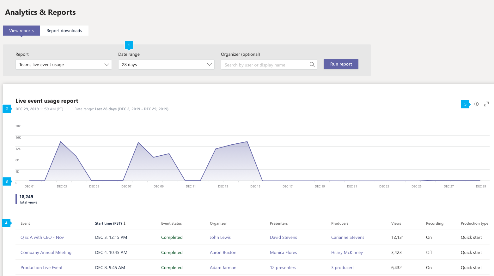
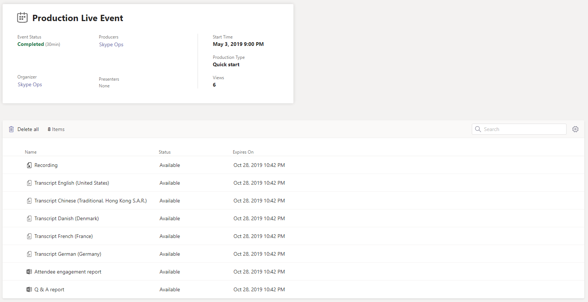

# Microsoft Teams live event usage report

The Teams live event usage report in the Microsoft Teams admin center shows you the activity overview for live events held in your organization. You can view usage information, including event status, start time, views, and production type for each event. You can gain insight into usage trends and see who in your organization schedules, presents, and produces live events. 

## View the report

1. In the left navigation of the Microsoft Teams admin center, click **Analytics & reports**, and then under **Report**, select **Teams live event usage**.
2. Under **Date range**, select a predefined range or set a custom range. You can set a range to show  data up to a year, six months before and after the current date.
3. (Optional) Under **Organizer**, you can choose to show only live events organized by a specific user.
4. Click **Run report**.  

## Interpret the report

|Callout |Description  |
|--------|-------------|
|**1**   |The Teams live event report can be viewed for trends over the last 7 days, 28 days, or a custom date range that you set. |
|**2**   |Each report has a date for when it was generated. The report reflects near real time activity when the page is refreshed. |
|**3**   |<ul><li>The X axis on the chart is the selected date range for the report.</li> <li> The Y axis is the total view count.</li> </ul>Hover over the dot on a given date to see the number of views across all live events on that date.|
|**4**   |The table gives you a breakdown of each live event. <ul><li>**Event** is the display name of the live event. Click the the event name to [get more details](#view-event-details) about the event. </li> <li>**Start Time** refers to the start date and time of the event.</li> <li>**Event Status** shows whether the event has taken place.  </li><li>**Organizer** is the name of the event organizer.</li> <li>**Presenters** are the names of the  event presenters.</li><li>**Producers** are the names of the event producers.</li><li>**Views** is the number of unique views.</li><li>**Recording** shows whether the recording setting is on or off.</li><li>**Production Type** shows whether the event is produced in Teams or by an external application or device.</li></li> </ul>Note that if a user account no longer exists in Azure AD, the user name is displayed as "--" in the table.   To see the information that you want in the table, make sure to add the columns to the table. |
|**5**   |Select **Edit columns** to add or remove columns in the table.|

## View event details

The live event details page gives you a summary of the details of a live event and lists all the files, including transcripts and recordings, associated with the event. Click a file name to view or download the file.

If your organization is enabled for [Hive](https://www.hivestreaming.com/partners/integration-partners/microsoft/)  eCDN or (Kollective)[https://kollective.com/] eCDN, you can get additional attendee analytics by clicking the partner report link.

## Related topics
- [Teams analytics and reporting](teams-reporting-reference.md)
- [What are Teams live events?](../teams-live-events/what-are-teams-live-events.md)