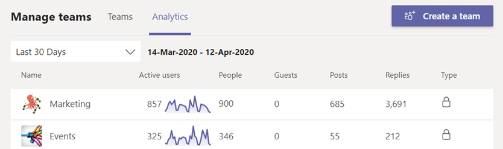
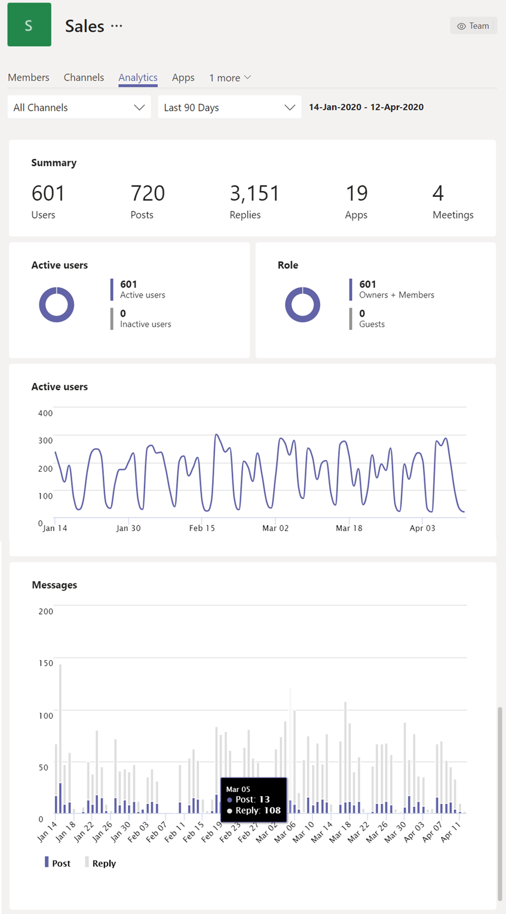
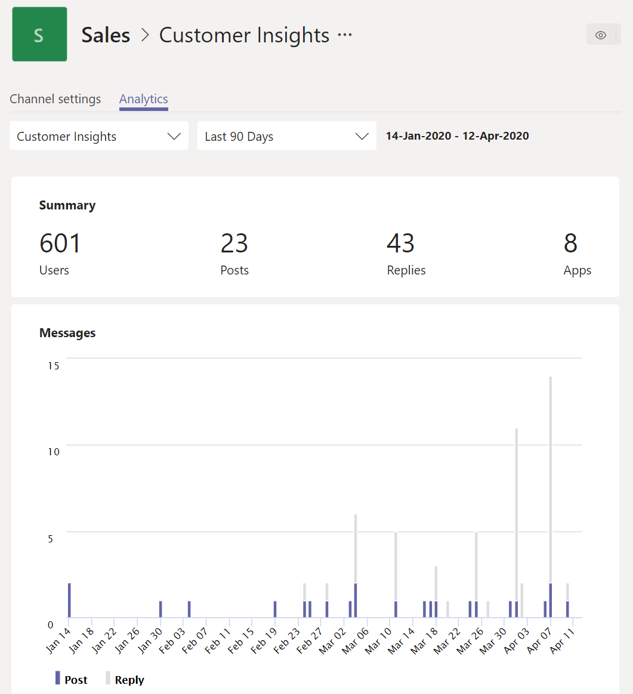

# View analytics in Teams

In Microsoft Teams, users can view analytics for teams and channels that they are part of. This information gives users insight into usage patterns and activity on their teams. Users can see data such as the number of active users, posts, replies, and more at three levels.

- **Cross-team analytics** gives users a broad overview of usage data for all teams that they are a member or owner of in a single list view.
- **Per-team analytics** gives users a more granular view, showing usage data for a specific team.
- **Per-channel analytics** gives users an even more granular view, showing usage data for a specific channel.

Users can filter any of these views to see data for a specified time period.

## View cross-team analytics

1. In Teams, at the bottom of the teams list, next to **Join or create a team**, click **Manage teams**.
2. Click the **Analytics** tab.
3. Select a date range to show usage data for all teams that you're a member or owner of.

    

    |Item |Description  |
    |--------|-------------|
    |**Name**   |Name of the team. |
    |**Active users**   |Number of active users on the team and trend line of team activity during the specified time period.
    |**People**   |Total number of people on the team in the specified time period. This includes team owners, team members, and guests.|
    |**Guests**   |Number of guests on the team during the specified time period. |
    |**Posts**   |Number of new messages posted in team chat during the specified time period. |
    |**Replies**   |Number of replies in team chat during the specified time period. |
    |**Type**   |Whether the team is a private team or public team.|

## View per-team analytics

1. In Teams, go to the team that you want, click **More options (...)**, and then click **Manage team**.
2. Click the **Analytics** tab.
4. Select a date range to show usage data for the team.  

    

    |Item |Description  |
    |--------|-------------|
    |**Summary**   |Summary of team activity including the following:<ul><li>**Users**: Total number of users in the specified time period. This includes team owners, team members, and guests.</li> <li>**Posts**: Number of new messages posted in team chat during the specified time period.</li><li>**Replies**: Number of replies in team chat during the specified time period.</li> <li>**Apps**: Number of apps added to the team.</li><li>**Meetings**: Number of Teams meetings organized at the team level.</li> </ul> |
    |**Active users**   |Number of active and inactive users.|
    |**Role**   |Numbers of users by role, including team owners, team members, and guests.|
    |**Active users** chart  |Number of daily active. Hover over the dot on a given date to see the number of active users on that date.|
    |**Messages** chart  |Total number of messages posted in team chat by date. Hover over the dot on a given date to see the number of new posts and replies posted on that date.|

> [!TIP]
> You can also view per-team analytics by clicking a team in list in the [cross-team analytics view](#view-cross-team-analytics).

## View per-channel analytics

1. In Teams, go to the channel that you want, click **More options (...)**, and then click **Manage channel**.
2. Click the **Analytics** tab.
3. Select a date range to show usage data for the channel.  

    

    |Item |Description  |
    |--------|-------------|
    |**Summary**   |Summary of channel activity including the following:<ul><li>**Users**: Total number of users in the specified time period. This includes team owners, team members, and guests.</li> <li>**Posts**: Number of new messages posted to the channel during the specified time period.</li><li>**Replies**: Number of replies in the channel during the specified time period.</li> <li>**Apps**: Number of apps added to the channel.</li> </ul> |
    |**Messages** chart  |Total number of messages posted to the channel chat by date. Hover over the dot on a given date to see the number of new posts and replies posted on that date.|

> [!TIP]
> You can also view per-channel analytics by selecting a channel in the drop-down list box in the [per-team analytics view](#view-per-team-analytics).
    
> [!NOTE]
> We define active users as users who perform an intentional action in the desktop client, mobile client, and web client. Examples of an intentional action include starting a chat, placing a call, sharing a file, editing a document within teams, participating in a meeting, and so on. We strip out passive actions like auto boot, minimizing a screen, or closing the app. We also de-dupe all actions across a single user ID.

## Related topics

- [View analytics for your teams](https://support.office.com/article/view-analytics-for-your-teams-5b8ad4b1-af34-4217-aff4-cd11a820b56b)
- [Teams analytics and reporting](teams-reporting-reference.md)