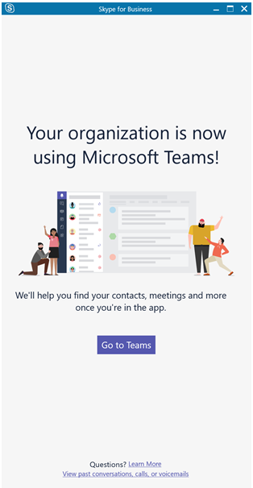
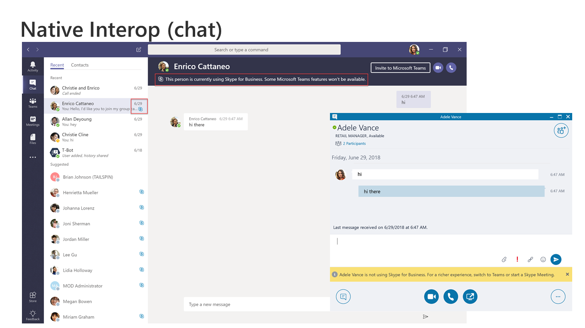
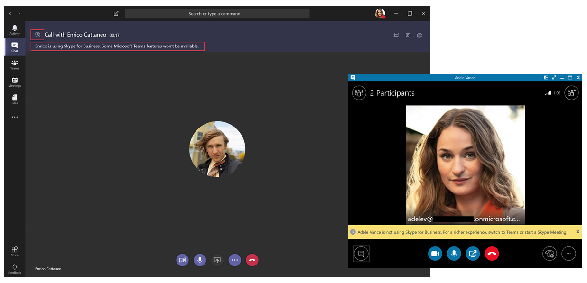

This article is part of the Project Definition stage of your upgrade journey, an activity you complete after you create a sponsorship coalition and project team and define the scope, goals, and vision for your project. Before proceeding, confirm that you’ve completed the following activities:

- [Enlisted your project stakeholders](upgrade-enlist-stakeholders.md)
- [Defined your project scope](https://aka.ms/SkypetoTeams-Scope)

# Understand Microsoft Teams and Skype for Business coexistence and interoperability

If your organization uses Skype for Business today and you intend to start using Teams alongside Skype for Business—or you intend to start upgrading to Teams—it’s important to understand how the two applications coexist, when and how they interoperate, and how to manage users’ migration all the way to their eventual upgrade from Skype for Business to Teams.

> [!Tip]
> Watch the following session to learn about [Coexistence and Interoperability](https://aka.ms/teams-upgrade-coexistence-interop)

## Coexistence of Teams and Skype for Business

In addition to collaboration capabilities, Teams delivers chat, calling, and meeting capabilities. Depending on how you choose to deploy Teams, these capabilities may overlap with the capabilities delivered by Skype for Business for a given user. The default mode is to run Teams alongside Skype for Business with the capabilities overlap; however, a user can be assigned one of several coexistence modes that were designed to ensure that these capabilities don’t overlap for that user (in which case interoperability between Teams and Skype for Business is available).

We recommend that you review the coexistence modes discussed below to help determine which path is right for your organization.

> [!Important]
> Introducing new technology or making changes to your existing, familiar Skype for Business environment, while delivering great new business benefits, can be disruptive for users. Take time to assess user readiness and implement a communication and training plan before you implement any of the changes outlined in this article. In addition, we strongly encourage you to pilot your plan with a selected group of users before implementing it across your organization.

### Islands mode

By default, users can run Teams alongside Skype for Business as two separate solutions that deliver similar and overlapping capabilities such as presence, chat, calling, and meetings. Teams users also can take advantage of new collaboration capabilities such as teams and channels, access to files in Office 365, and applications.

In this coexistence mode, called **Islands**, each of the client applications operates as a separate island. Skype for Business talks to Skype for Business, and Teams talks to Teams. Users run both clients at all times and can communicate natively in the client from which the communication was initiated. As such, there’s no need for interoperability in **Islands** mode.

To avoid a confusing or regressed Skype for Business experience, external (federated) communications, PSTN voice services and voice applications, Office integration, and several other integrations continue to be handled by Skype for Business.

> [!Important]
> In **Islands** mode, all messages from federated users (people outside your organization) are delivered to Skype for Business. After switching to **Teams Only** mode, all messages from outside your organization are delivered to Teams.

> [!Tip]
> Skype for Business Online customers recommended path is to start with the default **Islands** mode, drive Teams adoption saturation in the organization, and then move to **Teams Only** mode rapidly. On premises and hybrid customers may benefit from deploying the **Skype for Business with Teams collaboration** mode as a starting point rather than Islands, and progress from there to **Skype for Business with Teams collaboration and Meetings** mode, if appropriate, and to **Teams Only** mode when the organization is ready to adopt Teams.

### Skype for Business only

In this coexistence mode, users remain in Skype for Business—not Teams—for chat, meeting, and calling capabilities, and they don’t use Teams for teams and channels. This mode is available today; however, in the current implementation, teams and channels are not automatically turned off for the user. This can be achieved by using the App Permissions policy to hide teams and channels.

### Teams Only

A **Teams Only** user (also called an *upgraded* user) has access to all the capabilities in Teams. They may retain the Skype for Business client to join meetings on Skype for Business that have been organized by non-upgraded users or external parties. An upgraded user can continue to communicate with other users in the organization who are still using Skype for Business by using the interoperability capabilities between Teams and Skype for Business (provided these Skype for Business users are not in Islands mode); however, an upgraded user can't initiate a Skype for Business chat, call, or meeting.

As soon as your organization is ready for some or all users to use Teams as their only communications and collaboration tool, you can upgrade those users to **Teams Only** mode. If you are upgrading from Islands mode, we recommend that you first saturate Teams adoption throughout your organization before beginning the upgrade process. This avoids broken communication scenarios due to Islands mode not providing interoperability.

For additional considerations about moving to Teams Only mode, see [Teams Only mode considerations](teams-only-mode-considerations.md).

### Skype for Business with Teams Collaboration

Use this mode to introduce Teams in your environment while you continue to leverage your existing investment in Skype for Business. In this mode, you leave Skype for Business unchanged for chat, calling, and meeting capabilities, and you add Teams collaboration capabilities—teams and channels, access to files in Office 365, and applications. Teams communications capabilities—private chat, calling, and scheduling meetings—are off by default in this mode. Organizations with a starting point of Skype for Business server on premises or hybrid should consider this mode as an alternative to Islands mode if they want to give their users interoperability and predictability for their communications.

### Skype for Business with Teams Collaboration and Meetings

Use this coexistence mode to accelerate the availability of Teams meeting capabilities in your organization, in addition to its collaboration capabilities, enabling your users to take advantage of the superior Teams meetings experience-great quality, innovative capabilities such as transcription and translation or background blurring, and superior user experience across all platforms, including mobile devices and browsers.

Along with using Teams for teams and channels–based conversations in this mode, users will use Teams to schedule and conduct their meetings. Private chat, and calling remain on Skype for Business. Teams and Skype for Business benefit from a range of “better together” capabilities, such as presence reconciliation, automatic hold/unhold, and HID device support across both applications. 

This coexistence mode is especially useful for users in Skype for Business on-premises deployments with enterprise voice, who are likely to take some time to be upgraded to Teams and want to benefit from the superior Teams meetings as soon as possible.

> [!Note]
> When deployed in specific coexistence modes, Teams and Skype for Business can [interoperate](#interoperability-of-teams-and-skype-for-business), enabling users to chat with and call one another, and ensuring that communications remain fluid across your organization during your upgrade journey to Teams. Coexistence modes govern interoperability. The coexistence mode of the receiver determines whether interoperability will be available. For example, if the receiver is in a mode in which chat is only available in one client (say, Teams), chat interoperability will generally be available in case the initiator uses the other client (in this case, Skype for Business) to start the chat. On the other hand, if the receiver is in a mode in which chat is available in both clients (Islands mode), interoperability won’t be available for the chat. The message will be received by the receiver in the same client in which the initiator started the chat. Therefore, proper communication in Islands mode requires Teams adoption saturation; that is, all users actively using and monitoring both clients.

For more details about coexistence modes, prerequisites, and management, see [Migration and interoperability guidance for organizations using Teams together with Skype for Business](https://aka.ms/SkypeToTeams-Interop) and [Setting your coexistence and upgrade settings](https://aka.ms/SkypeToTeams-SetCoexistence).

| | | |
|---|---|---|
||Decision point|<ul><li>Which coexistence mode(s) best fit your organization’s and users’ needs?</li></ul>|
||Next step|<ul><li>Choose the best approach for your upgrade journey.</li></ul>|

## Interoperability of Teams and Skype for Business

Interoperability is the ability for Teams and Skype for Business users in the same organization to communicate across Teams and Skype for Business.

### Native interop and interop escalation

There are two types of interop experiences: native and interop escalation.

- A _native interop_ experience occurs in the client that the user is currently using. One user will be in the Skype for Business client, the other in Teams. A native interop experience won’t take them to another client to communicate, the users will be able to conduct their conversation in the client they’re currently using. The native interop experiences are one-to-one chat and calling.
- An _interop escalation_ experience means that as part of helping users perform an advanced action (such as sharing their desktop), the client facilitates the creation of a meeting which users can join to continue the experience in that meeting. The meeting is created on the platform of the initiator of the action. The user or users who aren’t on that platform receive a meeting join link. As they click this link, they are joined to the meeting in a compatible client (browser, web app, or full client, depending on configuration). Interop escalation from Skype for Business requires a recent client. Interop escalation from Teams is coming soon.

### Native interop experiences

Depending on the coexistence modes assigned to users (as described above), the following native interop experiences are available:

- Skype for Business users can chat one-on-one with Teams users, and vice versa. An interop chat needs to go through an interop gateway that’s part of Teams cloud services (and therefore only exists online). Interop chats are plain text: rich text and emoticons aren’t supported. Users in Teams and in Skype for Business are notified that the conversation is an interop conversation.

    

- Skype for Business users can make one-on-one voice and video calls to Teams users, and vice versa.

    

> [!Important]
> Interop experiences with an on-premises deployment of Skype for Business require that the on-premises environment is in hybrid mode with Office 365 Skype for Business. For details, see [Migration and interoperability guidance](https://aka.ms/SkypeToTeams-Interop).

These interop experiences are available to and between users who have one of the following coexistence modes assigned: **Skype for Business with Teams Collaboration**, **Skype for Business with Teams Collaboration and meetings**, **Skype for Business Only**, or **Teams Only**. There is no interoperability to users in Islands mode.

### Native interop experience limitations

Some features aren’t available for the interop chat and interop calling experience between Teams and Skype for Business:

- Markdown, rich text, and the full emoticon set aren’t supported either from Teams or Skype for Business. Other native features of the compose box in Teams chats aren’t supported.
- Screen sharing (desktop or app sharing) between Teams and Skype for Business isn’t supported.
- Group chats (multiple-party conversations) in Teams can only include participants who are using Teams.
- Multiple-party IM conversations (group chats) in Skype for Business can only include participants who are using Skype for Business.
- Escalating an ongoing peer-to-peer voice or video call to a multiple-party call involving both Teams and Skype for Business users isn’t supported.
- File transfer for two-party chats, or file attachment in group chats, from Teams to Skype for Business—and vice versa—aren’t supported.
- There is no interoperability with Skype for Business Persistent Chat.

For all these limitations (except for Persistent Chat), one possible workaround is for one user to start a meeting and invite the other user to join it. This workaround is the basis for interop escalation.

After you review this article, see [Choose your upgrade journey](upgrade-and-coexistence-of-skypeforbusiness-and-teams.md), [Migration and interoperability guidance](https://aka.ms/SkypeToTeams-Interop), [Coexistence with Skype for Business](coexistence-chat-calls-presence.md), and [Setting your coexistence and upgrade settings](https://aka.ms/SkypeToTeams-SetCoexistence) for implementation details.

## Related Links

[Video: Manage Coexistence and Interoperability between SfB and Teams](https://www.youtube.com/watch?v=wEc9u4S3GIA&list=PLaSOUojkSiGnKuE30ckcjnDVkMNqDv0Vl&index=11)
