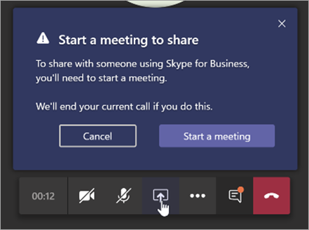

# Understand Microsoft Teams and Skype for Business coexistence and interoperability

This article is part of the Project Definition stage of your upgrade journey. Complete after you create a sponsorship coalition and project team and define the scope, goals, and plan for your project. Before proceeding, confirm that you've completed the following activities:

- [Enlisted your project stakeholders](upgrade-enlist-stakeholders.md)
- [Defined your project scope](./upgrade-define-project-scope.md)

If your organization uses Skype for Business today and you are starting to use Teams alongside Skype for Business—or you are starting to upgrade to Teams—it's important to understand how the two applications coexist, when and how they interoperate, and how to manage your users' migration all the way to their eventual upgrade from Skype for Business to Teams.

> [!Tip]
> Watch the following session to learn about [Coexistence and Interoperability](https://aka.ms/teams-upgrade-coexistence-interop).
>
> Additionally, you can join us for live, interactive workshops in which we'll share guidance, best practices, and resources designed to kick start upgrade planning and implementation.
>
> Join the [Plan your upgrade](./upgrade-workshops-landing-page.yml) session first to get started.

## Coexistence of Teams and Skype for Business overview

The following sections describe the coexistence modes that are available when you decide to upgrades to Teams, and the capabilities each mode offers. In addition, we describe the interoperability (interop) that occurs between users on Skype-for-Business clients and users on Teams clients, and how interop is affected by the chosen coexistence mode.

Teams delivers collaboration capabilities, chat, calling, and meeting capabilities. Depending on how you choose to deploy Teams, these capabilities might overlap with the capabilities delivered by Skype for Business for a given user. The default mode is to run Teams alongside Skype for Business with the capabilities overlap. However, a user can be assigned one of several coexistence modes (also known as upgrade modes) that were designed to ensure that these capabilities don't overlap for that user (in which case interoperability between Teams and Skype for Business is available). For example, if you have significant Skype for Business Server on-premises assets with a complex Enterprise Voice deployment, but want your users to enjoy modern meetings as quickly as possible, you might want to evaluate [Meetings First](meetings-first.md) as an alternative path.

We recommend that you review the following coexistence modes to help determine which path is right for your organization.

> [!Important]
> Coexistence modes continue to exist after retirement of Skype for Business Online, however users homed online can only have a mode of TeamsOnly. It is no longer possible to assign any mode other than TeamsOnly to a user homed online.  As was the case prior to retirement of Skype for Business Online, users homed on-premises can be assigned any mode *other than TeamsOnly*.

### Islands mode

By default, users can run Teams alongside Skype for Business as two separate solutions that deliver similar and overlapping capabilities. The capabilities include presence, chat, calling, and meetings. Teams users also can take advantage of new collaboration capabilities such as teams and channels, access to files in Microsoft 365, and applications.

In this coexistence mode, called **Islands**, each of the client applications operates as a separate island. Skype for Business talks to Skype for Business, and Teams talks to Teams. Users are expected to run both clients at all times and can communicate natively in the client from which the communication was started. As such, there's no need for interoperability in **Islands** mode.

To avoid a confusing or regressed Skype for Business experience, the Skype for Business handles the following integrations that aren't handled in Teams **Islands** mode:

- External (federated) communications.
- PSTN voice services and voice applications, Office integration.
- HID controls for USB devices.
- Several other integrations.

Phone System isn't supported in Teams in **Islands** mode. **Islands** mode doesn't support Enterprise Voice client is Skype for Business.

> [!Important]
> In **Islands** mode, all messages and calls from federated users (people outside your organization) are delivered to Skype for Business. After upgrading to **Teams Only** mode, all messages and calls from outside your organization are delivered to Teams.

### Teams Only

A **Teams Only** user (also called an *upgraded* user) has access to all the capabilities in Teams. They may retain the Skype for Business client to join meetings on Skype for Business that have been organized by non-upgraded users or external parties. An upgraded user can continue to communicate with other users in the organization who are still using Skype for Business by using the interoperability capabilities between Teams and Skype for Business (provided the Skype for Business users are not in **Islands** mode). However, an upgraded user can't initiate a Skype for Business chat, call, or meeting.

As soon as your organization is ready for some or all users to use Teams as their only communications and collaboration tool, upgrade those users to **Teams Only** mode. If you're upgrading from **Islands** mode, we advise that you first saturate Teams adoption throughout your organization before beginning the upgrade process. This adoption avoids broken communication scenarios due to **Islands** mode not providing interoperability.

When in **Teams Only** mode, Teams is the default app for the SIP/Tel protocol. Links in a user's contact card in Outlook for calling or chat will be handled by Teams.

For extra considerations about moving to **Teams Only** mode, see [Teams Only mode considerations](teams-only-mode-considerations.md).

### Skype for Business only

In this coexistence mode, users remain in Skype for Business—not Teams—for chat, meeting, and calling capabilities, and they don't use Teams for teams and channels. This mode is available today; however, in the current implementation, teams and channels are not automatically turned off for the user. This can be achieved by using the App Setup policy to hide teams and files.

This mode can be used prior to starting a managed deployment of Teams to prevent users from starting to use Teams ahead of having built readiness. This mode is also a way to enable authenticated participation in Teams meetings for Skype for Business users, provided the users are licensed for Teams.

### Skype for Business with Teams Collaboration

Use this mode to introduce Teams in your environment while you continue to use your existing investment in Skype for Business. Leave Skype for Business unchanged for chat, calling, and meeting capabilities. Add Teams collaboration capabilities:

- Teams and channels.
- Access to files in Microsoft 365 or Office 365.
- Applications. Teams communications capabilities—private chat, calling, and scheduling meetings.

Teams private chat, calling, and scheduling meetings are off by default in this mode.

Organizations with a starting point of Skype for Business Server on premises or hybrid should consider this mode as an alternative to **Islands** mode if they want to give their users interoperability and predictability for their communications, as well as having a predictable timeline for their upgrade to Teams (as opposed to relying on adoption saturation in **Islands** mode).

### Skype for Business with Teams Collaboration and Meetings, also known as Meetings First

Use this coexistence mode to accelerate the availability of Teams meeting and collaboration capabilities in your organization. The coexistence mode lets your users take advantage of the superior Teams meetings experience:

- Great quality.
- Transcription and translation.
- Background blurring.
- Superior user experience across all platforms, including mobile devices and browsers.

Along with using Teams for teams and channels–based conversations in this mode, users will use Teams to schedule and conduct their meetings. Private chat and calling remain on Skype for Business. Teams and Skype for Business benefit from a range of "better together" capabilities, such as presence reconciliation, automatic hold/unhold, and HID device support across both applications. It's possible to hide teams and channels, if desired, using the App Setup policy.

This coexistence mode is especially useful for organizations with Skype for Business on-premises deployments with Enterprise Voice. These organizations are likely to take some time to upgrade to Teams and want to benefit from the superior Teams meetings as soon as possible.

> [!TIP]
> To help identify the recommended upgrade mode based on the capabilities you want to enable in Teams while Skype for Business is still in use, leverage the [Skype to Teams Upgrade Wizard](https://aka.ms/SkypeToTeamsWizard).

For more information about coexistence modes, prerequisites, and management, see [Migration and interoperability guidance for organizations using Teams together with Skype for Business](./migration-interop-guidance-for-teams-with-skype.md) and [Setting your coexistence and upgrade settings](./setting-your-coexistence-and-upgrade-settings.md).

|Decision point icon |Icon definition |Description |
|---|---|---|
||Decision point|<ul><li>Which coexistence mode(s) best fit your organization's and users' needs?</li></ul>|
||Next step|<ul><li>Choose the best approach for your upgrade journey.</li></ul>|

### Interoperability of Teams and Skype for Business

Interoperability is the ability for Teams and Skype for Business users in the same organization to communicate across Teams and Skype for Business.

Interoperability is governed by the coexistence mode (also known as upgrade mode) of the receiver. There is no interoperability when the receiver is in **Islands** mode.

> [!Note]
> When deployed in any coexistence mode except **Islands**, Teams and Skype for Business can [interoperate](#interoperability-of-teams-and-skype-for-business), enabling users to chat with and call one another, and ensuring that communications remain fluid across your organization during your upgrade journey to Teams. Coexistence modes govern interoperability. The coexistence mode of the receiver determines whether interoperability will be available. For example, if the receiver is in a mode in which chat is only available in one client (say, Teams), chat interoperability will generally be available in case the initiator uses the other client (in this case, Skype for Business) to start the chat. On the other hand, if the receiver is in the mode in which chat is available in both clients (Islands mode), interoperability won't be available for the chat. The message will be received by the receiver in the same client in which the initiator started the chat. Therefore, proper communication in **Islands** mode requires Teams adoption saturation; that is, all users actively using and monitoring both clients.

> [!Note]
> **To have the latest coexistence experience, the client version must be the latest available client in the user's Office deployment channel.**

#### Native interop and interop escalation

There are two types of interop experiences: native and interop escalation.

- A _native interop_ experience occurs in the client that the user is currently using. One user will be in the Skype for Business client, the other in Teams. A native interop experience won't take them to another client to communicate. The users will be able to conduct their conversation in the client they're currently using. The native interop experiences are one-to-one chat and calling.
- An _interop escalation_ experience means that as part of helping users perform an advanced action (such as sharing their desktop), the client facilitates the creation of a meeting which users can join to continue the experience in that meeting. The meeting is created on the platform of the initiator of the action. The user or users who aren't on that platform receive a meeting join link. As they click this link, they are joined to the meeting in a compatible client (browser, web app, or full client, depending on configuration). Interop escalation from Skype for Business requires a recent client. Interop escalation from Teams is now available. Both are supported in interoperability experiences in-tenant, and for federated communication cross-tenants.

#### Native interop experiences

Depending on the coexistence modes assigned to users (as previously described), the following native interop experiences are available:

Skype for Business users can chat one-on-one with Teams users, and vice versa. An interop chat needs to go through an interop gateway that's part of Teams cloud services (and therefore only exists online). Interop chats are plain text: rich text and emoticons aren't supported. Users in Teams and in Skype for Business are notified that the conversation is an interop conversation.

<!---->

Skype for Business users can make one-on-one voice and video calls to Teams users, and Teams users can do the same.

<!---->

> [!Important]
> Interop experiences with an on-premises deployment of Skype for Business require that the on-premises environment is in hybrid mode with Teams. For details, [Configure hybrid connectivity between Skype for Business Server and Microsoft 365 or Office 365](/SkypeForBusiness/hybrid/configure-hybrid-connectivity).

These interop experiences are available to and between users who have one of the following coexistence modes assigned: **Skype for Business with Teams Collaboration**, **Skype for Business with Teams Collaboration and meetings**, **Skype for Business Only**, or **Teams Only**. There is no interoperability to users in **Islands** mode.

#### Native interop experience limitations

Because of the difference in protocols and technology, it is not possible to support all capabilities natively. Specifically, the following capabilities are not available:

- Markdown, rich text, and the full emoticon set aren't supported either from Teams or Skype for Business. Other native features of the compose box in Teams chats aren't supported.
- Screen sharing (desktop or app sharing) between Teams and Skype for Business isn't supported natively. However, it is supported through interop escalation.
- Group chats (multiple-party conversations) in Teams can only include participants who are using Teams.
- Multiple-party IM conversations (group chats) in Skype for Business can only include participants who are using Skype for Business. However, interop escalation to multiple-party is available from Skype for Business.
- Escalating an ongoing peer-to-peer voice or video call to a multiple-party call involving both Teams and Skype for Business users isn't supported.
- File transfer for two-party chats, or file attachment in group chats, from Teams to Skype for Business—and vice versa—aren't supported.
- There is no interoperability with Skype for Business Persistent Chat.

For all these limitations (except for Persistent Chat), one possible workaround is for one user to start a meeting and invite the other user to join it.

This workaround is the basis for interop escalation. In particular, screen sharing and escalation to multiparty are not achievable natively but they are supported via interop escalation.

#### Interop escalation experiences

Interop escalation consists in supplementing the native interop capabilities with managed escalations to meetings. Meetings offer rich experiences available to anyone, regardless of which client they have.

When interop escalation is triggered by the Teams user, a Teams meeting is created. When it is triggered by the Skype for Business user, a Skype for Business meeting is created. In both cases, the meeting created is a **Meet now** meeting, which is not reflected on the user's calendar.

The other party receives the meeting join link through interop chat and joins by clicking that link. If the Skype for Business user has a Teams account and is invited by the Teams user, they will join the meeting authenticated. Otherwise, they will join as an anonymous participant. Conversely, Teams users almost always have a Skype for Business account and a Skype for Business client they can use to join a Skype for Business meeting as an authenticated participant, but they might also join as an anonymous participant, for example using the Skype Meeting App.

Once the parties have joined the meeting, they can conduct any activity supported in meetings, such as desktop or content sharing, file sharing or transfer, adding other participants, and so on.

#### Interop escalation from Skype for Business

Interop and interop escalation from Skype for Business was updated in the July 2019 build of monthly C2R. Previously, Skype for Business did not have advance awareness that the remote party was using Teams. It only surmised that from the signaling received after a session was established.

When the signaling indicated that the response came from (or through) the interop gateway, it would display the yellow business bar (banner) indicating the other party was not using Skype for Business. With the evolution of our service, this resulted in false positives where Skype for Business users would see the business bar when they were connected to the Cloud Voicemail Service or other cloud voice services, rather than to an actual **Teams Only** user.

To prevent these false positives, the presence service is now informing the Skype for Business client when the other party is a **Teams Only** actual user. This allows Skype for Business to be aware that it needs to create an interop conversation ahead of it having been created, and the conversation window to be specific to interop.

If the Skype for Business user wants to share their desktop for example, they are informed that we will start a meeting and guided through the steps.

Meanwhile, the Teams user receives an incoming chat message with the link to the meeting and are guided to join.

This escalation to a Skype for Business meeting is available for both in-tenant interop and cross-tenant federated calls and chats. It is on by default and there is no setting the admin has to provision.

#### Interop escalation from Teams

Interop escalation from Teams to a Teams meeting is now available when the Teams user selects the desktop sharing button in an in-tenant interop thread with a Skype for Business user or in a cross-tenant interop federation thread. Interop escalation is supported from a 1:1 chat conversation or from a 1:1 call.

The capability is supported in the Teams desktop client for Windows, in the Teams desktop client for Mac, and in the Teams web client on browsers where content sharing is supported, while in communication with any Skype for Business client version.

In interoperability threads, and in federation interoperability threads, the Teams user now has the controls (button) to start content sharing. When the Teams user selects the button, they are presented with an additional menu that informs them that to share content, they will need to start a Teams meeting.

If the users were in a call, the menu also warns them that their current call between Teams and Skype for Business will be terminated as they are put into a Teams meeting. If they choose, they can warn the Skype for Business user prior to accepting.

Upon acceptance, they are put in the Teams meeting; they must start sharing from the sharing tray in the meeting.

Meanwhile, the Skype for Business user receives an incoming chat message with the link to the meeting and are guided to join.

This escalation to a Teams meeting is available for both in-tenant interop and cross-tenant federated calls and chats. It is on by default and there is no setting the admin has to provision. However, it is turned off for the user if the admin sets ``-AllowPrivateMeetNow`` in ``CsTeamsMeetingPolicy`` to ``$false``.

After you review this article, see [Choose your upgrade journey](upgrade-and-coexistence-of-skypeforbusiness-and-teams.md), [Migration and interoperability guidance](./migration-interop-guidance-for-teams-with-skype.md), [Coexistence with Skype for Business](coexistence-chat-calls-presence.md), and [Setting your coexistence and upgrade settings](./setting-your-coexistence-and-upgrade-settings.md) for implementation details. We also recommend the following video:
[Video: Manage Coexistence and Interoperability between SfB and Teams](https://www.youtube.com/watch?v=wEc9u4S3GIA&list=PLaSOUojkSiGnKuE30ckcjnDVkMNqDv0Vl&index=11)

## Technical details of Teams and Skype for Business coexistence

The following sections summarize behavior that may be experienced when running both Teams and Skype for Business clients in the same organization, regardless of what mode and what upgrade method is used:

- [Meetings](#meetings)
- [Interoperability](#interoperability)
- [Interop versus native conversation threads](#interop-versus-native-conversation-threads)
- [Presence](#presence)
- [Federation](#federation)
- [Contacts](#contacts)

### Meetings

Regardless of their mode, users can always join any type of meeting they are invited to, whether it is Skype for Business or Teams.  However, users must join the meeting with a corresponding client that matches the meeting type:

- If the meeting is a Teams meeting, all participants (whether they are TeamsOnly, Islands, or Skype for Business users) use the Teams client to join the meeting. If Teams is not installed, the user will be directed to the web, upon attempting to join a meeting.

- If the meeting is a Skype for Business meeting, all participants (whether they are TeamsOnly, Islands, or Skype for Business users) use the Skype for Business client to join the meeting. If the Skype for Business client is not installed, the user will be directed to the web to join via the Skype Meeting App.

When organizing meetings, the meeting type that gets scheduled is based on the mode of the organizer, as shown in the following table:

| Mode of organizer    |      Behavior |
| :------------------ | :---------------- |
| TeamsOnly, SfbWithTeamsCollabAndMeetings | All meetings scheduled in Teams. Skype for Business add-in is not available in Outlook. |
| SfbWithTeamsCollab, SfbOnly | All meetings scheduled in Skype for Business. Teams add-in is not available in Outlook. |
| Islands | By default, meetings can be scheduled in either Skype for Business or Teams. Both add-ins are available in Outlook. However, you can optionally require that users in Islands always schedule meetings in Teams by assigning them an instance of TeamsMeetingPolicy with the PreferredMeetingProviderForIslandsMode=Teams.|

### Interoperability

As described above in [Interoperability of Teams and Skype for Business](#interoperability-of-teams-and-skype-for-business), Teams supports interop with Skype for Business in certain scenarios. Interop communication refers to a chat or call between a Skype for Business user and a Teams user.  Interop communication is only possible between two users; multi-party chat/calling or adding additional users is not supported.

An interop chat or call between two users is created when each of the following are true:

- One user is using Teams and the other is using Skype for Business.

- The mode of the recipient of the initial communication is NOT Islands (otherwise the communication would land in the same client) if both users are in the same organization. In federated scenarios, the sending user is using Teams, and the recipient is not in TeamsOnly mode.

- The Teams user does NOT also have a Skype for Business account homed on-premises.

Within the interop communication, chat is plain-text only. In addition, file sharing and screen sharing are not possible *in the interop chat itself*. However, users in an interop conversation can easily achieve file and/or screen sharing by creating an on-demand meeting, from within the interop chat, as described below:

- If the Teams user attempts to share their screen, an on-demand Teams meeting is automatically created and an invite link to that meeting is sent to the Skype for Business user's client. Upon clicking the link, the Skype for Business user will open Teams and join the meeting. Both users are now in a Teams meeting and can share as needed.

- If the Skype for Business user is using a client from 2018 or later and attempts to share any content, an on-demand Skype for Business meeting is automatically created and an invite link to that meeting is sent to the Teams user's client. Upon clicking the link, the Teams user will attempt to join the Skype for Business meeting. If the Teams user has the Skype for Business client installed, it will open and the user is prompted to sign in (if not already signed in).  If the Teams user does not have the Skype for Business client installed, the user will be prompted to use the web version. Once both users are signed in, they are in a Skype for Business meeting and can share as needed.

### Interop versus native conversation threads

Because interop communications do not support all the features of native Teams conversation, the Teams client maintains separate conversation threads for Teams-to-Teams and Teams-to-Skype for Business communication. These conversations are rendered differently in the user interface: Interop threads can be differentiated from a regular native Teams thread by:

- Lack of controls for rich text, file/screen sharing, inability to add users.
- A modification to the target user's icon, showing an "S" for Skype for Business.

These differences are shown in the following screenshots:

A native Teams-to-Teams conversation with User G3 Test

An interop conversation with the same User G3 Test

Once a conversation thread is created, its type never changes. Once created, an interop thread in Teams will always route to the target user's Skype for Business client. A native thread will always route to the target user's Teams client.  If a recipient user's mode changes, existing Teams threads to that user will no longer function and a note will be displayed on that chat with a link to start a new native conversation as shown in the following screenshot.

### Presence

Presence for a given user is based on the user's activity in the service via the client. The presence is then published for other users to see.  Skype for Business and Teams are separate services with separate clients, so each service has its own presence state for a user.   There is also synchronization between the presence services in Teams and in Skype for Business Online.  This allows one service to potentially publish the presence of the user from the other service if needed.

Presence publishing behavior is based on the user's mode. There are three basic cases:

- If a user is in TeamsOnly mode, all other users see Teams presence for that user, regardless of which client they use.

- If a user is in any of the Skype for Business modes, all other users see Skype for Business presence for that user, regardless of which client they use.

- If a user is in Islands mode, presence published in Skype for Business and Teams are independent, so the presence shown to users within the same organization will depend on the client of the other user. Users in federated organizations will see presence of that user based on their Skype for Business activity, since federated traffic to an Islands mode user lands in Skype for Business.

For example, Assume User A is in Islands mode. If User A is active in Teams but is not signed in to Skype for Business, other users would see User A as active from their Teams client, but in their Skype for Business client they would see User A as offline. This is by design, since User A cannot be reached if they are not running the client.

### Federation

Federation from Teams to another user using Skype for Business requires the Teams user to be homed online in Skype for Business. TeamsUpgradePolicy governs routing for incoming federated chats and calls. Federated routing behavior is the same as for same-tenant scenarios, except in Islands mode. When recipients are in Islands mode:

- Chats and calls initiated from Teams land in Skype for Business if the recipient is in a federated tenant.
- Chats and calls initiated from Teams land in Teams if the recipient is in the same tenant.
- Chats and calls initiated from Skype for Business always land in Skype for Business.

A federated chat can either be a native thread or an interop thread. See [Interop versus native conversation threads](#interop-versus-native-conversation-threads).

- If the receiver and sender are both in TeamsOnly upgrade mode, the conversation will be a native chat experience which includes all the rich messaging and calling capabilities. To learn more, read [Native chat experience for external (federated) users in Teams](native-chat-for-external-users.md).

- If either of the conversation participants is NOT in TeamsOnly upgrade mode, the conversation remains an interop experience with text-only messages. The user interface exposes federated chats in a similar manner to same-tenant interop threads, except there is a note indicating the user is external.

For more details, see [Manage external access in Microsoft Teams](manage-external-access.md) and [Native chat experience for external (federated) users in Teams](native-chat-for-external-users.md).

### Contacts

Teams and Skype for Business have separate lists of contacts. This means that contact additions, removal, and modifications made in one system are not synchronized to the other system. However, contacts from Skype for Business are automatically copied over to Teams when either of two specific events occur:

- For any Skype for Business Online user, the first time they log onto Teams, contacts from Skype for Business will be copied over to Teams.  This behavior is not available for users with an on-premises account in Skype for Business Server.

- After a user is upgraded to TeamsOnly (either via assigning TeamsUpgradePolicy or via Move-CsUser -MoveToTeams), the next time a user logs into Teams, existing contacts in Skype for Business will be merged with existing contacts already in Teams. This behavior happens whether the user was moved to TeamsOnly from on-premises or online.

In both cases, the transfer of contacts from Skype for Business to Teams is asynchronous so it may be a few minutes before contacts appear in Teams. The two events above are what trigger the copy.

### Related links

[Migration and interoperability guidance for organizations using Teams together with Skype for Business](migration-interop-guidance-for-teams-with-skype.md)

[Configure hybrid connectivity between Skype for Business Server and Microsoft 365 or Office 365](/SkypeForBusiness/hybrid/configure-hybrid-connectivity)

[Move users between on-premises and cloud](/SkypeForBusiness/hybrid/move-users-between-on-premises-and-cloud)

[Setting your coexistence and upgrade settings](setting-your-coexistence-and-upgrade-settings.md)

[Grant-CsTeamsUpgradePolicy](/powershell/module/skype/grant-csteamsupgradepolicy)

[Using the Meeting Migration Service (MMS)](/skypeforbusiness/audio-conferencing-in-office-365/setting-up-the-meeting-migration-service-mms)
