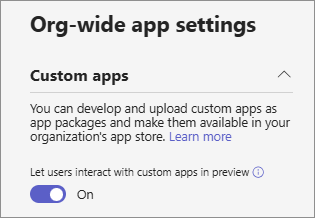

# Manage custom app policies and settings in Microsoft Teams

> [!INCLUDE [Preview customer token](includes/preview-feature.md)]

As an admin, you can use custom app policies and settings to control who in your organization can upload custom apps to Microsoft Teams. Admins decide which users can upload custom apps, and admins and team owners can determine whether specific teams in your organization allow custom apps to be added to them.  

## Overview of custom apps

Users can add a custom app to Teams by uploading an app package (in a .zip file) directly to a team or in the personal context. This is different from how apps are added through the Store. Adding a custom app by uploading an app package, previously called sideloading, lets you test an app as it's being developed, before it's ready to be widely distributed. It also lets you build an app for internal use only and share it with your team without submitting it to the Teams app catalog in the Store.

## Custom app policy and settings

Three components determine whether a user can upload a custom app to a team, giving you granular control over who can add custom apps to a team and which teams custom apps can be added to:

- [User custom app policy](#user-custom-app-policy)
- [Team custom app setting](#team-custom-app-setting)
- [Org-wide custom app setting](#org-wide-custom-app-setting)

These settings don't affect on the ability to block third-party apps.  

### User custom app policy

As part of [app setup policies](teams-app-setup-policies.md), admins can use a policy setting, **User can upload custom apps**,  to control whether a user can upload custom apps to Teams.
 
If this setting is turned off:

- The user can't upload a custom app to any team in your organization.
- The user can interact with custom apps, depending on the org-wide custom app setting.

If this setting is turned on:

- The user can upload custom apps to teams that allow it and to teams for which they are owners, depending on the org-wide custom app setting.
- The user can interact with custom apps, depending on the org-wide custom app setting.

You can edit the settings in the global app setup policy to include the apps that you want. If you want to customize Teams for different groups of users in your organization, create and assign one or more custom app setup policies.

#### Set a user custom app policy 

1. In the left navigation of the Microsoft Teams admin center, go to **Teams apps** > **App setup policies**.
2. Select **New policy**.
3. Turn on or turn off **User can upload custom apps**.
4. Choose any other settings that you want to for the policy.
5. Click **Save**.

### Team custom app setting

Admins and team owners can determine whether a team allows for custom apps to be added to it. This setting, **Allow members to upload custom apps**, combined with a user's custom app policy controls who can add custom apps to a particular team.
 
If this setting is turned off: 

- Team owners can add custom apps, if their custom app policy allows it. 
- Team members who aren't team owners can't add custom apps to the team. 

If this setting is turned on: 

- Team owners can add custom apps, if their custom app policy allows for it. 
- Team members who aren't team owners can add custom apps, if their custom app policy allows for it.

#### Configure the team custom app setting

1. In Teams, go to the team, click **More options ˙˙˙** > **Manage team**..
2. Click **Settings**, and then expand **Member permissions**. 
3. Select or clear the **Allow members to upload custom apps** check box.

    

### Org-wide custom app setting

The org-wide custom app setting, **Allow interaction with custom apps**, applies to everyone in your organization and governs whether they can upload or interact with custom apps. It's intended to serve as a master on/off switch during security events.

#### Configure the org-wide custom app setting

1. In the left navigation of the Microsoft Teams admin center, go to **Teams apps** > **Permission policies**.
2. Click **Org-wide app settings**.
3. Under **Custom apps**, turn on or turn off **Allow interaction with custom apps**.

## How the custom app policies and settings work together

This table summarizes the custom app policy and settings discussed in this article, how they work together, and their combined effect on controlling who in your organization can upload custom apps to Teams.

|Allow interaction with custom apps  (Org-wide setting) |Allow team members to upload custom apps (Team-level setting) |User can upload custom apps (User-level setting) |Effect  |
|---------|---------|---------|---------|
| Off    | Off    | Off     |Interaction with all custom apps is blocked for your organization. Custom apps can't be uploaded by anyone. You can use PowerShell to remove the custom app.   |
| Off     | Off     | On        |Interaction with all custom apps is blocked for your organization. Custom apps can't be uploaded by anyone. You can use PowerShell to remove the custom app.         |
| Off    | On        | Off        |Interaction with all custom apps is blocked for your organization. Custom apps can't be uploaded by anyone. You can use PowerShell to remove the custom app.         |
| Off    | On      | On       |Interaction with all custom apps is blocked for your organization. Custom apps can't be uploaded by anyone. You can use PowerShell to remove the custom app.         |
| True    | Off       | Off         |  If the user is a team owner, they can upload custom apps to the team. If the user isn't a team owner, they can't upload custom apps to the team.        |
| True     | Off       | On         | The user can't upload custom apps to the team.       |
| True     | On        | Off        | The user can upload custom apps to the team, regardless of whether the user is a team owner.        |

 ## Related topics
- [Manage app setup policies in Microsoft Teams](teams-app-setup-policies.md)
- [Manage app permission policies in Microsoft Teams](teams-app-permission-policies.md)
