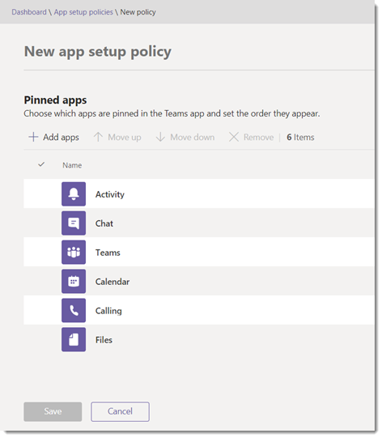
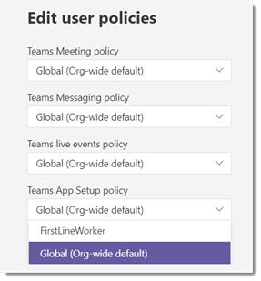

# Manage app setup policies in Microsoft Teams

As an admin, you can use app setup policies to customize the left side of Teams to include the apps that are most important for your users. You choose the apps to pin to Teams and set the order that they appear. App setup policies let you showcase your line-of-business apps and other apps that users in your organization need.


You manage app setup policies in the Microsoft Teams & Skype for Business Admin Center. You can use the global (org-wide default) app setup policy or create and assign custom app setup policies. Users in your organization will get the global app setup policy unless you create and assign a custom app setup policy. 

You can edit the settings in the global app setup policy to include the apps that you want. If you want to customize Teams for different groups of users in your organization, create and assign one or more custom app setup policies.


> [!NOTE]
> If a user is assigned a custom app setup policy, that policy applies to the user. If a user isn't assigned a custom app setup policy, the global policy applies to the user.

## Edit the global app setup policy

###  Using the Microsoft Teams & Skype for Business Admin Center

1. In the left navigation, go to **Teams app** > **App setup policies**.
2. Select **Global (Org-wide default)**.
3. From here, make the changes that you want. You can add, remove, and change the order of apps.
4. Click **Save**. 
5. Wait for the changes to propagate. This could take up to 24 hours.

## Create a custom app setup policy

###  Using the Microsoft Teams & Skype for Business Admin Center

1. In the left navigation, go to **Teams app** > **App setup policies**.
2. Select **New policy**.
3. Enter a descriptive name for the policy, and then click **Add apps**.

    

4. In the **Add pinned apps** pane, search for the apps you want to add, and then click **Add**.  To see a list of all apps, select **Teams app store**. When you've chosen your list of apps, click **Add**.

     

5. Arrange the apps in the order that you want them to appear in Teams, and then click **Save**.

## Assign a custom app setup policy to users

You can use the Microsoft Teams & Skype for Business Admin Center to assign a custom app setup policy to individual users or Windows PowerShell to assign a custom app setup policy to a group of users, such as security group or distribution group. 

###  Using the Microsoft Teams & Skype for Business Admin Center

These steps show you how to assign a custom app setup policy to individual users.

1. In the left navigation of the Microsoft Teams & Skype for Business Admin Center, go to **Users**, and then click the user.
2. Next to **Assigned policies**, choose **Edit**.
3. Under **Teams App Setup policy**, select the app setup policy you want to assign, and then choose **Save**.

    
4. Wait for the changes to propagate. This could take up to 24 hours. 

### Using Windows PowerShell

This example walks you through how to assign a custom app setup policy to a security group.

Get the list of all groups in your organization.
```
$groups = Get-MsolGroup
$groups 
```
Get the list of all users in the group.
```
$groupmembers = Get-MsolGroupMember -GroupObjectId <group object ID> -MemberObjectTypes user
```
Get the count of users in the group. 
```
$groupmembers.count
```
Iterate through all users in the group and assign the policy.
```
$groupmembers | foreach-object { Grant-CsTeamsAppSetupPolicy -PolicyName "Name of policy" -Identity $_.EmailAddress}
``` 

## Things to consider when working with app setup policies

- It's important to know that not all apps can be pinned to the left side of Teams through an app setup policy. To find apps that can be pinned through an app setup policy, search for the app in the **Add pinned apps** pane. Tabs that have a personal scope (static tabs) and bots can be pinned to the Teams desktop client and these apps are available in the **Add pinned apps** pane. Keep in mind that the Teams app store lists all Teams apps whereas the **Add pinned apps** pane includes only apps that can be pinned to Teams through an app setup policy. 
- Depending on the apps set in the app setup policy, apps pinned to the Teams desktop client might not be pinned to the Teams mobile client. This is because some apps can only be pinned to the Teams desktop client.
- Users may have to click **... More apps** to view all apps in the left side of Teams, depending on the number of apps that you set in the app setup policy and the size of the Teams window.
- If your organization is developing your own apps for Teams and you're publishing them to AppSource (formerly known as Office Store), be sure to follow the logo guidelines before you submit the app so that the app icon is displayed as expected. To learn more, see [Checklist for Seller Dashboard submission](https://docs.microsoft.com/microsoftteams/platform/publishing/office-store-checklist). 

## FAQ

### Why can't I find an app in the Add pinned apps pane?

Not all apps can be pinned to the left side of Teams through an app setup policy. To find apps that can be pinned through an app setup policy, search for the app in the **Add pinned apps** pane. Tabs that have a personal scope (static tabs) and bots can be pinned to the Teams desktop client and these apps are available in the **Add pinned apps** pane. 

The Teams app store lists all Teams apps whereas the **Add pinned apps** pane includes only apps that can be pinned to Teams through an app setup policy. 

### Why are some apps pinned to the Teams desktop client but not pinned to the Teams mobile client after I assign a policy?

Depending on the apps set in the app setup policy, apps pinned to the Teams desktop client might not be pinned to the Teams mobile client. This is because some apps can only be pinned to the Teams desktop client.

###  How long does it take for policy changes to take effect?

After you edit the global policy or assign a custom app setup policy, it can take up to 24 hours for changes to take effect.

### How can users see all apps pinned to the left side of Teams?
On the left side of Teams, click **... More apps** to view all pinned apps.  Users may have to do this depending on the number of apps set in the app setup policy and the size of the Teams client window.

### My organization built a custom Teams app and published it through AppSource but the app icon isn't displayed as expected. How do I fix it? 
Make sure that you follow the logo guidelines before you submit the app. To learn more, see [Checklist for Seller Dashboard submission](https://docs.microsoft.com/microsoftteams/platform/publishing/office-store-checklist). 

 ### Related topics
- [Publish an app to the Tenant Apps Catalog from the Teams client](tenant-apps-catalog-teams.md)
