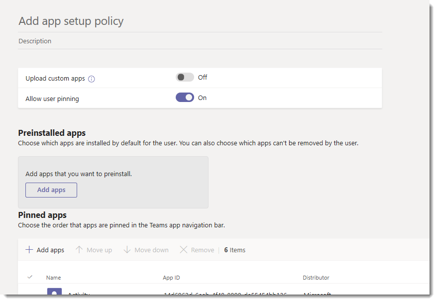
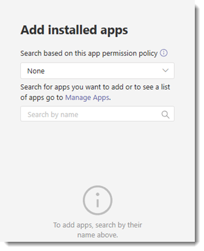

# Manage app setup policies in Microsoft Teams

As an admin, you can use app setup policies to do the following tasks:

- Customize Teams to highlight the apps that are most important for your users. You choose the apps to pin and set the order that they appear. Pinning apps lets you showcase apps that users in your organization need, including apps built by third parties or by developers in your organization.
- Control whether users can pin apps to Teams.
- Install apps on behalf of users. You choose which apps are installed by default for users when they start Teams. Keep in mind that users can still install apps themselves if the [app permission policy](teams-app-permission-policies.md) that's assigned to them allows it.

> [!Note]
> For apps installed by admins, users can't uninstall those apps.

Apps are pinned to the app bar, which is the bar on the side of the Teams desktop client and at the bottom of the Teams mobile clients (iOS and Android).

|Teams desktop client  |Teams mobile client |
|---------|---------|
|   |         |

To see the apps installed by admins, in the app bar, users select **... More apps** in the Teams desktop and web clients and swipe up in the mobile clients.

You manage app setup policies in the Microsoft Teams admin center. Use the global (Org-wide default) policy or create and assign custom policies.  Users in your organization will automatically get the global policy unless you create and assign a custom policy. You must be a global admin or Teams service admin to manage these policies.

You edit the settings in the global policy to include the apps that you want. To customize Teams for different groups of users in your organization, create and assign one or more custom policies.

> [!NOTE]
> If you have Teams for Education, it's important to know that the Assignments app is pinned by default in the global policy even though currently, you don't see it listed in the global policy. It will be the fourth app in the list of pinned apps on Teams clients.

## Create a custom app setup policy

You can use the Microsoft Teams admin center to create a custom policy.

1. In the left navigation of the Microsoft Teams admin center, go to **Teams apps** > **Setup policies**.

2. Select **Add**.

   

3. Enter a name and description for the policy.

4. Turn on or turn off **Upload custom apps**, depending on whether you want to let users upload custom apps to Teams. You can't change this setting if **Allow third-party apps** is turned off in [org-wide app settings](manage-apps.md#manage-org-wide-app-settings).

5. Turn on or turn off **Allow user pinning**, depending on whether you want to let users personalize their app bar by pinning apps to it.

   > [!NOTE]
   > The **Allow user pinning** setting is available in the Teams admin center in Microsoft 365 Government Community Cloud (GCC) environments (GCC, GCC High and DoD), but currently it has no effect.

6. To install apps for users, do the following tasks:

    1. Under **Installed apps**, select **Add apps**.

    2. In the **Add installed apps** pane, search for the apps you want to automatically install for users when they start Teams. You can also filter apps by app permission policy. When you've chosen your list of apps, select **Add**.

       

7. To pin apps, do the following steps:

    1. Under **Pinned apps**, select **Add apps**.

    2. In the **Add pinned apps** pane, search for the apps you want to add, and then select **Add**. You can also filter apps by app permission policy. When you've chosen your list of apps to pin, select **Add**.

       

    3. Arrange the apps in the order that you want them to appear in Teams, and then select **Save**.

       

## Edit an app setup policy

You can use the Microsoft Teams admin center to edit a policy, including the global (Org-wide default) policy and custom policies that you create.

1. In the left navigation of the Microsoft Teams admin center, go to **Teams apps** > **Setup policies**.

2. Select the policy by clicking to the left of the policy name, and then select **Edit**.

3. From here, make the changes that you want.

4. Select **Save**.

## Assign a custom app setup policy to users

[!INCLUDE [assign-policy](includes/assign-policy.md)]

## FAQ

### Working with app setup policies

#### What built-in app setup policies are included in the Microsoft Teams admin center

- **Global (Org-wide default)**: This default policy applies to all users in your organization unless you assign another policy. Edit the global policy to pin apps that are most important for your users.

- **FrontlineWorker**: This policy is for Frontline Workers. You can assign it to Frontline Workers in your organization. It's important to know that like custom policies that you create, you have to assign the policy to users for the settings to be active. For more information, go to the [Assign a custom app setup policy to users](#assign-a-custom-app-setup-policy-to-users) section of this article.

#### Why can't I find an app in the Add pinned apps pane

Not all apps can be pinned to Teams through an app setup policy. Some apps may not support this functionality. To find apps that can be pinned, search for the app in the **Add pinned apps** pane. Tabs that have a personal scope (static tabs) and bots can be pinned to the Teams desktop client and these apps are available in the **Add pinned apps** pane.

Keep in mind that the Teams app store lists all Teams apps. The **Add pinned apps** pane includes only apps that can be pinned to Teams through a policy.

#### I'm a Teams for Education admin. What do I need to know about app setup policies in Teams for Education

The Calling app isn't available in Teams for Education. When you create a new custom app setup policy, the Calling app is displayed in the list of apps. However, the app isn't pinned to Teams clients and Teams for Education users won't see the Calls app in Teams.

#### How many pinned apps can be added to a policy

A minimum of two apps must be pinned to the Teams mobile clients (iOS and Android). If a policy has fewer than two apps, the mobile clients won't reflect the policy settings and instead will continue to use the existing configuration.

There's no limit on the number of pinned apps you can add to a policy.

#### How long does it take for policy changes to take effect

After you edit or assign a policy, it can take a few hours for changes to take effect.

### User experience

#### How can users see all their pinned apps in Teams

To view all apps that are pinned for a user, users might have to do the following depending on the number of installed apps and the size of their Teams client window.

|Teams desktop client |Teams mobile client |
|---------|---------|
|In the app bar on the side of Teams, select **... More apps**.| In the app bar near the bottom of Teams, swipe up.|
|    |  

#### What do I need to know about the Teams mobile experience

The Teams mobile clients (iOS and Android) currently don't support personal apps with static tabs. Depending on the apps set in the policy, apps pinned to the Teams desktop client might not appear in the Teams mobile clients. Personal bots will still appear in Chat on mobile clients.

With the Teams mobile clients, users will see core Teams apps such as Activity, Chat, and Teams, and you can pin some first-party apps from Microsoft, such as Shifts.

#### Can users change the order of apps pinned through a policy

Users can change the order of their pinned apps on Teams desktop and mobile clients if the **Allow user pinning** option is turned on. Users can't change the order of their pinned apps on Teams web clients.

#### Does user pinning take precedence

If the app setup policy assigned to the user is changed to block user app pinning, Teams removes any apps pinned to the app bar. If the policy is then changed to allow user app pinning, users must repin their previously pinned apps.

### Custom Teams apps

My organization built a custom Teams app and published it, either to AppSource or the tenant app catalog, but the app icon isn't displayed as expected when the app is pinned to the app bar in Teams. How do I fix it

Make sure that you follow the logo guidelines before you submit the app. To learn more, see [Checklist for Seller Dashboard submission](/microsoftteams/platform/concepts/deploy-and-publish/appsource/prepare/overview).

## Related topics

[Admin settings for apps in Teams](admin-settings.md)

[Assign policies to your users in Teams](assign-policies.md)
