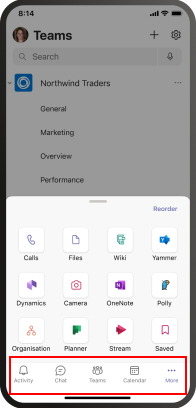
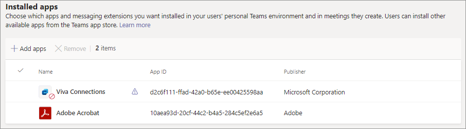
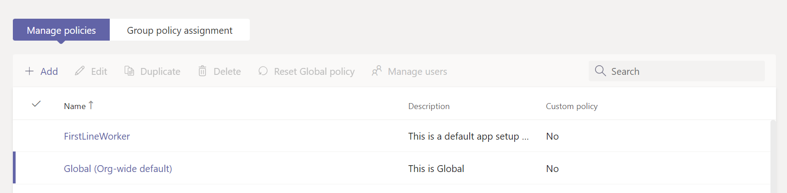

# Manage app setup policies in Microsoft Teams

As an admin, you use app setup policies to install and pin apps, and allow users to upload custom apps. Pinning helps promote adoption of relevant apps in your organization.

* **Pin apps:** App setup policies let you choose apps to pin, set the order the apps show up for your users in the Teams app bar or the compose message area. Admins can also control whether the end-users can pin their own apps or not. See [Pin apps](#pin-apps).
* **Install apps:** App setup policies let you install the allowed apps on behalf of users when they start Teams and during meetings. For more information, see [Install apps](#install-apps).
* **Upload custom apps:** App setup policies let you allow users to upload custom apps to Teams. For more information, see [Upload custom apps](#upload-custom-apps).

## Pin apps

Pinning apps lets you highlight apps that users in your organization need the most. Pinning works for apps provided by Microsoft, by ISV firms, and by developers within your organization. Pinning an app via an app setup policy also installs it, if the app is allowed for the user. Using an app setup policy, you can do the following tasks:

* Customize Microsoft Teams for end-users to highlight the most important apps for them. You choose the apps to pin and the order that the apps display in.
* Control whether users can pin apps or not.

Apps are pinned to the app bar on the left side of the Teams desktop client and at the bottom of the Teams mobile clients.

|Teams desktop client  |Teams mobile client |
|---------|---------|
|.  |         |

The messaging extensions are available at the bottom of the compose message area.

To create an app setup policy to pin apps, follow these steps:

1. Sign in to [Microsoft Teams admin center](https://admin.teams.microsoft.com).

1. In the left pane, go to **Teams apps** > **Setup policies**.

1. Select **Add**.

1. Enter a name and description for the policy.

1. Turn on **User pinning**.

   > [!NOTE]
   > The **User pinning** setting is available in the Teams admin center in Microsoft 365 Government Community Cloud (GCC) environments (GCC, GCC High and DoD), but currently it has no effect.

1. Under **Pinned apps**, select **Add apps**.

1. In the **Add pinned apps** pane, search for the apps you want to add, and then select **Add**. You can also filter apps by app permission policy.

1. Select **Add**.

1. Under the **App bar** or **Messaging extensions**, arrange the apps in the order that you want them to appear in Teams.

   :::image type="content" source="media/pin-messaging-extensions.png" alt-text="the pinned apps section"border="true":::

1. Select **Save**.

> [!NOTE]
> In Teams for Education, the Assignments app is pinned by default in the global policy even though you don't see it listed in the global policy.

> [!NOTE]
> For the frontline workers in your organization, we recommend using the tailored frontline app experience. This feature pins the most relevant apps in Teams for users who have an [F license](https://www.microsoft.com/en-us/microsoft-365/enterprise/frontline?rtc=1#office-SKUChooser-0dbn8nt). To learn more, see [Tailor Teams apps for your frontline workers](/microsoft-365/frontline/pin-teams-apps-based-on-license?bc=%2fmicrosoftteams%2fbreadcrumb%2ftoc.json&toc=%2fmicrosoftteams%2ftoc.json).

## Install apps

Using an app setup policy, an admin can achieve the following tasks:

* Install apps for end-users in their personal Teams environment, by default.
* Install apps for end-users as [messaging extensions](/microsoftteams/platform/messaging-extensions/what-are-messaging-extensions).

The end-users can install apps on their own if the [app permission policy](teams-app-permission-policies.md) allows it.

To create an app setup policy to install apps, follow these steps:

1. Sign in to Teams admin center and access **Teams apps** > **Setup policies**.

2. Select **Add**.

3. Provide a name and description for the policy.

4. Under **Installed apps**, select **Add apps**.

5. In the **Add installed apps** pane, search the apps that you want to install for users. You can also filter apps by app permission policy.

6. Select **Add**.

> [!IMPORTANT]
> Users can't uninstall apps that are installed by admins.

>[!NOTE]
> Using this procedure, you cannot install custom apps with configurable tabs.

## Upload custom apps

To create a custom policy to allow users to upload custom apps, follow these steps:

1. Sign in to Teams admin center and access **Teams apps** > **Setup policies**.

2. Select **Add**.

3. Provide a name and description for the policy.

4. Turn on or turn off **Upload custom apps**.

> [!NOTE]
> To change this setting, your tenant's [org-wide app settings](manage-apps.md#manage-org-wide-app-settings) must allow **Third-party apps**.

## Manage app setup policies

You manage app setup policies in the Microsoft Teams admin center. Use the global (Org-wide default) policy or create and assign custom policies. End-users get the global policy. If you create a custom policy, it overrides the global policy. Global admin or Teams service admin can manage these policies.

You edit the settings in the global policy to include the apps that you want. To customize Teams for different groups of users in your organization, create and assign one or more custom policies.

### Edit an app setup policy

You can use the Microsoft Teams admin center to edit a policy, including the global (Org-wide default) policy and custom policies that you create.

1. In the left navigation of the Microsoft Teams admin center, go to **Teams apps** > **Setup policies**.

2. Choose the policy you want to edit and then select **Edit**.

3. Make the changes that you want.

4. Select **Save**.

### Assign a custom app setup policy to users and groups

For more information on assigning policies to your users and groups, see [Assign policies to users and groups](assign-policies-users-and-groups.md).

## FAQs

<!--- TBD: Incorporate these pointers in the content itself.
--->

### Working with app setup policies

#### What built-in app setup policies are included in the Microsoft Teams admin center

* **Global (Org-wide default)**: This default policy applies to all users in your organization unless you assign another policy. Edit the global policy to pin apps that are most important for your users.

* **FrontlineWorker**: This policy is for Frontline Workers. You can assign it to Frontline Workers in your organization. It's important to know that like custom policies that you create, you have to assign the policy to users for the settings to be active. For more information, go to the [Assign a custom app setup policy to users](#assign-a-custom-app-setup-policy-to-users-and-groups) section of this article.

#### Why can't I find an app in the Add pinned apps pane

Not all apps can be pinned to Teams through an app setup policy. Some apps may not support this functionality. To find apps that can be pinned, search for the app in the **Add pinned apps** pane. Tabs that have a personal scope (static tabs) and bots can be pinned to the Teams desktop client and these apps are available in the **Add pinned apps** pane.

Keep in mind that the Teams app store lists all Teams apps. The **Add pinned apps** pane includes only apps that can be pinned to Teams through a policy.

#### I'm a Teams for Education admin. What do I need to know about app setup policies in Teams for Education

The Calling app isn't available in Teams for Education. When you create a new custom app setup policy, the Calling app is displayed in the list of apps. However, the app isn't pinned to Teams clients and Teams for Education users won't see the Calls app in Teams.

#### How many pinned apps can be added to a policy

A minimum of two apps must be pinned to the Teams mobile clients (iOS and Android). If a policy has fewer than two apps, the mobile clients won't reflect the policy settings, and instead will continue to use the existing configuration.

There's no limit on the number of pinned apps you can add to a policy.

#### How long does it take for policy changes to take effect

After you edit or assign a policy, it can take a few hours for changes to take effect.

### User experience

#### How can users see all their pinned apps in Teams

To view all apps that are pinned for a user, users might have to do the following depending on the number of installed apps and the size of their Teams client window.

|Teams desktop client |Teams mobile client |
|---------|---------|
|In the app bar on the side of Teams, select **... More apps**.| In the app bar near the bottom of Teams, swipe up.|
|   |  

#### What do I need to know about the Teams mobile experience

The Teams mobile clients (iOS and Android) support personal apps with static tabs. Apps pinned to the Teams desktop client will appear in the Teams mobile clients. Personal bots will appear in Chat on mobile clients.

Third-party apps (which can be downloaded from Teams Store) need to be approved before they show up on mobile. If an admin pins an app, which is unapproved by Microsoft for Mobile, it will show up on the Teams Desktop, but not show up on mobile. For more information, see [Mobile clients](/microsoftteams/platform/tabs/what-are-tabs#mobile-clients).

With the Teams mobile clients, users will see core Teams apps such as Activity, Chat, and Teams, and you can pin some first-party apps from Microsoft, such as Shifts.

#### Can users change the order of apps pinned through a policy

Users can change the order of their pinned apps on Teams desktop and mobile clients if the **User pinning** option is turned on. Users can't change the order of their pinned apps on Teams web clients.

#### Does user pinning take precedence

Admin pins always take precedence. If the **User pinning** option is turned on, then users will retain their pinned apps below admin pinned apps. If the **User pinning** option is turned off, then users will lose their pre-existing pins, and only admin-pinned apps will be present in the app bar.

### Custom Teams apps

#### My organization built a custom Teams app and published it, either to AppSource or the tenant app catalog, but the app icon isn't displayed as expected when the app is pinned to the app bar in Teams. How do I fix it?

Make sure that you follow the logo guidelines before you submit the app. To learn more, see [Checklist for Seller Dashboard submission](/microsoftteams/platform/concepts/deploy-and-publish/appsource/prepare/overview).

## See also

* [Admin settings for apps in Teams](admin-settings.md)
* [Assign policies to end-users in Teams](assign-policies-users-and-groups.md)
