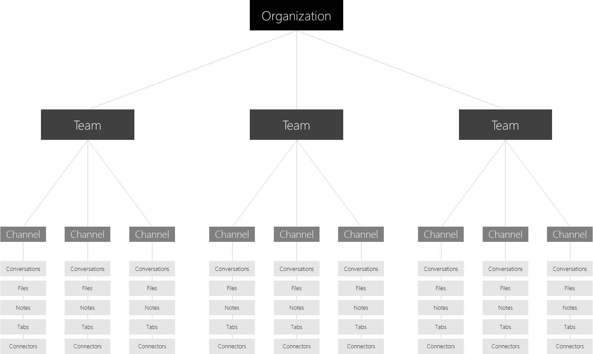

Overview of teams and channels in Microsoft Teams
=================================================

Let’s get started by thinking about how Microsoft Teams allows individual teams to self-organize:

-   **Teams** are a collection of people, content, and tools surrounding different projects and jobs within an organization.

    -   Teams can be created to be private to only invited users.

    -   Teams can also be created to be public and open and anyone within the organization can join (up to 999 members).

-   **Channels** are dedicated sections within a team to keep conversations organized by specific topics, projects, disciplines—whatever works for your team!

    -   Team channels are places where everyone on the team can openly have conversations. Private chats are only visible to those people in the chat.

    -   Channels can be extended with Apps that include Tabs, Connectors, and Bots.

One key early planning activity to engage users with Microsoft Teams, is to help people think and understand how Microsoft Teams can enhance collaboration in their day to day lives.

By default, all users have permissions to create a team within Microsoft Teams (to modify this, see here). Users of an existing Office 365 Group can also enhance them with Microsoft Teams functionality.

Sample Team Set up
------------------

Below are a few functional examples of how different types of users may approach setting up their teams, channels and apps (tabs/connectors/bots) – this may be useful to help kick off a conversation about Microsoft Teams with your user community. As you think about how to implement Microsoft Teams in your organization, remember that you can provide guidance on how to structure their teams, however users have control of how they can self-organize. These are just examples to help get teams to start thinking through the possibilities.

Microsoft Teams is great at breaking down organizational silos and promoting cross-functional teams, so encourage your users to think about this as functional teams and not organizational silos.

|Types of Teams  |Potential Channels  |Apps (Tabs /Connectors /Bots )  |
|---------|---------|---------|
|Sales     |Annual Sales Meeting   Quarterly Business Review   Monthly Sales Pipeline Review   Sales Playbook |Power BI  Trello  CRM  Summarize Bot         |
|Public Relations     |Press Releases  News and Updates  Fact Checking         |RSS Feed  Twitter         |
|Event Planning     |Marketing  Logistics and Scheduling  Venue  Budget         |Twitter  Facebook  Planner  PDF         |
|Marketing/Go to Market   |Market Research  Messaging Pillars  Communications Plan  Marketing Bill of Materials        |YouTube  Microsoft Stream  Twitter  MailChimp         |
|Technical Operations    |Incident Management  Sprint Planning  Work Items  Infrastructure and Operations         |Team Services  Jira  AzureBot         |
|Product Team	   |Strategy  Marketing  Sales  Operations  Insights  Services & Support         |Power BI  Team Services         |
|Finance    |Current Fiscal  FY Planning  Forecasting  Accounts Receivable  Accounts Payable         |Power BI  Google Analytics         |
|Logistics     |Warehouse Operations  Vehicle Maintenance  Driver Rosters         |Weather Service  Travel / Road Disruptions  Planner  Tubot  UPS Bot         |
|HR     |Talent Management  Recruiting  Performance Review Planning  Morale         |HR Tools  External Job Posting Sites  Growbot         |
|Cross-organizational   Virtual Team |Strategy  Workforce Development  Compete & Research         |Power BI  Microsoft Stream         |

