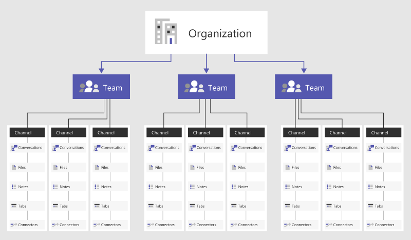

> [!NOTE]
> Review the following information to understand chat, teams, channels, & apps in Teams. Then, go to [Deploy chat, teams, channels, & apps in Teams](deploy-chat-teams-channels-microsoft-teams-landing-page.md) to walk through a list of decisions important to your Teams rollout.

Overview of teams and channels in Microsoft Teams
=================================================

Let’s get started by thinking about how Microsoft Teams allows individual teams to self-organize and collaborate across business scenarios:

-   **Teams** are a collection of people, content, and tools surrounding different projects and outcomes within an organization.

    -   Teams can be created to be private to only invited users.

    -   Teams can also be created to be public and open and anyone within the organization can join (up to 5000 members).
    
    A team is designed to bring together a group of people that work closely to get things done. Teams can be dynamic for project-based work (for example, launching a product, creating a digital war room), as well as ongoing, to reflect the internal structure of your organization (for example, departments and office locations). Conversations, files and notes across team channels are only visible to members of the team.

-   **Channels** are dedicated sections within a team to keep conversations organized by specific topics, projects, disciplines—-whatever works for your team! Files that you share in a channel (on the Files tab) are stored in SharePoint. To learn more, read [How SharePoint Online and OneDrive for Business  interact with Teams](SharePoint-OneDrive-interact.md).

    -   Team channels are places where everyone on the team can openly have conversations. Private chats are only visible to those people in the chat (and files that you share in a chat are stored in OneDrive for Business). 
    -   **Updated** Channels are places where conversations happen and where the work actually gets done. Channels can be open to all team members or, if you need a more select audience, they can be private. Standard channels are for conversations that everyone in a team can participate in and private channels limit communication to a subset of people in a team.

    -   Channels are most valuable when extended with apps that include tabs, connectors, and bots that increase their value to the members of the team. To learn more, see [Apps, bots, & connectors in Teams](deploy-apps-microsoft-teams-landing-page.md).

View this short video to learn more about best practices for creating teams and channels.

   > [!VIDEO https://www.youtube.com/embed/hjJWtoaRJeE]

Membership, roles, and settings
------------------------------

**Team Membership**
When Microsoft Teams is activated for your entire organization, designated team owners are able to invite any employee they work with to join their team. Microsoft Teams makes it easy for team owners to add people in the organization based on their name. Depending on your organization's settings guests who are team members but outside of your organization can also be added to your teams. See [Guest Access in Microsoft Teams](guest-access.md) for more information. 

Team owners can also create a team based on an existing Office 365 Group. Any changes made to the group will be synched with Microsoft Teams automatically. Creating a team based on an existing Office 365 Group not only simplifies the process of inviting and managing members, but also syncs group files inside of Microsoft Teams.

**Team Roles**
There are two main roles in Microsoft Teams: a team owner, the person who creates the team, and team members, the people who they invite to join their team. Team owners can make any member of their team a co-owner when they invite them to the team or at any point after they’ve joined the team. Having multiple team owners enables you to share the responsibilities of managing settings and membership, including invitations.

**Team Settings** 
Team owners can manage team-wide settings directly in Microsoft Teams. Settings include the ability to add a team picture, set permissions across team members for creating channels, adding tabs and connectors, @mentioning the entire team or channel, and the usage of GIFs, stickers, and memes. 

Take three minutes to check out this go-to-guide video for team owners: 

   > [!VIDEO https://www.youtube.com/embed/7XcDSuw6NR4]

If you are a Microsoft Teams administrator in Office 365, you have access to system-wide settings in the Microsoft Teams admin center. These settings can impact the options and defaults team owners see under team settings. For example, you can enable a default channel, “General”, for team-wide announcements, discussions and resources, which will appear across all teams.

By default, all users have permissions to create a team within Microsoft Teams (to modify this, see [Assign roles and permissions in Teams](assign-roles-permissions.md). Users of an existing Office 365 Group can also enhance them with Teams functionality.

One key early planning activity to engage users with Microsoft Teams, is to help people think and understand how Teams can enhance collaboration in their day to day lives. Talk with people and help them select business scenarios where they are currently collaborating in fragmented ways.  Bring them together into a channel with the relevant tabs that will help them get their work done. One of the most powerful use cases of Teams is any cross-organizational process. 

Example Teams 
--------------

Below are a few functional examples of how different types of users may approach setting up their teams, channels and apps (tabs/connectors/bots) – this may be useful to help kick off a conversation about Microsoft Teams with your user community. As you think about how to implement Microsoft Teams in your organization, remember that you can provide guidance on how to structure their teams, however users have control of how they can self-organize. These are just examples to help get teams to start thinking through the possibilities.

Microsoft Teams is great at breaking down organizational silos and promoting cross-functional teams, so encourage your users to think about this as functional teams and not organizational silos.

|Types of Teams  |Potential Channels  |Apps (Tabs /Connectors /Bots )  |
|---------|---------|---------|
|Sales     |Annual Sales Meeting   Quarterly Business Review   Monthly Sales Pipeline Review   Sales Playbook |Power BI  Trello  CRM  Summarize Bot         |
|Public Relations     |Press Releases  News and Updates  Fact Checking         |RSS Feed  Twitter         |
|Event Planning     |Marketing  Logistics and Scheduling  Venue  Budget         |Twitter  Facebook  Planner  PDF         |
|Marketing/Go to Market   |Market Research  Messaging Pillars  Communications Plan  Marketing Bill of Materials        |YouTube  Microsoft Stream  Twitter  MailChimp         |
|Technical Operations    |Incident Management  Sprint Planning  Work Items  Infrastructure and Operations         |Team Services  Jira  AzureBot         |
|Product Team	   |Strategy  Marketing  Sales  Operations  Insights  Services & Support         |Power BI  Team Services         |
|Finance    |Current Fiscal  FY Planning  Forecasting  Accounts Receivable  Accounts Payable         |Power BI  Google Analytics         |
|Logistics     |Warehouse Operations  Vehicle Maintenance  Driver Rosters         |Weather Service  Travel / Road Disruptions  Planner  Tubot  UPS Bot         |
|HR     |Talent Management  Recruiting  Performance Review Planning  Morale         |HR Tools  External Job Posting Sites  Growbot         |
|Cross-organizational   Virtual Team |Strategy  Workforce Development  Compete & Research         |Power BI  Microsoft Stream         |

It is possible to create Teams that align to the organizational structure.  This is best used for leaders who want to drive morale, have team specfic reviews, clarify employee onboarding processes, discuss workforce plans and increase visibility across a diverse workforce.  

## Org-wide teams

If your organization has no more than 5,000 users, you can create an org-wide team. Org-wide teams provide an automatic way for everyone in an organization to be a part of a single team for collaboration. For more information, including best practices for creating and managing an org-wide team, see [Create an org-wide team in Microsoft Teams](create-an-org-wide-team.md).
