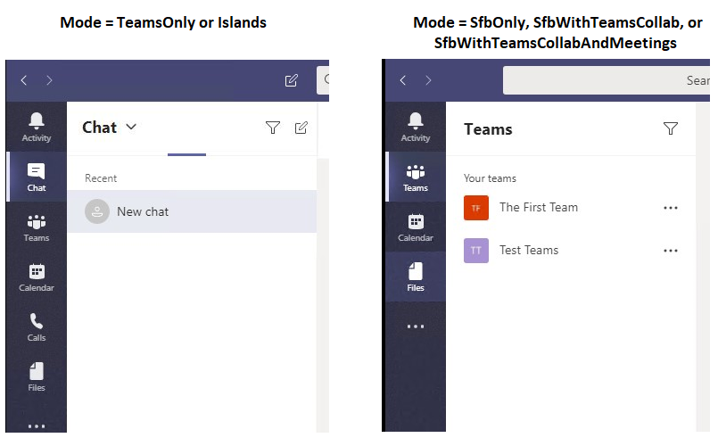

# Teams client experience and conformance to coexistence modes

> [!NOTE]
> This page describes important, recently released changes in the behavior of Teams client when users are in any of the Skype for Business modes (SfBOnly, SfBWithTeamsCollab, SfBWithTeamsCollabAndMeetings).

The purpose of co-existence modes is to provide a simple, predictable experience for end users as organizations transition from Skype for Business to Teams.  For an organization moving to Teams, the TeamsOnly mode is the final destination for each user, though not all users need to be assigned TeamsOnly (or any other mode) at the same time.  Prior to users reaching TeamsOnly mode, organizations can use any of the Skype for Business modes (SfBOnly, SfBWithTeamsCollab, SfBWithTeamsCollabAndMeetings) to ensure predictable communication between users who are TeamsOnly and those who aren’t yet. 

When a user is in any of the Skype for Business modes, all incoming chats and calls are routed to the user’s Skype for Business client. To avoid end user confusion and ensure proper routing, calling and chat functionality in the Teams client is disabled when a user is in any of the Skype for Business modes. Similarly, meeting scheduling in Teams is explicitly disabled when users are in the SfBOnly or SfBWithTeamsCollab modes, and explicitly enabled when a user is in the SfBWithTeamsCollabAndMeetings mode.   

## How the available functionality in Teams client changes based on mode
The available functionality in Teams dependes on the user's coexistence mode, as set by TeamsUpgradePolicy. The table below summarizes the  behavior:

|User's effective mode|Experience in Teams client|
|---|---|
|Any Skype for Business mode|Calling and Chat1 are disabled.|
|SfBWithTeamsCollabAndMeetings|Meeting scheduling is available|
|SfBWithTeamsCollab or SfBOnly2|Meeting scheduling is not available|
|||

The following screenshots illustrate the difference between TeamsOnly or Islands mode and all other modes. Note that the chat and calling icons are available with TeamsOnly or Islands mode (left screenshot), but not with the other modes (right screenshot):

 
**Notes:**
1 Meeting chat is still available.

2 For now, SfBwithTeamsCollab and SfBOnly behave the same, but the intent is for SfBOnly mode to also disable Channels and Files functionality in Teams; however, there is currently no setting that allows this functionality in Teams to be disabled.

## Impact of Mode on other policy settings
As described above, a user's coexistence mode impact's what functionality is available in the user's Teams client. This means that the value of mode can take precedence over the value of other policy settings, depending on the mode. Specifically,  coexistence mode impacts whether the following policy settings are honored:

|**Modality (App)**|**Policy.Setting**|
|---|---|
|Chat|TeamsMessagingPolicy.AllowUserChat|
|Calling|TeamsCallingPolicy.AllowPrivateCalling|
|Meeting scheduling|TeamsMeetingPolicy.AllowPrivateMeetingScheduling TeamsMeetingPolicy.AllowChannelMeetingScheduling|
|||

Administrators need *not* explicitly set these policy settings when using co-existence mode, but it's important to understand that these settings effectively behave as follows for a given mode. 

|Mode|AllowUserChat|AllowPrivateCalling|AllowPrivateMeetingScheduling|AllowChannelMeetingScheduling|
|---|---|---|---|---|
|TeamsOnly or Islands|Enabled|Enabled|Enabled|Enabled|
|SfBWithTeamsCollabAndMeetings|Disabled|Disabled|Enabled|Enabled|
|SfBWithTeamsCollab or SfBOnly|Disabled|Disabled|Disabled|Disabled|
||||||

In the near future, the `Grant-CsTeamsUpgradePolicy` cmdlet will check the configuration of the corresponding settings in TeamsMessagingPolicy, TeamsCallingPolicy, and TeamsMeetingPolicy to determine if those settings will be superceded by TeamsUpgradePolicy and if so, an informational message is provided in PowerShell.  As noted above,  is no longer necessary to set these other policy settings. Below is an example of what the PowerShell warning  looks like:

`Grant-CsTeamsUpgradePolicy -Identity user1@contoso.com -PolicyName SfBWithTeamsCollab`

`WARNING: The user 'user1@contoso.com' currently has enabled values for: AllowUserChat, AllowPrivateCalling, AllowPrivateMeetingScheduling, AllowChannelMeetingScheduling, however these values will be ignored. This is because you are granting this user TeamsUpgradePolicy with mode=SfBWithTeamsCollab, which causes the Teams client to behave as if they are disabled.`

# Related topics

[Migration and interoperability guidance for organizations using Teams together with Skype for Business](https://docs.microsoft.com/en-us/microsoftteams/migration-interop-guidance-for-teams-with-skype)

