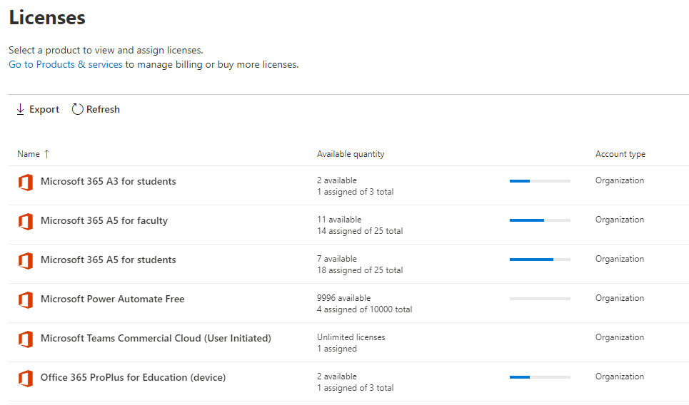
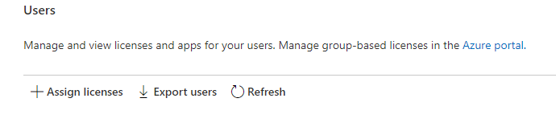
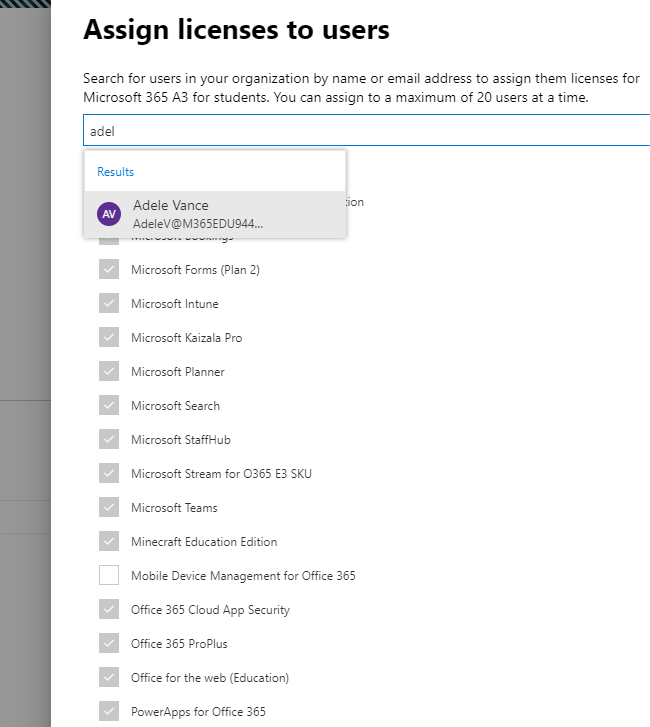
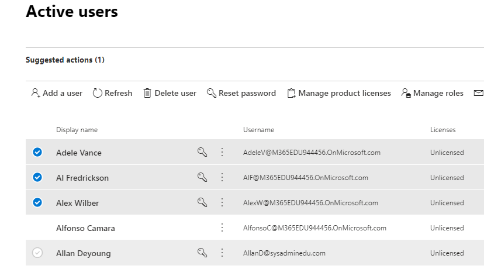
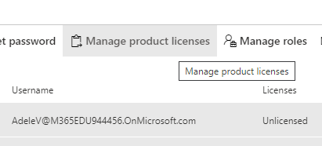
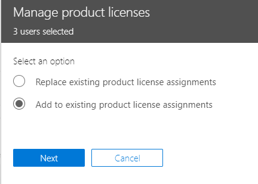
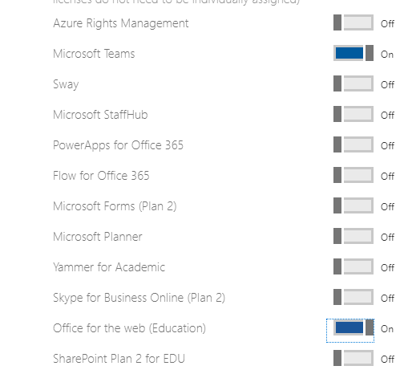

# Assign Microsoft Teams licenses for EDU

Microsoft Teams is a digital hub that brings conversations, content, and apps together in one place. Because it's built on Office 365, schools benefit from integration with their familiar Office apps and services. Your institution can use Microsoft Teams to create collaborative classrooms, connect in professional learning communities, and communicate with school staff all from a single experience in Office 365 for Education.

To get started, IT administrators need to use the Microsoft 365 Admin Center to [enable Microsoft Teams for your school](/microsoft-365/education/intune-edu-trial/enable-microsoft-teams).
Once complete, you must assign licenses to user accounts so your faculty, staff, and students can access Office 365 services, such as Microsoft Teams.

You can assign licenses to user accounts either individually or automatically through group membership. This article will walk you through how to assign Office 365 licenses to an individual or a small set of user accounts via the Microsoft 365 admin center. To assign licenses automatically through group membership, see one of our supporting articles:

- [Office 365 Powershell](/office365/enterprise/powershell/assign-licenses-to-user-accounts-with-office-365-powershell)
- [Group-based Licensing in Active Directory](/azure/active-directory/users-groups-roles/licensing-groups-assign)

You can assign licenses to users on either the **Licenses** page, or on the **Active Users** page. Which method you use depends on whether you want to assign product licenses to specific users, or assign users licenses to specific products.

> [!NOTE]
> If you're not using the new Microsoft 365 admin center, you can turn it on by selecting the **Try the new admin center** toggle located at the top of the Home page.

## Assign licenses to users on the Licenses page

> [!NOTE]
> You must be a Global admin, Billing admin, License admin, or User management admin. For more information, see [About Office 365 admin roles](/microsoft-365/admin/add-users/about-admin-roles).

When you use the **Licenses** page to assign licenses, you assign licenses for a specific product for up to 20 users. On the **Licenses** page, you see a list of all the products you have subscriptions for, together with the total number of licenses for each product, how many licenses are assigned, and how many are available.

1. In the admin center, go to the **Billing** > [Licenses](https://go.microsoft.com/fwlink/p/?linkid=842264) page.

   
2. Select a product for which you want to assign licenses. Microsoft Teams is part of the free Office 365 A1 for Students SKU.

   
3. Select **Assign licenses**.

   
4. In the **Assign licenses to users** pane, begin typing a name, which should generate a list of names. Choose the name you're looking for from the results to add it to the list. You can add up to 20 users at a time.

   
5. Select **Turn apps and services on or off** to assign or remove access to specific items, such as Microsoft Teams. Ensure **Microsoft Teams** and **Office for the web (Education)** are selected.
6. When you're finished, select **Assign**, then select **Close**.

To change the apps and services a user has access to:

1. Select the row that contains the user.
1. In the right pane, select or deselect the apps and services that you want to give access to, or remove access from.
1. When you're finished, select **Save**, then select **Close**.

## Assign licenses to an individual or multiple users on the Active users page

1. In the admin center, go to the **Users** > [Active users](https://go.microsoft.com/fwlink/p/?linkid=834822) page.

   
2. Select the circles next to the name(s) of the user(s) you want to assign license(s) to.

   
3. At the top select **Manage product licenses**.

   
4. In the **Manage product licenses** pane, select **Add to existing product license assignments** > **Next**.

   
5. In the **Add to existing products** pane, switch the toggle to the **On** position for the license that you want the selected users to have. Ensure **Microsoft Teams** and **Office for the web (Education)** are selected.

   

   By default, all services associated with those license(s) are automatically assigned to the user(s). You can limit which services are available to the users. Switch the toggles to the **Off** position for the services that you don't want the users to have.
6. At the bottom of the pane, select Add > Close.