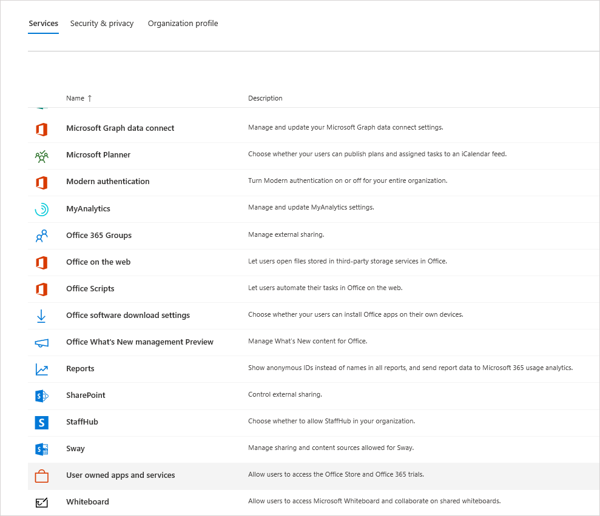
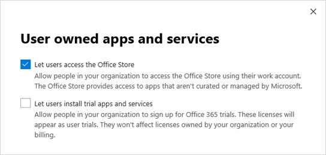

# Manage the Microsoft Teams Exploratory license

The Microsoft Teams Exploratory experience lets users in your organization who have Azure Active Directory (Azure AD) and aren't licensed for Teams initiate an exploratory experience of Teams. Admins can switch this feature on or off for users in their organization.

## What's in the Teams Exploratory experience

The service plans that an admin will see as part of the Teams Exploratory experience are:

- Exchange Online (Plan 1)
- Power Automate
- Microsoft Viva Insights
- Microsoft Forms (Plan E1)
- Microsoft Planner
- Microsoft Search
- Microsoft Stream for Microsoft 365 and Office 365 E1 SKUs 1</1>
- Microsoft Teams
- Mobile Device Management for Microsoft 365 or Office 365
- Office Mobile Apps for Office 365
- Office Online
- Power Apps for Microsoft 365 or Office 365
- SharePoint Online (Plan 1)
- Sway
- To-Do (Plan 1)
- Whiteboard (Plan 1)
- Yammer Enterprise

  1 The change from using Microsoft Stream to [OneDrive for Business and SharePoint for meeting recordings](tmr-meeting-recording-change.md) will be a phased approach. At launch, you'll be able to opt in to this experience. In November, you'll have to opt out if you want to continue using Stream. Sometime in early 2021, we'll require all customers to use OneDrive for Business and SharePoint for new meeting recordings.

## Who's eligible

Users fit the criteria for a Teams Exploratory experience if they:

- Have a managed Azure AD domain email address.
- Belong to a tenant with a paid subscription.
- Do not have an active Teams license.
- Are not in a tenant where a license assignment policy was created.

Users must be enabled to sign up for apps and trials (in the Microsoft 365 admin center). For more information, see [Manage the Teams Exploratory experience](#manage-the-teams-exploratory-experience), later in this article.

## Who isn't eligible

Users don't fit the criteria if they:

- Currently have Teams from a paid license or trial license, or previously had trial license
- Are in a tenant that used/received at least one special COVID offer.

Your organization isn't eligible for this offer if you're a Syndication Partner Customer or a GCC, GCC High, DoD, or EDU customer.

## How users sign up for the Teams Exploratory experience

Eligible users can sign up for the Teams Exploratory experience by signing in to Teams from the desktop or web ([teams.microsoft.com](https://teams.microsoft.com)). At this time, enabling Exploratory through mobile is not supported. When they sign up, they'll be assigned this license automatically and the tenant admin will receive an email notification the first time someone in your org starts the Teams Exploratory experience.

## Manage the Teams Exploratory experience

The Teams Exploratory experience is meant to be initiated by individual end users, and you can't initiate this offer on behalf of end-user employees.

The Teams Exploratory experience comes with an Exchange Online license, but it won't be assigned to the user until the admin assigns it. If the user doesn't have an Exchange license already, and the admin has yet to assign the Exchange Online license, the user won't be able to schedule meetings in Teams and might be missing other Teams functionality.

Admins can disable the ability for end users to run the Teams Exploratory experience within their organization by using the **Trial apps and services** switch.

### Prevent users from installing trial apps and services

You can turn off a user's ability to install trial apps and services, which would prevent the user from running the Teams Exploratory experience.

1. From the Microsoft 365 admin center, go to **Settings** > **Org settings**, select **Services**, and then select **User owned apps and services**.

    

2. Clear the check mark from **Let users install trial apps and services**.

    

    > [!NOTE]
    > If your organization is ineligible for the Teams Exploratory experience, you won't see the **Let users install trial apps and services** option.

### Manage availability for a user with a license that includes Teams

A user who is assigned a license that includes Teams isn't eligible for the Teams Exploratory experience. When the Teams service plan is turned on, the user can sign in and use Teams. If the service plan is disabled, the user can't sign in and the Teams Exploratory experience isn't available. You must have admin privileges.

To turn off access to Teams:

1. In the Microsoft 365 admin center, select **Users** > **Active users**.

2. Select the box next to the name of the user.

3. In the **Product licenses** row, choose **Edit**.

4. In the **Product licenses** pane, switch the toggle to **Off**.

    

### Manage Teams availability for users who are already using the Teams Exploratory experience

If a user is running the Teams Exploratory experience, you can turn it off by removing the license or service plan. You must have admin privileges.

To turn off the Teams Exploratory experience license:

1. In the Microsoft 365 admin center, select **Users** > **Active users**.

2. Select the box next to the name of the user.

3. In the **Product licenses** row, choose **Edit**.

4. In the **Product licenses** pane, switch the toggle for this exploratory license to **Off**.

    > [!NOTE]
    > The Teams Exploratory toggle switch will appear after the first user in the organization launches the Teams Exploratory experience.

### Manage Teams for users who have the Teams Exploratory license

You can manage users who have the Teams Exploratory license just like you manage users who have a regular paid license. For more information, see [Manage Teams settings for your organization](enable-features-office-365.md).

### Upgrade users from Teams Exploratory

You must have admin privileges to upgrade users from Teams Exploratory. For more information see [Upgrade users from the Teams Exploratory trial](upgrade-from-teams-exploratory.md).

> [!NOTE]
> If the Teams Exploratory license ends and a user isn't immediately upgraded to a subscription that includes Teams, they lose access to Teams after a 30-days grace period. Another 30 days after which, the data is deleted. The user still exists in Azure Active Directory. Once a new license is assigned to the user to enable Teams functionality again, all content will still exist if the user is added within the grace period time frame.

### Remove a Teams Exploratory license

- If you would like to remove this license by using PowerShell, see:
[Remove licenses from user accounts with Office 365 PowerShell](/office365/enterprise/powershell/remove-licenses-from-user-accounts-with-office-365-powershell)

- If you would like to remove this license through the admin portal, see:
[Delete a user from your organization](/microsoft-365/admin/add-users/delete-a-user)

## What is the data retention policy

See [Microsoft 365 subscription information](/microsoft-365/commerce/subscriptions/what-if-my-subscription-expires?view=o365-worldwide).

## How long does the Teams Exploratory experience last

Teams Exploratory is available as a 12 month subscription (from initial user sign-up) for all new customers. The new Teams Exploratory subscription starts when the first user in an organization signs-up for Teams Exploratory and it will expire after 12 months. The expiry date will apply to all users in the same tenant as the 12-month term begins on the first user's sign-up date.

> [!NOTE]
> The end date for the experience is configured at an organization level, meaning it will apply to all users in the same organization. For example, User 1 signs up for the subscription on January 1, 2021. This initiates a subscription end-date of December 31, 2021. Another user, User 2, signs up for the subscription on October 1, 2021. User 2 can use Teams Exploratory for two months, as their end-date will be December 31, 2021 because they're under the same organization's subscription as User 1.

### What should administrators do at the end of the 12 month Teams Exploratory experience

At the end of the 12 month subscription, administrators should convert all Teams Exploratory users to a paid license that includes Teams. It is vital to ensure this is completed before the Teams Exploratory subscription expires to avoid any disruption to user's experience.

> [!NOTE]
> Customers will be disabled and blocked from starting a new Exploratory trial licenses for 3 months past the expiration of their previous Exploratory trial license.

For more information, see [Upgrade users from Teams Exploratory](#upgrade-users-from-teams-exploratory), above in this article.
