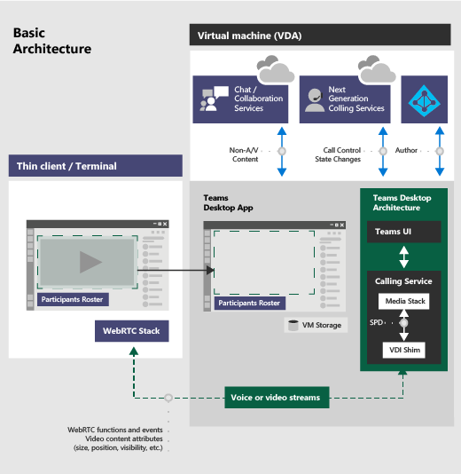

# Teams for Virtualized Desktop Infrastructure

This article describes the requirements and limitations of using Microsoft Teams in a virtualized environment.

## What is VDI?

Virtual Desktop Infrastructure (VDI) is virtualization technology that hosts a desktop operating system and applications on a centralized server in a data center. This enables a complete, and personalized, desktop experience for users with a fully secured and compliant centralized source.

Teams in a virtualized environment supports chat and collaboration. And with the Azure Virtual Desktop, Citrix, and VMware platforms, calling and meeting functionality is also supported.

Teams also supports multiple configurations in virtual environments. These include VDI, dedicated, shared, persistent, and non-persistent modes. Features are in continuous development and are added on a regular basis, and functionality will expand over time.

Using Teams in a virtualized environment might be somewhat different from using Teams in a non-virtualized environment. For example, some advanced features might not be available in a virtualized environment, and video resolution might differ.

To ensure an optimal user experience, follow the guidance in this article.

> [!Note]
> For details about Teams VDI on different platforms, see [Teams features by platform](https://support.microsoft.com/office/teams-features-by-platform-debe7ff4-7db4-4138-b7d0-fcc276f392d3).

## Teams on VDI components

Using Teams in a virtualized environment requires the following components.

- **Virtualization broker**: The resource and connection manager to the virtualization provider, such as Azure
- **Virtual desktop**: The Virtual Machine (VM) stack that runs Teams
- **Thin client**: The device that the user physically interfaces with
- **Teams desktop app**: The Teams desktop client app

## Teams on VDI requirements

### Virtualization provider requirements

The Teams desktop app was validated with leading virtualization solution providers. With multiple market providers, we recommend that you consult your virtualization solution provider to ensure that you meet the minimum requirements.
  
Currently, Teams on VDI with audio/video (AV) optimization is certified with Azure Virtual Desktop, Citrix, and VMware. Review the information in this section to ensure that you meet all requirements for proper functionality.

### Platforms certified for Teams

The following platforms have virtual desktop infrastructure solutions for Teams.

|Platform|Solution|
|----|---|
|| <a href="/azure/virtual-desktop/teams-on-wvd" target="_blank">Azure Virtual Desktop</a>, <a href="/windows-365/enterprise/teams-on-cloud-pc" target="_blank">Windows 365</a> |
|| <a href="https://www.citrix.com/products/citrix-virtual-apps-and-desktops/" target="_blank">Citrix Virtual Apps and Desktops</a> |
|| <a href="https://www.vmware.com/products/horizon.html" target="_blank">VMware Horizon</a> |

### Azure Virtual Desktop

Azure Virtual Desktop provides AV optimization for Teams on VDI. To learn more on requirements and installation, see [Use Teams on Azure Virtual Desktop](/azure/virtual-desktop/teams-on-wvd).

### Windows 365

Windows 365 uses AV optimization provided by Azure Virtual Desktop to ensure optimal Teams experiences from Cloud PCs. To learn more on requirements and installation, see [Use Teams on Cloud PC](/windows-365/enterprise/teams-on-cloud-pc).

### Citrix Virtual Apps and Desktops requirements

Citrix Virtual Apps and Desktops (formerly known as XenApp and XenDesktop) provides AV optimization for Teams on VDI. With Citrix Virtual Apps and Desktops, Teams on VDI supports calling and meeting functionality in addition to chat and collaboration.

You can download the latest version of Citrix Virtual Apps and Desktops at the [Citrix downloads site](https://www.citrix.com/downloads/citrix-virtual-apps-and-desktops/). (You'll need to sign in first.) The necessary components are bundled into the [Citrix Workspace app (CWA)](https://www.citrix.com/downloads/workspace-app/) and Virtual Delivery Agent (VDA) by default. You don't need to install any additional components or plugins on CWA or the VDA.

For the latest server and client requirements, see the [Optimization for Microsoft Teams](https://docs.citrix.com/en-us/citrix-virtual-apps-desktops/multimedia/opt-ms-teams.html) article on the Citrix website.

### VMware Horizon Workspace and Desktop requirements

VMware Horizon is a modern platform for secure delivery of virtual desktops and apps across the hybrid cloud. To offer a great end-user experience, VMware Horizon provides media optimization for Teams. This optimization improves overall productivity across virtual desktops and apps, and enhances user experience when calling and meeting using Teams.

You can download the latest version of VMware Horizon from the [VMware Downloads](https://customerconnect.vmware.com/downloads/#all_products) page. The required media optimization components are part of the Horizon Agent and Horizon Client by default and there's no need to install any additional plug-in to use the optimization feature for Teams.

To get the latest requirements and instructions on how to configure media optimization for Teams, see the [Configuring Media Optimization for Microsoft Teams](https://docs.vmware.com/en/VMware-Horizon/2006/horizon-remote-desktop-features/GUID-F68FA7BB-B08F-4EFF-9BB1-1F9FC71F8214.html) article on the VMware website.

## Install or update the Teams desktop app on VDI

You can deploy the Teams desktop app for VDI using a per-machine installation or per-user installation using the MSI package. Deciding on which approach to use depends on whether you use a persistent or non-persistent setup and the associated functionality needs of your organization.

For a dedicated persistent setup, both per-machine and per-user installation will work. However, for a non-persistent setup, Teams requires a per-machine installation in order to work efficiently. See the [Non-persistent setup](#non-persistent-setup) section.

With per-machine installation, automatic updates are disabled. This means that to update the Teams app, you must uninstall the current version to update to a newer version. With per-user installation, automatic updates are enabled.

> [!IMPORTANT]
> Keep the Teams desktop app in your VDI environment up to date. Teams desktop app versions with release dates that are more than 90 days older than the [current version's release date](/officeupdates/teams-app-versioning) aren't supported. Unsupported Teams desktop app versions show a blocking page to users and request that they update their app.

For most VDI deployments, we recommend you deploy Teams using per-machine installation. To update to the latest Teams version, start with the uninstall procedure followed by latest Teams version deployment.

For Teams AV optimization in VDI environments to work properly, the thin-client device must have access to the internet. If internet access isn't available at the thin-client device, optimization startup won't be successful. This means that the user is in a non-optimized media state.

#### Dedicated persistent setup

In a dedicated persistent setup, users' local operating system changes are retained after users log off. For persistent setup, Teams supports both per-user and per-machine installation.

The following is the recommended minimum VM configuration.

|Parameter  |Workstation operating system  |Server operating system  |
|---------|---------|---------|
|vCPU   |    2 cores     |  4, 6, or 8 cores<br>It's important to understand the underlying non-uniform memory access (NUMA) configuration and configure your VMs accordingly.     |
|RAM     |   4 GB      | 512 MB to 1 GB per user        |
|Storage    | 8 GB        | 40 GB to 60 GB        |

#### Non-persistent setup

In a non-persistent setup, users' local operating system changes are not retained after users log off. Such setups are commonly shared multi-user sessions. VM configuration varies based on the number of users and available physical server resources.

For a non-persistent setup, the Teams desktop app must be installed per-machine to the golden image. This ensures an efficient launch of the Teams app during a user session. To learn more, see the [Install or update the Teams desktop app on VDI](#install-or-update-the-teams-desktop-app-on-vdi) section.

Using Teams in a non-persistent setup also requires a profile-caching manager for efficient Teams runtime data synchronization. Efficient data synchronization ensures that the appropriate user-specific information (such as a user's data, profile, or settings) is cached during the user's session. Make sure data in these two folders are synced:<br>

- `C:\Users\username\AppData\Local\Microsoft\IdentityCache (%LocalAppData%\Microsoft\IdentityCache)`
- `C:\Users\username\AppData\Roaming\Microsoft\Teams (%AppData%\Microsoft\Teams)`

> [!NOTE]
> A roaming folder (or, if you are using folder redirection, a caching manager) is required to ensure that the Teams app has the runtime data and files required to run the application. This is necessary to mitigate network latency issues or network glitches, which would otherwise cause application errors and a slow experience due to unavailable data and files.

There are a variety of caching manager solutions available, such as [FSLogix](/fslogix/overview). Consult your caching manager provider for specific configuration instructions.

##### Teams cached content exclusion list for non-persistent setup

Exclude the following from the Teams caching folder, `%AppData%/Microsoft/Teams`. Excluding these items helps reduce the user caching size to further optimize your non-persistent setup.

- .txt files
- Media-stack folder
- `%AppData%\Microsoft\Teams\meeting-addin\Cache`

### Microsoft 365 Apps for enterprise considerations

Consider the following when you deploy Teams with Microsoft 365 Apps for enterprise on VDI.

#### New deployments of Teams through Microsoft 365 Apps for enterprise

Before you deploy Teams through Microsoft 365 Apps for enterprise, you must first uninstall any pre-existing Teams apps if they were deployed using per-machine installation.

Teams through Microsoft 365 Apps for enterprise is installed per-user. To learn more, see the [Install or update the Teams desktop app on VDI](#install-or-update-the-teams-desktop-app-on-vdi) section.

#### Teams deployments through Microsoft 365 Apps for enterprise updates

Teams is also being added to existing installations of Microsoft 365 Apps for enterprise. Since Microsoft 365 Apps for enterprise installs Teams per-user only, see the [Install or update the Teams desktop app on VDI](#install-or-update-the-teams-desktop-app-on-vdi) section.

#### Using Teams with per-machine installation and Microsoft 365 Apps for enterprise

Microsoft 365 Apps for enterprise doesn't support per-machine installations of Teams. To use per-machine installation, you must exclude Teams from Microsoft 365 Apps for enterprise. See the [Deploy the Teams desktop app to the VM](#deploy-the-teams-desktop-app-to-the-vm) and [How to exclude Teams deployment through Microsoft 365 Apps for enterprise](#how-to-exclude-teams-deployment-through-microsoft-365-apps-for-enterprise) sections.

#### How to exclude Teams deployment through Microsoft 365 Apps for enterprise

To learn more about Teams and Microsoft 365 Apps for enterprise, see [How to exclude Teams from new installations of Microsoft 365 Apps for enterprise](/DeployOffice/teams-install#how-to-exclude-microsoft-teams-from-new-installations-of-microsoft-365-apps) and [Use Group Policy to control the installation of Teams](/DeployOffice/teams-install#use-group-policy-to-control-the-installation-of-microsoft-teams).

### Deploy the Teams desktop app to the VM

1. Download the Teams MSI package that matches your VDI VM operating system using one of the following links:

    - [32-bit version](https://teams.microsoft.com/downloads/desktopurl?env=production&plat=windows&managedInstaller=true&download=true)
    - [64-bit version](https://teams.microsoft.com/downloads/desktopurl?env=production&plat=windows&arch=x64&managedInstaller=true&download=true)

    > [!NOTE]
    > For government clouds, see [Bulk install Teams using Windows Installer (MSI)](msi-deployment.md) for the download links to the MSI files.

2. Install the MSI to the VDI VM by running one of the following commands:

    - Per-user installation (default)
  
        ```console
        msiexec /i <path_to_msi> /l*v <install_logfile_name> ALLUSERS=1
        ```

        This process is the default installation, which installs Teams to the `%AppData%` user folder. At this point, the golden image setup is complete.

        > [!IMPORTANT]
        > Teams won't work properly with per-user installation on a non-persistent setup.

    - Per-machine installation

        ```console
        reg add "HKLM\SOFTWARE\Microsoft\Teams" /v IsWVDEnvironment /t REG_DWORD /d 1 /f
        ```

        This process adds a required registry key to the machine that lets the Teams installer know it is a VDI instance.  Without it, the installer will error out, stating: "Installation has failed.  Cannot install for all users when a VDI environment is not detected."

        ```console
        msiexec /i <path_to_msi> /l*v <install_logfile_name> ALLUSER=1 ALLUSERS=1
        ```

        This process installs Teams to the `%ProgramFiles(x86)%` folder on a 64-bit operating system and to the `%ProgramFiles%` folder on a 32-bit operating system. At this point, the golden image setup is complete.

        > [!IMPORTANT]
        >  Installing Teams per-machine is required for non-persistent setups.

        When the next interactive logon session starts, Teams starts and asks for credentials.

        > [!NOTE]
        > These examples also use the `ALLUSERS=1` parameter. When you set this parameter, **Teams Machine-Wide Installer** appears in **Programs and Features** in **Control Panel** and in **Apps & features** in **Windows Settings** for all users of the computer. All users can then uninstall Teams if they have admin credentials.
        >
        > It's important to understand the difference between `ALLUSERS=1` and `ALLUSER=1`. The `ALLUSERS=1` parameter can be used in non-VDI and VDI environments, while the `ALLUSER=1` parameter is used only in VDI environments to specify a per-machine installation.

3. Uninstall the MSI from the VDI VM. There are two ways to uninstall Teams.

    - **PowerShell script**: You can use the [Teams deployment cleanup](scripts/powershell-script-deployment-cleanup.md) PowerShell script to uninstall Teams and remove the Teams folder for a user. Run the script for each user profile in which Teams was installed on the computer.
    - **Command line**: Run the following command.
  
      ```console
      msiexec /passive /x <path_to_msi> /l*v <uninstall_logfile_name>
      ```

      This process uninstalls Teams from the `%ProgramFiles(x86)%` folder or `%ProgramFiles%` folder, depending on the operating system environment.

## Teams on VDI performance considerations

There are a variety of virtualized setup configurations, each with a different focus for optimization. For example, a configuration might focus on user density. When planning, consider the following to help optimize your setup based on your organization's workload needs.

- **Minimum requirement**: Some workloads might require a setup using resources that are above the minimum requirements. For example, workloads for developers who use applications that demand more computing resources.
- **Dependencies**: These include dependencies on infrastructure, workload, and other environmental considerations outside the Teams desktop app.
- **Disabled features on VDI**: Teams disables GPU-intensive features for VDI, which can help improve transient CPU utilization. The following features are disabled:
    - Teams CSS animation
    - Giphy auto-start

## Teams on VDI with calling and meetings

In addition to chat and collaboration, Teams on VDI with calling and meetings is available with supported virtualization provider platforms. Supported features are based on the WebRTC media stack and virtualization provider implementation. The following diagram provides an overview of the architecture.



> [!IMPORTANT]
> If you currently run Teams without AV optimization in VDI and you use features that are not supported yet for optimization (such as Give and take control when app sharing), you have to set virtualization provider policies to turn off Teams redirection. This means that Teams media sessions won't be optimized. For steps on how to set policies to turn off Teams redirection, contact your virtualization provider.

### Network requirements

We recommend that you evaluate your environment to identify any risks and requirements that can influence your overall cloud voice and video deployment. Use the [Skype for Business Network Assessment Tool](https://www.microsoft.com/download/details.aspx?id=53885) to test whether your network is ready for Teams.

To learn more about how to prepare your network for Teams, see [Prepare your organization's network for Teams](prepare-network.md).

### Migrate from Skype for Business on VDI to Teams on VDI

If you're migrating from Skype for Business on VDI to Teams on VDI, besides the differences between the two applications, there are some differences when VDI is also implemented. Some capabilities that aren't currently supported in Teams VDI that are in Skype for Business VDI are as follows:

- Per-platform policy to disable some AV features in VDI
- Give and take control when app sharing
- Screen share from chat without audio
- Simultaneous video and screen sharing send and receive

### Teams on Chrome browser versus Teams desktop app for VDI

Teams on Chrome browser doesn't provide a replacement for the Teams desktop app for VDI with AV optimization. The chat and collaboration experience works as expected. When media is needed, there are some experiences that might not meet user expectations on the Chrome browser:

- The audio and video streaming experience might not be optimal. Users might experience delays or reduced quality.
- Device settings aren't available in browser settings.
- Device management is handled through the browser and requires multiple settings in browser site settings.
- Device settings might also need to be set in Windows device management.

## Teams on VDI with chat and collaboration

If your organization wants to only use chat and collaboration features in Teams, you can set user-level policies to turn off calling and meeting functionality in Teams.

### Set policies to turn off calling and meeting functionality

You can set policies by using the Teams admin center or PowerShell. It up to a few hours for the policy changes to propagate. If you don't see changes for a given account immediately, try again in a few hours.

[**Calling polices**](teams-calling-policy.md): Teams includes the built-in **DisallowCalling** calling policy, in which all calling features are turned off. Assign the **DisallowCalling** policy to all users in your organization who use Teams in a virtualized environment.

[**Meeting policies**](meeting-policies-overview.md): Teams includes the built-in **AllOff** meeting policy, in which all meeting features are turned off. Assign the **AllOff** policy to all users in your organization who use Teams in a virtualized environment.

#### Assign policies using the Teams admin center

To assign the **DisallowCalling** calling policy and the **AllOff** meeting policy to a user:

1. In the left navigation of the Teams admin center, go to **Users**.
2. Select the user by clicking to the left of the user name, and then click **Edit settings**.
3. Do the following:
    1. Under **Calling policy**, click **DisallowCalling**.
    2. Under **Meeting policy**, click **AllOff**.
4. Click **Apply**.

To assign a policy to multiple users at a time:

1. In the left navigation of the Teams admin center, go to **Users**, and then search for the users or filter the view to show the users you want.
2. In the **&#x2713;** (check mark) column, select the users. To select all users, click the **&#x2713;** (check mark) at the top of the table.
3. Click **Edit settings**, make the changes that you want, and then click **Apply**.

Or, you can also do the following:

1. In the left navigation of the Teams admin center, go to the policy you want to assign. For example:
    - Go to **Voice** > **Calling policies**, and then click **DisallowCalling**.
    - Go to **Meetings** > **Meeting policies**, and then click **AllOff**.
2. Select **Manage users**.
3. In the **Manage users** pane, search for the user by display name or by user name, select the name, and then click **Add**. Repeat this step for each user that you want to add.
4. When you're finished adding users, click **Save**.

#### Assign policies using PowerShell

The following example shows how to use the [Grant-CsTeamsCallingPolicy](/powershell/module/skype/grant-csteamscallingpolicy) to assign the `DisallowCalling` calling policy to a user.

```PowerShell
Grant-CsTeamsCallingPolicy -PolicyName DisallowCalling -Identity "user email id"
```

To learn more about using PowerShell to manage calling policies, see [Set-CsTeamsCallingPolicy](/powershell/module/skype/set-csteamscallingpolicy).

The following example shows how to use the [Grant-CsTeamsMeetingPolicy](/powershell/module/skype/grant-csteamsmeetingpolicy) to assign the `AllOff` meeting policy to a user.

```PowerShell
Grant-CsTeamsMeetingPolicy -PolicyName AllOff -Identity "user email id"
```

To learn more about using PowerShell to manage meeting policies, see [Set-CsTeamsMeetingPolicy](/powershell/module/skype/set-csteamsmeetingpolicy).

## Migrate Teams on VDI with chat and collaboration to optimize Teams with calling and meetings

If you have an existing implementation of Teams on VDI with chat and collaboration in which you had set user-level policies to turn off calling and meeting functionality, and you're migrating to Teams with AV optimization, you must set policies to turn on calling and meeting functionality for those Teams on VDI users.

### Set policies to turn on calling and meeting functionality

You can use the Teams admin center or PowerShell to set and assign calling and meeting policies to your users. It can take some time (a few hours) for policy changes to propagate. If you don't see changes for a given account immediately, try again after a few hours.

[**Calling polices**](teams-calling-policy.md): Calling policies in Teams control which calling features are available to users. Teams includes the built-in **AllowCalling** calling policy, in which all calling features are turned on. To turn on all calling features, assign the **AllowCalling** policy. Or, create a custom calling policy to turn on the calling features that you want and assign it to users.

[**Meeting policies**](meeting-policies-overview.md): Meeting policies in Teams control the types of meetings that users can create and the features that are available to meeting participants that are scheduled by users in your organization. Teams includes the built-in **AllOn** meeting policy, in which all meeting features are turned on. To turn on all meeting features, assign the **AllOn** policy. Or, create a custom meeting policy to turn on the meeting features that you want and assign it users.

#### Assign policies using the Teams admin center

To assign the **AllowCalling** calling policy and the **AllOn** meeting policy to a user:

1. In the left navigation of the Teams admin center, go to **Users**.
2. Select the user by clicking to the left of the user name, and then click **Edit settings**.
3. Do the following:
    1. Under **Calling policy**, click **AllowCalling**.
    2. Under **Meeting policy**, click **AllOn**.
4. Click **Apply**.

To assign a policy to multiple users at a time:

1. In the left navigation of the Teams admin center, go to **Users**, and then search for the users or filter the view to show the users you want.
2. In the **&#x2713;** (check mark) column, select the users. To select all users, click the **&#x2713;** (check mark) at the top of the table.
3. Click **Edit settings**, make the changes that you want, and then click **Apply**.

Or, you can also do the following:

1. In the left navigation of the Teams admin center, go to the policy you want to assign. For example:
    - Go to **Voice** > **Calling policies**, and then click **AllowCalling**.
    - Go to **Meetings** > **Meeting policies**, and then click **AllOn**.
2. Select **Manage users**.
3. In the **Manage users** pane, search for the user by display name or by user name, select the name, and then click **Add**. Repeat this step for each user that you want to add.
4. When you're finished adding users, click **Save**.

#### Assign policies using PowerShell

The following example shows how to use the [Grant-CsTeamsCallingPolicy](/powershell/module/skype/grant-csteamscallingpolicy) to assign the `AllowCalling` calling policy to a user.

```PowerShell
Grant-CsTeamsCallingPolicy -PolicyName AllowCalling -Identity "user email id"
```

To learn more about using PowerShell to manage calling policies, see [Set-CsTeamsCallingPolicy](/powershell/module/skype/set-csteamscallingpolicy).

The following example shows how to use the [Grant-CsTeamsMeetingPolicy](/powershell/module/skype/grant-csteamsmeetingpolicy) to assign the `AllOn` meeting policy to a user.

```PowerShell
Grant-CsTeamsMeetingPolicy -PolicyName AllOn -Identity "user email id"
```

To learn more about using PowerShell to manage meeting policies, see [Set-CsTeamsMeetingPolicy](/powershell/module/skype/set-csteamsmeetingpolicy).

## Control fallback mode in Teams

When users connect from an unsupported endpoint, the users are in fallback mode, in which AV isn't optimized. You can disable or enable fallback mode by setting one of the following registry `DWORD` values:

- `HKEY_LOCAL_MACHINE\SOFTWARE\Microsoft\Teams\DisableFallback`
- `HKEY_CURRENT_USER\SOFTWARE\Microsoft\Office\Teams\DisableFallback`

To disable fallback mode, set the value to **1**. To enable audio only, set the value to **2**. If the value isn't present or is set to **0** (zero), fallback mode is enabled.

This feature is available in Teams version 1.3.00.13565 and later.

## Disable audio and video settings for VDI

Teams VDI policies are available in the Teams module. These policies are active and enforced on non-optimized VDI environments.

- `New-CsTeamsVdiPolicy`
- `Grant-CsTeamsVdiPolicy`
- `Remove-CsTeamsVdiPolicy`
- `Set-CsTeamsVdiPolicy`

> [!NOTE]
> This is only for non-optimized environments.

### Connect to Microsoft Teams PowerShell

Follow the instructions in [Install Microsoft Teams PowerShell Module](/Teams/teams-powershell-install.md) to connect to the Microsoft Teams PowerShell module. Then run the following command to confirm that all VDI cmdlets are available:

```PowerShell
Get-Command -Noun *VDI*
```

### Set policies to limit calling features

When users whose VDI `DisableCallsAndMeetings` policy is set to `$true` sign into Teams on VDI, they can't:

- Make calls.
- Join meetings.
- Screen share from chat.

All types of calling should be disabled.

> [!NOTE]
> This is only for non-optimized environments.

```PowerShell
New-CsTeamsVdiPolicy -Identity DisableCallsAndMeetingsTrue -DisableCallsAndMeetings $true -DisableAudioVideoInCallsAndMeetings $false

<# Assign policy #>
$user = 'meganb@jvteams.xyz'
Grant-CsTeamsVdiPolicy -Identity $user -PolicyName DisableCallsAndMeetingsTrue

<# Wait for some time until the policy is applied #>
Get-CSOnlineUser -Identity $user | FL UserPrincipalName, *vdi*

<# Show all policies #>
Get-CsTeamsVdiPolicy | FT Iden*, Disable*
```

When users whose VDI `DisableAudioVideoInCallsAndMeetings` policy is set to `$true` sign in to Teams on VDI, they:

- Can screen share from chat.
- Can join a meeting and share a screen and move their audio to a phone.
- Can't hold person-to-person audio and video calls from VDI.

> [!NOTE]
> This is only for non-optimized environments.

```powershell
$PolName = "DisableCallsAndMeetingsAV"

New-CsTeamsVdiPolicy -Identity $PolName -DisableCallsAndMeetings $false -DisableAudioVideoInCallsAndMeetings $true
Grant-CsTeamsVdiPolicy -Identity $user -PolicyName $PolName

<# Wait for some time until the policy is applied #>
Get-CSOnlineUser -identity $user | FL UserPrincipalName, *vdi*

<# Cleanup afterwards #>
$cleanup = $false
if($cleanup){

    "Doing cleanup"

    # De-assign policy from user  
    Grant-CsTeamsVdiPolicy -Identity $user -PolicyName $null
    Get-CSOnlineUser -identity $user | FL UserPrincipalName, *vdi*

    # Remove policies
    Get-CsTeamsVdiPolicy | ?{$_.identity -ne 'Global'} | remove-csTeamsVdiPolicy
}
```

## Known issues and limitations

### Client deployment, installation, and setup

- With per-machine installation, Teams on VDI isn't automatically updated in the way that non-VDI Teams clients are. You have to update the VM image by installing a new MSI as described in the [Install or update the Teams desktop app on VDI](#install-or-update-the-teams-desktop-app-on-vdi) section. You must uninstall the current version to update to a newer version.
- In Citrix environments, if the user disconnects from the Virtual Machine while Teams is running, Teams updates can result in the user to be in a non-optimized state for AV when they reconnect. We recommend that users quit Teams before they disconnect from Citrix Virtual Machine to avoid this scenario.
- Teams should be deployed either per user or per machine. Deployment of Teams for concurrent per user and per machine is not supported. To migrate from either per machine or per user to one of these modes, follow the uninstall procedure and redeploy to either mode.
- Azure Virtual Desktop doesn't support macOS and Linux-based clients at this time.
- Fast tenant switch can result in calling-related issues on VDI such as screen sharing not available. Restarting the client will mitigate these issues.

### Notifications

- Message count notification and presence on the Windows taskbar is not supported on a Windows Server 2016 host.

### Calling and meetings

The following calling and meeting features are not supported:

- HID buttons and LED controls between the Teams app and devices for Citrix and VMware
- Background blur and effects for Citrix and VMware
- Broadcast and live event producer and presenter roles
- Location-Based Routing (LBR)
- PSTN call ringback tone
- Shared system audio/computer sound
- Media bypass for Direct Routing
- Zoom control

> [!NOTE]
> We're working on adding calling and meeting features that are currently only available in non-VDI environments. These might include more admin control over quality, additional screen sharing scenarios, and advanced features recently added to Teams. Contact your Teams representative to learn more about upcoming features.

The following are known issues and limitations for calling and meetings:

- Interoperability with Skype for Business is limited to audio calls; there is no video modality.
- Incoming and outgoing video stream resolution is limited to 720p resolution.
- Teams doesn't switch to use the last audio device that a user selected, if the device is disconnected, and then reconnected.
- Live events are not optimized.
- Outgoing screen sharing:
  - Application sharing is not supported for VMware and AVD/W365.
- Give control and take control:
  - Not supported during application sharing session.

For Teams known issues that aren't related to VDI, see [Support Teams in your organization](/MicrosoftTeams/troubleshoot/teams-welcome).

## Troubleshooting

### Troubleshoot Citrix components

#### Teams crashes or the Teams sign in screen is blank

This is a known issue with Citrix VDA versions 1906 and 1909. To work around this issue, add the following registry `DWORD` value, and set it to `204` (hexadecimal).

```console

HKEY_LOCAL_MACHINE\SOFTWARE\Citrix\CtxHook\AppInit_Dlls\SfrHook\Teams.exe

```

Then, restart VDA. To learn more, see this Citrix support article, [Troubleshooting HDX optimization for Microsoft Teams](https://support.citrix.com/article/CTX253754).

## Related topics

- [Bulk install Teams using Windows Installer (MSI)](msi-deployment.md)
- [Teams PowerShell overview](teams-powershell-overview.md)
- [Use Microsoft Teams on Azure Virtual Desktop](/azure/virtual-desktop/teams-on-wvd)
