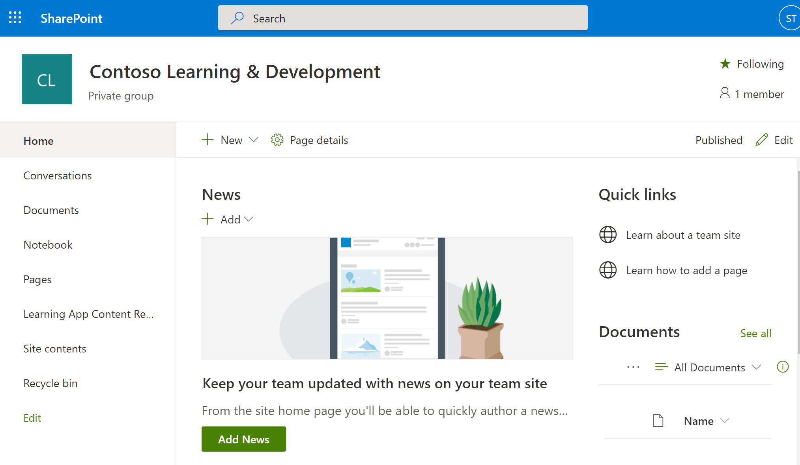
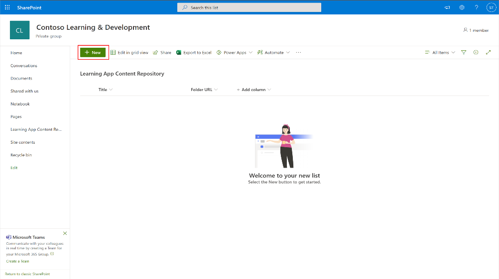
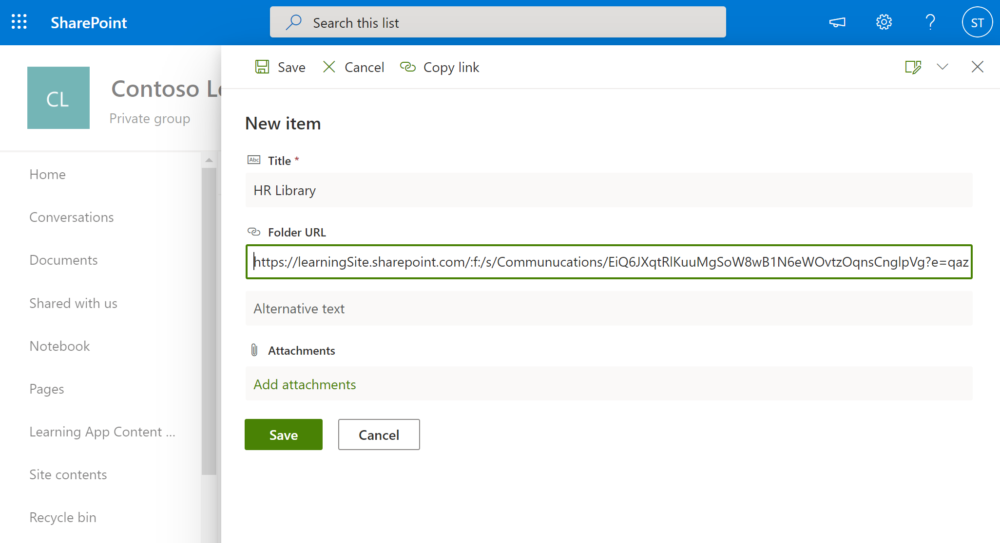
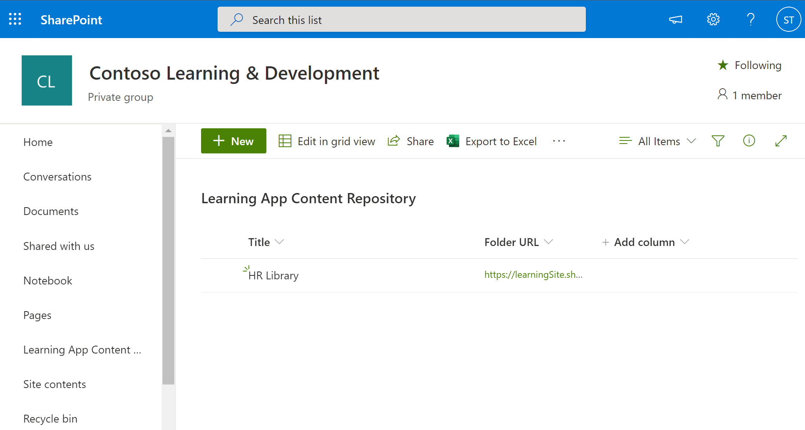

# Install, manage, and assign permissions for the Teams Learning app (private preview)

*This article contains preliminary content for the Teams Learning app, which is in private preview.*

The Microsoft Teams Learning app (private preview) empowers teams and individuals to make learning a natural part of their day. The app creates a central hub in Teams where employees can share, assign, and learn from content libraries across your organization. Admins set permissions and allow content for the Teams Learning app (private preview). Learning content can include LinkedIn Learning, Microsoft Learn, Microsoft 365 training, your organization's own content stored in SharePoint online, and third-party providers that are supported by the application.

To set up the Teams Learning app (private preview), you'll need to involve:

-	Teams admin center admin
-	Microsoft 365 admin center admin
-	Knowledge admin (a new role in the Microsoft 365 admin center that can be assigned to a user to set up and manage the learning sources)

## Configure the Teams Learning app (private preview) in the Teams admin center

The Teams admin installs the Teams Learning app (private preview) from the app store, and configures other app-to-Teams interactions, such as pinning and unpinning. (The [Knowledge admin](#assign-the-knowledge-admin-role-[Optional]) configures the learning sources.)

### Install or update the app
The Teams Learning app (private preview) will be automatically pre-installed on Teams for approved users in the private preview. The app will be automatically updated by Teams and Microsoft for users who in the appropriate ring.

### Manage settings for the app

To manage settings for the Teams Learning app (private preview), follow these steps:

1. In the left navigation of the Microsoft Teams admin center, go to **Teams apps** > **Manage apps**.

   

2. On the **Manage apps** page, in the search box, type *learning* to search for the Teams Learning app (private preview).

   

3. On the **Learning** page:
   1. Under **Status**, select **Allowed** to turn on the app.
   2. On the **Settings** tab, in the **App settings** section, go to the Microsoft 365 admin center to manage settings for the app.

   

## Configure learning content sources in the Microsoft 365 admin center

The admins for the Microsoft 365 admin center—either by themselves or by assigning the Knowledge admin role to selected individuals in your organization—can manage settings related to the Teams Learning app (private preview) and can configure the learning content sources.

> [!TIP]
> The Knowledge admin should be moderately technical and have existing SharePoint admin credentials, preferably someone who is well-versed in the education, learning, training, or employee experience part of the organization.
 
The admin selects which learning content sources (such as LinkedIn Learning or SharePoint) will be available in the app. The admin then configures those sources to make sure the content is available for search and discovery and can be browsed by the employees who use the app.

### Assign the Knowledge admin role [Optional]

These steps are to be performed by the admin for the Microsoft 365 admin center.

1.	In the left navigation of the Microsoft 365 admin center, go to **Roles**.

2.	On the **Roles** page, on the **Azure AD** tab, select **Knowledge admin**.
 
3.	On the **Knowledge admin** page, in the **Assigned Admins** section, select **Add**, and then add the person you choose for the role.

### Configure settings for the learning content sources for the app

These steps are to be performed by the Microsoft 365 admin or the Knowledge admin.

1.	In the left navigation of the Microsoft 365 admin center, go to **Settings** > **Org settings**.

2.	On the **Settings** page, on the **Services & add-ins** tab, select **Learning app**.
  
3.	On the **Learning app** panel, select the learning content sources you want to configure for the organization, and then select **Save**.
  
The learning content sources that are enabled by default include:

- LinkedIn Learning (free content)
- Microsoft Learn
- Microsoft 365 Training

More learning sources will be available in future releases.

> [!NOTE]
> If your organization has a LinkedIn Learning Standard or Pro subscription, the content repository will be unlocked for the employees in your organization. Only those employees who have permission will be able to use the entire content repository.

To enable or disable a learning content source, select the check box next to the source. If a source is enabled, a check mark will be visible.

## Configure SharePoint as a learning content source

You configure SharePoint as a learning content source for the Teams Learning app (private preview) in the Microsoft 365 admin center.

### Overview

The Knowledge admin provides a site URL to where the Learning Service can create an empty centralized learning content repository in the form of a structured SharePoint list. This list can be used by the organization to house links to cross-company SharePoint folders that contain learning content. Admins are responsible for collecting and curating a list of URLs for folders. These folders should only include content that can be made available in the Teams Learning app (private preview).

### Permissions

Folder URLs can be collected from any SharePoint site in the organization. Any content within these folders will be searchable, but only content to which the individual employee has permissions can be used.
 
### Learning Service

The Learning Service uses the provided folder URLs to get metadata from all content stored in those folders. Within 24 hours of supplying the folder URL in the centralized repository, employees can search for and use the company’s content within the app. Content deletion from the repository isn't supported at this point. Unintentionally surfaced content can only be removed by supplying a new SharePoint site URL in the Microsoft 365 admin center.

### Configure SharePoint as a source

These steps are to be performed by Microsoft 365 admin or the Knowledge admin.

1.	In the left navigation of the Microsoft 365 admin center, go to **Settings**.
 
2.	On the **Settings** page, on the **Services & add-ins** tab, select **Learning app**.
 
3.	On the **Learning app** panel, provide the site URL to the SharePoint site where you want the app to create a centralized repository.

4.	A SharePoint list is created automatically within the provided organization’s SharePoint site. In the left navigation of the SharePoint site, select **Learning App Content Repository**. 

   

 
5. On the **Learning App Content Repository** page, populate the SharePoint list with URLs to the learning content folders.

   1.	Select **New** to view the **New item** panel. 

   
 
   2.	On the **New item** panel, in the **Title** field, add a directory name of your choice. In the **Folder URL** field, add the URL to the learning content folder. Select **Save**.

   

   3. The Learning App Content Repository page is updated with the new learning content.

   

 

