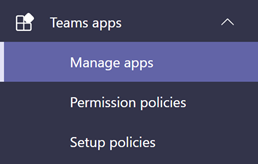
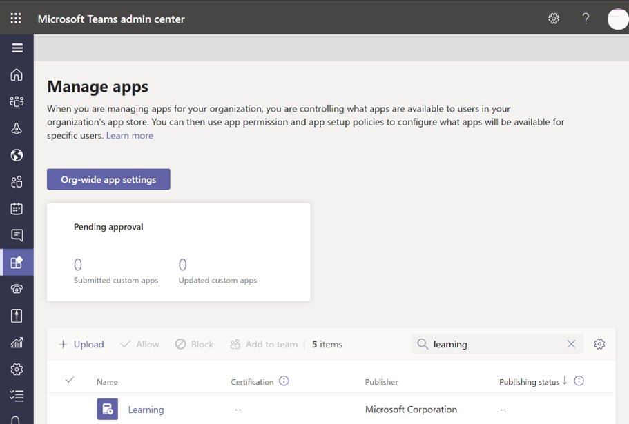
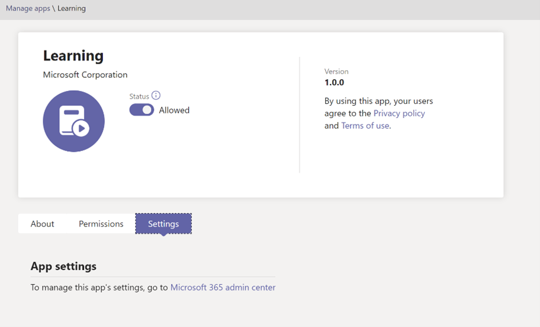
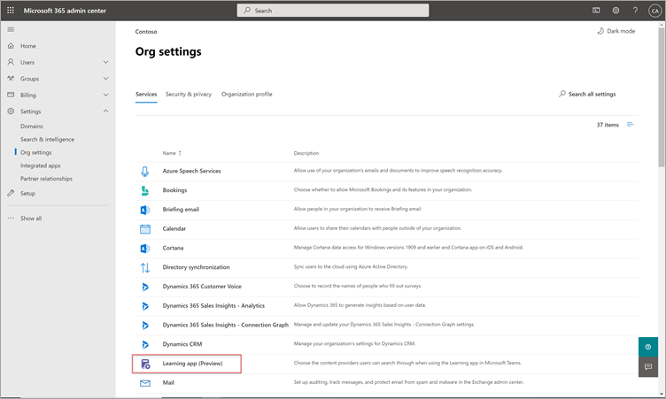
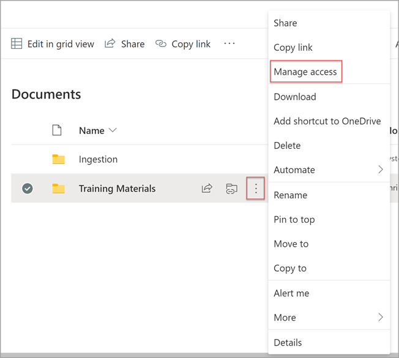

# Install, manage, and assign permissions for Microsoft Viva Learning (private preview)

*This article contains preliminary content for Microsoft Viva Learning, which is in private preview.*

Microsoft Viva Learning (private preview) empowers teams and individuals in your organization to make learning a natural part of their day. The app creates a central hub in Teams where employees can share, assign, and learn from content libraries across your organization.

Admins set permissions and allow learning content sources for Viva Learning (private preview). Learning content can include LinkedIn Learning, Microsoft Learn, Microsoft 365 training, your organization's own content stored in SharePoint online, and third-party providers that are supported by Viva Learning (private preview).

## Admin roles

To set up Viva Learning (private preview), you'll need permissions as:

- Microsoft Teams admin
- Microsoft 365 global administrator or SharePoint administrator
- Knowledge admin — This is a new role in the Microsoft 365 admin center that can be assigned to anyone in the organization. This role manages the organization’s learning content sources through the Microsoft 365 admin center. 

> [!TIP]
> The knowledge admin should be moderately technical and have existing SharePoint admin credentials, preferably someone who is well-versed in the education, learning, training, or employee experience part of the organization.
 
## Manage Viva Learning (private preview) in the Teams admin center

The Teams admin installs Viva Learning (private preview) from the app store, and then applies setup, manage, and permission policies through the Teams admin center.

### Manage settings for Viva Learning (private preview)

You must be an administrator in the Teams admin center to perform these tasks.

To manage settings for Viva Learning, follow these steps:

1. In the left navigation of the Teams admin center, go to **Teams apps** > **Manage apps**.

   

2. On the **Manage apps** page, in the search box, type *learning* to search for the Teams Learning app (private preview).

   

3. On the **Learning** page:
   1. Under **Status**, select **Allowed** to turn on the app.
   2. On the **Settings** tab, in the **App settings** section, go to the Microsoft 365 admin center to configure learning content sources.

   

4. After **Manage app** settings, go to **Permissions and Set-up policies** to grant permission to employees who should have access to the app as part of your organization's participation in the private preview.

> [!NOTE]
>  If your organization is in Ring 4.0 as part of Teams TAP100 program, you might need to do the following to enable approved users in Ring 3.0 to access Viva Learning (private preview).

As part of private preview, Viva Learning (private preview) is released in Ring 3.0. If your organization is in Ring 4.0, you won’t see the app in the app store. To test the app, you need to create a custom apps permission policy, set it to **Allow all apps**, and assign it to Ring 3.0 approved users.

   

## Configure learning content sources in the Microsoft 365 admin center

The administrators for the Microsoft 365 admin center—either by themselves or by assigning the knowledge admin role to selected individuals in your organization—can manage settings related to Viva Learning (private preview) and can configure the learning content sources.

The administrator selects which additional learning content sources (for example, SharePoint or supported third-party content provider sources) will be available to users of Viva Learning (private preview). The admin then configures those sources to make sure the content is available for search and discovery and can be browsed by the employees who use Viva Learning (private preview).

> [!NOTE]
>  Users sign in to non-Microsoft and LinkedIn Learning Pro learnings in a browser or embedded viewer. This configured learning is subject to the separate license, privacy and service terms between your organization and the third party, and not the Viva Learning (private preview) terms. Before selecting this type of learning, verify you have an agreement in place for your organization and users.

### Assign the knowledge admin role [Optional]

You must be a Microsoft 365 global administrator to perform these tasks.

To assign a knowledge admin for Viva Learning, follow these steps:

1.	In the left navigation of the Microsoft 365 admin center, go to **Roles**.

2.	On the **Roles** page, on the **Azure AD** tab, select **Knowledge admin**.
 
3.	On the **Knowledge admin** page, in the **Assigned Admins** section, select **Add**, and then add the person you choose for the role.

### Configure settings for the learning content sources for Viva Learning (private preview)

You must be a Microsoft 365 global administrator or knowledge admin to perform these tasks.

To configure settings for learning content sources in Viva Learning, follow these steps:

1.	In the left navigation of the Microsoft 365 admin center, go to **Settings** > **Org settings**.

2.	On the **Org settings** page, on the **Services** tab, select **Learning app (Preview)**.

   

3.	On the **Learning app (Preview)** panel, select the learning content sources you want to configure for the organization, and then select **Save**.

   

Among all the learning sources that exist, some will be enabled by default. These include:

- LinkedIn Learning (free content)
- Microsoft Learn
- Microsoft 365 Training

> [!NOTE]
> If your organization has a LinkedIn Learning Standard or Pro subscription, the content repository will be unlocked for the employees in your organization. Only those employees who have permission will be able to use the entire content repository.  Other sources might need to be enabled or configured manually. Learning sources that are not from Microsoft are separately licensed between your organization and the third party. You’ll need to verify you’ve signed up for their learning for you and your users.

To enable or disable a learning content source, select the check box next to the source. If a source is enabled, a check mark will be visible.

## Configure SharePoint as a learning content source

You can configure SharePoint as a learning content source to make your organization's own content available in Viva Learning (private preview).

### Overview

The knowledge admin (or global administrator) provides a site URL to where the Learning Service can create an empty centralized location—the Learning App Content Repository—in the form of a structured SharePoint list. This list can be used by your organization to house links to cross-company SharePoint folders that contain learning content. Admins are responsible for collecting and curating a list of URLs for folders. These folders should only include content that can be made available in Viva Learning (private preview).

Viva Learning (private preview) supports the following document types:

- Word, PowerPoint, Excel, PDF
- Audio (.m4a)
- Video (.mov, .mp4, .avi)

For more information, see the [SharePoint Online documentation](https://docs.microsoft.com/sharepoint/introductionlink). 

### Permissions

Document library folder URLs can be collected from any SharePoint site in the organization. Viva Learning (private preview) follows all existing content permissions. Therefore, only content for which a user has permission to access is searchable and visable within Viva Learning (private preview). Any content within these folders will be searchable, but only content to which the individual employee has permissions can be used.

Content deletion from your organization’s repository is not currently supported.

To remove unintentionally surfaced content, follow these steps:

1.	To restrict access on the document library, select the **Show actions** option, and then select **Manage access**.
	 
   

2.	Delete the original document within the document library.

For more information, see [Sharing and permissions in the SharePoint modern experience](https://docs.microsoft.com/sharepoint/modern-experience-sharing-permissions). 

### Learning Service

The Learning Service uses the provided folder URLs to get metadata from all content stored in those folders. Within 24 hours of supplying the folder URL in the centralized repository, employees can search for and use your organization’s content within Viva Learning (private preview). All changes to content, including updated metadata and permissions, will also be applied in the Learning Service within 24 hours.

### Configure SharePoint as a source

You must be a Microsoft 365 global administrator, SharePoint administrator, or knowledge admin to perform these tasks.

To configure SharePoint as a learning content sources in for Viva Learning (private preview), follow these steps:

1.	In the left navigation of the Microsoft 365 admin center, go to **Settings** > **Org settings**.
 
2.	On the **Org settings** page, on the **Services** tab, select **Learning app (Preview)**.

   

3.	On the **Learning app (Preview)** panel, under **SharePoint**, provide the site URL to the SharePoint site where you want Viva Learning to create a centralized repository.

   

4.	A SharePoint list is created automatically within the provided SharePoint site.

     

     In the left navigation of the SharePoint site, select **Site contents** > **Learning App Content Repository**. 

    

5. On the **Learning App Content Repository** page, populate the SharePoint list with URLs to the learning content folders.

   1.	Select **New** to view the **New item** panel. 

   
 
   2.	On the **New item** panel, in the **Title** field, add a directory name of your choice. In the **Folder URL** field, add the URL to the learning content folder. Select **Save**.

   

   3. The **Learning App Content Repository** page is updated with the new learning content.

   

> [!NOTE]
> To allow for broader access to the Learning App Content Repository, a link to the list soon will be available in the Viva Learning (private preview) interface where users can request access and ultimately help populate the list. Site owners and global administrators will be required to grant access to the list. Access is specific to the list only and does not apply to the site where the list is stored.

### Folder URL document library curation

Default metadata (such as modified date, created by, document name, content type, and organization name) is automatically pulled into Viva Learning (private preview) by the Microsoft Graph API.
 
To improve overall discovery and search relevance of the content, we recommend adding a **Description** column.

To add a **Description** column to the document library page, follow these steps:

1.	On the **Documents** page, select **Add column**.

2. Select the **Show actions** option, and then select **Single line of text**.

   

3. On the **Create a column** panel, in the **Name** field, add a descriptive name for the column. Select **Save**.

   
 
4. On the **Documents** page, in the **Description** column, add custom descriptions for each item. If no description is supplied, Viva Learning (private preview) will provide a default message that highlights the content as being from your own SharePoint library. 

   
 
### Frequently asked questions

#### Does Viva Learning (private preview) support keyword, skills tags, and custom-built columns for documents?

At the moment no, but we are planning to provide these options.

#### Does Viva Learning (private preview) support custom thumbnails?

At the moment no, but working to provide preview thumbnails.
 
#### How will nested folders within document libraries be handled?

Currently, there are five levels of folders. The folder levels will be flattened as items are ingested into the learning service.

#### How many total SharePoint items does Viva Learning (private preview) support?

Viva Learning (private preview) supports 5,000 total items per organization for private preview. 
