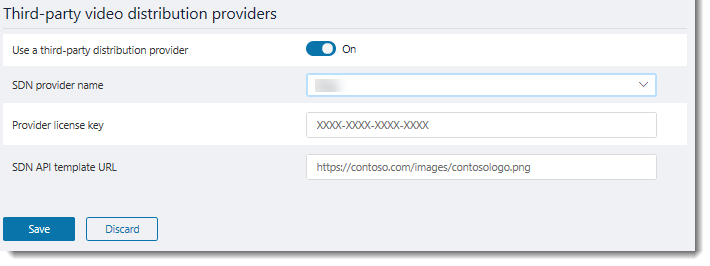

# Configure live event settings in Microsoft Teams

Use Teams live events settings to configure settings for live events that are held in your organization. You can set up a support URL and configure a third-party video distribution provider. These settings apply to all live events that are created in your organization. 

You can easily manage these settings in the Microsoft Teams admin center. In the left navigation, go to **Meetings** > **Live events settings**. 

 

## Set up event support URL

This URL is shown to live event attendees. Add the support URL for your organization to give attendees a way to contact support during a live event.

###  Using the Microsoft Teams admin center

1. In the left navigation, go to **Meetings** > **Live event settings**.
2. Under **Support URL**, enter your organization's support URL. 

    

### Using Windows PowerShell
Run the following:
```
Set-CsTeamsMeetingBroadcastConfiguration -SupportURL “{your URL}” 
```
For more information, see [Set-CsTeamsMeetingBroadcastConfiguration](https://docs.microsoft.com/powershell/module/skype/set-csteamsmeetingbroadcastconfiguration?view=skype-ps).
## Configure a third-party video distribution provider 

If you purchased and set up a software defined network (SDN) solution or enterprise content delivery network (eCDN) solution through a Microsoft video delivery partner, configure the provider for live events in Teams. 

###  Using the Microsoft Teams admin center

1. In the left navigation, go to **Meetings** > **Live event settings**.
2. Under **Third-party video distribution providers**, complete the following: 

    

    - **Use a third-party distribution provider** Turn this on to enable the third-party video distribution provider.
    - **SDN provider name** Choose the provider you're using.
    - **Provider license key** Enter the license ID that you got from your provider contact.
    - **SDN API template URL** Enter the API template URL that you got from your provider contact.

### Using Windows PowerShell
Get the license ID or API token and API template from your provider contact, and then run one of the following, depending on the provider you're using:

**Hive** 
```
Set-CsTeamsMeetingBroadcastConfiguration -AllowSdnProviderForBroadcastMeeting $True -SdnProviderName hive -SdnLicenseId {license ID GUID provided by Hive} -SdnApiTemplateUrl “{API template URL provided by Hive}”
```
**Kollective** 
```
Set-CsTeamsMeetingBroadcastConfiguration -AllowSdnProviderForBroadcastMeeting $True -SdnProviderName kollective -SdnApiTemplateUrl "{API template URL provided by Kollective}" -SdnApiToken {API token GUID provided by Kollective}
```
For more information, see [Set-CsTeamsMeetingBroadcastConfiguration](https://docs.microsoft.com/powershell/module/skype/set-csteamsmeetingbroadcastconfiguration?view=skype-ps).

> [!NOTE]
> If you plan to create live events that use external encoders, you'll also need to [configure your eCDN provider with Microsoft Stream](https://docs.microsoft.com/stream/network-caching). 

### Related topics
- [What are Teams live events?](what-are-teams-live-events.md)
- [Plan for Teams live events](plan-for-teams-live-events.md)
- [Set up for Teams live events](set-up-for-teams-live-events.md)