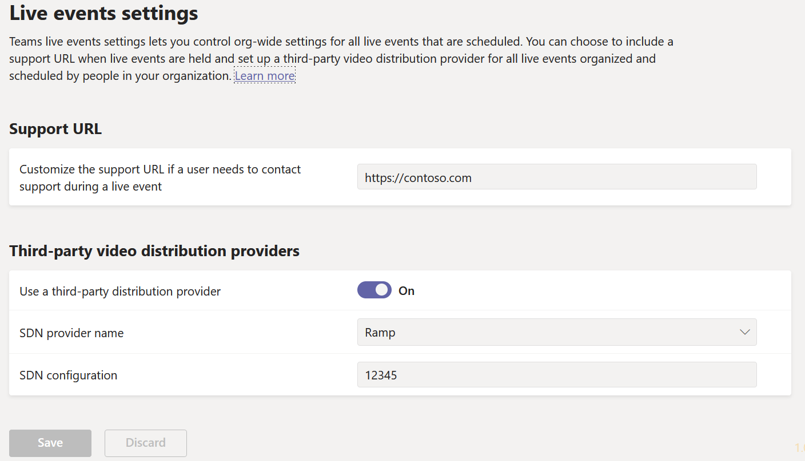
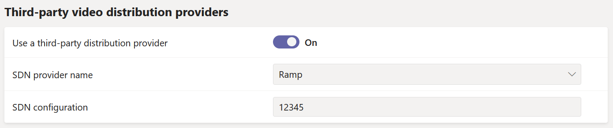

# Configure live event settings in Microsoft Teams

Use Teams live events settings to configure settings for live events that are held in your organization. You can set up a support URL and configure a third-party video distribution provider. These settings apply to all live events that are created in your organization.

You can easily manage these settings in the Microsoft Teams admin center. In the left navigation, go to **Meetings** > **Live events settings**.



## Set up event support URL

This URL is shown to live event attendees. Add the support URL for your organization to give attendees a way to contact support during a live event.

### Using the Microsoft Teams admin center

1. In the left navigation, go to **Meetings** > **Live event settings**.
2. Under **Support URL**, enter your organization's support URL.

    

### Using Windows PowerShell

Run the following:

```PowerShell
Set-CsTeamsMeetingBroadcastConfiguration -SupportURL “{your URL}”
```
For more information, see [Set-CsTeamsMeetingBroadcastConfiguration](/powershell/module/skype/set-csteamsmeetingbroadcastconfiguration?view=skype-ps&preserve-view=true).
## Configure a third-party video distribution provider 

If you purchased and set up a software defined network (SDN) solution or enterprise content delivery network (eCDN) solution through a Microsoft video delivery partner, configure the provider for live events in Teams. 

### Using the Microsoft Teams admin center

1. In the left navigation, go to **Meetings** > **Live event settings**.
2. Under **Third-party video distribution providers**, complete the following: 

    

    - **Third-party distribution provider** Turn this ON to enable the third-party video distribution provider.
    - **SDN provider name** Choose the provider you're using.
    - **SDN Configuration** Enter SDN Configuration details.
        
### Using Windows PowerShell
Get the license ID or API token and API template from your provider contact, and then run one of the following, depending on the provider you're using:

**Hive** 
```PowerShell
Set-CsTeamsMeetingBroadcastConfiguration -AllowSdnProviderForBroadcastMeeting $True -SdnProviderName hive -SdnLicenseId {license ID GUID provided by Hive} -SdnApiTemplateUrl “{API template URL provided by Hive}”
```
**Kollective** 
```PowerShell
Set-CsTeamsMeetingBroadcastConfiguration -AllowSdnProviderForBroadcastMeeting $True -SdnProviderName kollective -SdnApiTemplateUrl "{API template URL provided by Kollective}" -SdnApiToken {API token GUID provided by Kollective}
```
**Riverbed** 
```PowerShell
Set-CsTeamsMeetingBroadcastConfiguration -AllowSdnProviderForBroadcastMeeting $True -SdnProviderName riverbed -SdnApiTemplateUrl "{API template URL provided by Riverbed}" -SdnApiToken {API token GUID provided by Riverbed}
```
**Ramp** 
```PowerShell
Set-CsTeamsMeetingBroadcastConfiguration -AllowSdnProviderForBroadcastMeeting $True -SdnProviderName ramp -SdnRuntimeConfiguration "{Configuration provided by RAMP}"
```
**Peer5**
```PowerShell
Set-CsTeamsMeetingBroadcastConfiguration -AllowSdnProviderForBroadcastMeeting $True -SdnProviderName peer5 -SdnLicenseId {peer5CustomerId}
```

For more information, see [Set-CsTeamsMeetingBroadcastConfiguration](/powershell/module/skype/set-csteamsmeetingbroadcastconfiguration?view=skype-ps&preserve-view=true).

> [!NOTE]
> If you plan to create live events using an external app or device, you'll also need to [configure your eCDN provider with Microsoft Stream](/stream/network-caching). 

>[!Note]
> The change from using Microsoft Stream to [OneDrive for Business and SharePoint for meeting recordings](../tmr-meeting-recording-change.md) will be a phased approach. At launch you'll be able to opt-in to this experience, in November you'll have to opt-out if you want to continue using Stream, and some time in early 2021 we'll require all customers to use OneDrive for Business and SharePoint for new meeting recordings.

>[!Note]
> Your chosen eCDN solution is subject to the selected 3rd party provider’s terms of service and privacy policy, which will govern your use of the eCDN provider’s solution. Your use of the eCDN provider’s solution will not be subject to the Microsoft volume licensing terms or Online Services Terms. If you don't agree to the 3rd party provider’s terms, then don't enable the eCDN solution in Microsoft Teams.

### Related topics
- [What are Teams live events?](what-are-teams-live-events.md)
- [Plan for Teams live events](plan-for-teams-live-events.md)
- [Set up for Teams live events](set-up-for-teams-live-events.md)
