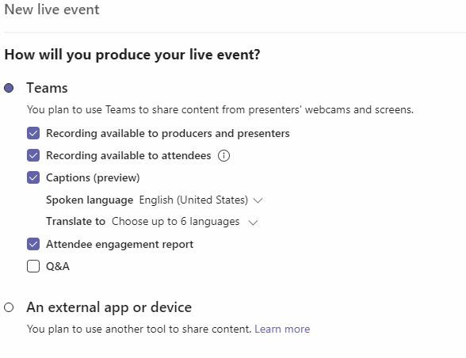

# Live event recording policies in Microsoft Teams

You have several options for recording a Microsoft Teams live event. The recording options are set using recording policies. This article describes the various settings.

## Scheduling & option behavior

There are two organizer options while scheduling a live event recording:

- Recording available for producers and presenters

  - Recording file: Provides a recording file that producers/presenters can download after the event is over

- Recording available for attendees

  - DVR: Allows attendees to rewind and pause during the event

  - VOD: Allows attendees to watch after the event is over

## Broadcast recording policy setting

As part of the broadcast policy, there is a setting that you can toggle to turn on/off recording for a live event.

|                                 | **Recording available for producers and presenters** | **Recording available for attendees** |
| ------------------------------- | ---------------------------------------------------- | ------------------------------------- |
| **Always record**               | Disabled and selected                                | Enabled and selected by default       |
| **Organizer can record or not** | Enabled and not selected by default                  | Enabled and not selected by default   |
| **Never record**                | Disabled and not selected                            | Enabled and selected by default       |

When the policy is set to **Always record**, the policy page has the following selected options:

## Flags set on client

| **Can be set by user**                                         | **Flag/capability set by client?** | **Flag**                 | **Implications**                                                                                               |
| -------------------------------------------------------------- | ---------------------------------- | ------------------------ | -------------------------------------------------------------------------------------------------------------- |
| Organizer option: Recording available for attendee             | Yes                                | Capabilities.VOD         | If True, Attendee Service admits user after event is over                                                      |
| Organizer option: Recording available for producer & presenter | Yes                                | Capabilities.Recording   | If True, generates mp4                                                                                         |
| Admin setting: Never record admin policy setting               | No                                 | Capabilities.DoNotRecord | If DoNotRecord is set, then by definition, MP4, VOD AND DVR must all be disabled – no assets should be stored. |

## Storage & persistence behavior

| **Option**                                       | **State**    | **DVR**                                                   | **VOD**                                                     | **Recording**                |
| ------------------------------------------------ | ------------ | --------------------------------------------------------- | ----------------------------------------------------------- | ---------------------------- |
| **Recording available to producers and presenters** | Selected     | DVR is available and the AMS asset is stored for 180 days | Attendee can access and watch the event                     |                              |
|                                                  | Not Selected | DVR is available and the AMS asset is stored for 180 days | Attendee will not get access into the event after it's over |                              |
| **Recording available to producers and presenters** | Selected     |                                                           |                                                             | An MP4 is created and stored |
|                                                  | Not Selected |                                                           |                                                             | No file is created           |

## Mitigation

### End user changes & fixes

<table>
<thead>
<tr class="header">
<th><strong>End User Scenario</strong></th>
<th><strong>Requirement/Fix</strong></th>
<th><strong>Notes</strong></th>
</tr>
</thead>
<tbody>
<tr class="odd">
<td>When the live event recording policy setting is set to **Never record** don’t allow organizers to select any recording options</td>
<td><ul>
<li>
Disable and grey out the **Recording for attendees**
</li>
</ul></td>
<td></td>
</tr>
<tr class="even">
<td></td>
<td><ul>
<li>
Set the following:
</li>
</ul>

Capabilities.DoNotRecord = true
</td>
<td></td>
</tr>
<tr class="odd">
<td>When the policy is set to **Never record** the system does not store any recording assets</td>
<td><ul>
<li>
If the DoNotRecord flag is set to true then:

<ul>
<li>
Delete the AMS asset used for DVR after the event is over
</li>
<li>
Never create a recording MP4
</li>
</ul></li>
</ul></td>
<td>Users who paused during the event and resumed after it’s over would get a playback error since the AMS asset has been deleted</td>
</tr>
</tbody>
</table>

### New State

|                                 | **Recording available to producers and presenters** | **Recording available to attendees** |
| ------------------------------- | ---------------------------------------------------- | ------------------------------------- |
| **Always record**               | Enabled and selected by default                      | Enabled and selected by default       |
| **Organizer can record or not** | Enabled and not selected by default                  | Enabled and not selected by default   |
| **Never record**                | Disabled                                             | Disabled                              |

### New State with options

| **Option**                                       | **State**    | **DVR**                                                       |**VOD**                                                     | **Recording**                |
| ------------------------------------------------ | ------------ | ------------------------------------------------------------- | ----------------------------------------------------------- | ---------------------------- |
| **Recording available to producers and presenters** | Selected     | DVR is available and the AMS asset is stored for 180 days     | Attendee can access and watch the event                     |                              |
|                                                  | Not selected | DVR is available and the AMS asset is deleted after the event | Attendee will not get access into the event after it's over |                              |
| **Recording available to producers and presenters** | Selected     |                                                               |                                                             | An MP4 is created and stored |
|                                                  | Not selected |                                                               |                                                             | No file is created           |

### Phases

**Phase 1** – Put the new changes behind an ECS flag and enable for a
handful of tenants

**Phase 2** –

- Make changes to the DVR:
    
  - .DoNotRecord is set = no VOD
    
  - Separate DVR option for end user so that AMS asset doesn’t get
        created in the first place.

- Get feedback from users on the policy change before releasing to all
    users.

### Related topics

- [What are Teams live events?](what-are-teams-live-events.md)
- [Plan for Teams live events](plan-for-teams-live-events.md)
- [Configure live events settings in Teams](configure-teams-live-events.md)
