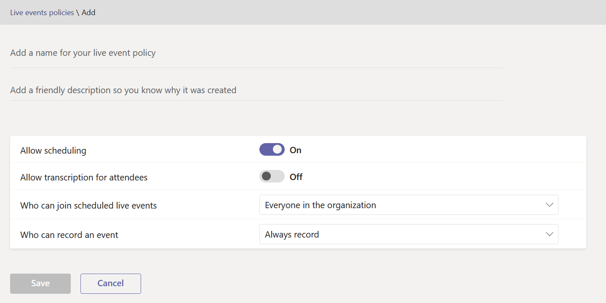

# Set up for live events in Microsoft Teams

When you're setting up for live events, there are several steps that you must take.

## Step 1: Set up your network for live events in Teams

Live events produced in Teams require you to [prepare your organization's network for Teams](../prepare-network.md).  

## Step 2: Get and assign licenses

Ensure you have correct license assignments for [who can create and schedule live events](plan-for-teams-live-events.md#who-can-attend-create-and-schedule-live-events) and [who can watch live events](plan-for-teams-live-events.md#who-can-watch-live-events).

## Step 3: Set up live events policies

Live events policies are used to control who in your organization can hold live events and the features that are available in the events they create. You can use the default policy or create one or more custom live events policies. After you create a custom policy, assign it to a user or groups of users in your organization.

> [!NOTE]
> Users in your organization will get the global (Org-wide default) policy unless you create and assign a custom policy. By default in the global policy, live event scheduling is enabled for Teams users, live captions and subtitles (transcription) is turned off, everyone in the organization can join live events, and the recording setting is set to always record.

### Create or edit a live events policy

1. In the left navigation of the Microsoft Teams admin center, go to **Meetings** > **Live events policies** > **Manage Policies** tab.
2. Do one of the following options:

    - If you want to edit the existing default policy, choose **Global (Org-wide default)**.
    - If you want to create a new custom policy, choose **+Add**.
    - If you want to edit a custom policy, select the policy, and then choose **Edit**.

    Here are the settings you can change to fit the needs of your organization.

    

|Setting  |Description  |
|---------|---------|
|**Title**     |This is the title of the policy that appears on the live events policies page. It can't be longer than 64 characters or have any special characters.          |
|**Description**    |Use this to add a friendly description for the policy.         |
|**Live events scheduling**     |Turning this on lets users in your organization create and schedule live events in Teams. It's important to know that if you want users to schedule a live event produced with an external app or device, there are additional steps you must do. To learn more, see  [Enable users to schedule events that were produced with an external app or device](#enable-users-to-schedule-events-that-were-produced-with-an-external-app-or-device).     |
|**Transcription for attendees** |This setting can only be applied to events produced in Teams. Turning this on enables live event attendees to see live captions and subtitles during the event.         |
|**Who can join scheduled live events**    |Choose one of the following.  **Everyone** Users can create live events that everyone, including people outside your organization, can attend. This setting enables the **Public** permission type in Teams when a user schedules a live event.  **Everyone in the organization** Users can create live events that people in your organization, including [guest users](../add-guests.md) added to your organization, can attend. Users can't create live events that are attended by anonymous users. This setting enables the **Org-wide** permission type in Teams when a user schedules a live event.  **Specific users or groups** Users can create live events that only specific users or groups in your organization can attend. Users can't create live events that are attended by everyone in your organization or by anonymous users. This setting enables the **People and groups** permission type in Teams when a user schedules a live event.       |
|**Recording setting**        | This setting can only be applied to events produced in Teams. Choose one of the following.    **Always record** Live events created by users are always recorded. After the event is over, event team members can download the recording and attendees can watch the event.   **Never record** Live events created by users are never recorded.  **Organizer can record or not** Users can decide whether to record the live event. If it's recorded, after the event is over, event team members can download the recording and attendees can watch the event.

You can also do this by using Windows PowerShell, and, currently, GCC High and DoD customers must use this method. For more information, see [Use PowerShell to set live events policies in Teams](set-teams-live-events-policies-using-powershell.md).

### Assign a live events policy to users

If you created a custom live events policy, assign it to users for the policy to be active.   [!INCLUDE [assign-policy](../includes/assign-policy.md)]

### Enable users to schedule events that were produced with an external app or device

For users to schedule events produced with an external app or device, you must also do the following steps:

1. Enable Microsoft Stream for users in your organization. Stream is available as part of eligible Microsoft 365 or Office 365 subscriptions or as a standalone service. Stream isn't included in Business Essentials or Business Premium plans. See [Stream licensing overview](/stream/license-overview) for more details.

   >[!Note]
   > The change from using Microsoft Stream to [OneDrive for Business and SharePoint for meeting recordings](../tmr-meeting-recording-change.md) will be a phased approach. At launch you'll be able to opt-in to this experience, in November you'll have to opt-out if you want to continue using Stream, and some time in early 2021 we'll require all customers to use OneDrive for Business and SharePoint for new meeting recordings. Learn more about how you can [**assign licenses to users**](https://support.office.com/article/Assign-licenses-to-users-in-Office-365-for-business-997596B5-4173-4627-B915-36ABAC6786DC) so that users can access Stream. Ensure Stream isn't blocked for the users as defined in [**this article**](/stream/disable-user-organization).

2. Ensure users have live event creation permission in Stream. By default, administrators can create events with an external app or device. Stream administrator can [enable additional users for live event creation](/stream/live-event-administration#restrict-who-can-create-events) in Stream.

3. Ensure live event organizers have consented to the company policy set by Stream admin. If a Stream administrator has [set up a company guidelines policy](/stream/company-policy-and-consent) and requires employees to accept this policy before saving content, then users must do so before creating a live event (with an external app or device) in Teams. Before you roll out the live events feature in the organization, make sure users who will be creating these live events have consented to the policy.

## Step 4: Set up a video distribution solution for live events in Teams

Playback of live event videos uses adaptive bitrate streaming (ABR) but it's a unicast stream, meaning every viewer is getting their own video stream from the internet. For live events or videos sent out to large portions of your organization, there could be a significant amount of internet bandwidth consumed by viewers. For organizations that want to reduce this internet traffic for live events, live events solutions are integrated with Microsoft's trusted video delivery partners offering software defined networks (SDNs) or enterprise content delivery networks (eCDNs). These SDN/eCDN platforms enable organizations to optimize network bandwidth without sacrificing end user viewing experiences. Our partners can help enable a more scalable and efficient video distribution across your enterprise network.

**Purchase and set up your solution outside of Teams**
Get expert help with scaling video delivery by leveraging Microsoft's trusted video delivery partners. Before you can enable a video delivery provider to be used with Teams, you must purchase and set up the SDN/eCDN solution outside and separate from Teams.

The following SDN/eCDN solutions are pre-integrated and can be set up to be used with Stream.

- **Hive Streaming** provides a simple and powerful solution for live and on-demand enterprise video distribution. Hive is a software-based solution that requires no additional hardware or bandwidth and provides a secure way to enable thousands of simultaneous video viewers without impact to your network. For customers looking to understand the impact video is having on their network prior to purchasing an SDN/eCDN solution, Hive Streaming also provides a browser-based analytics solution for Microsoft customers. [Learn more](https://www.hivestreaming.com/partners/integration-partners/microsoft/).

- **Kollective** is a cloud-based, smart-peering distribution platform that leverages your existing network infrastructure to deliver content in many forms (live streaming video, on-demand video, software updates, security patches, and more) faster, more reliably, and with less bandwidth. Our secure platform is trusted by the world's largest financial institutions and with no additional hardware, setup and maintenance are easy. [Learn more](https://kollective.com/microsoft-pilot/).

- **Ramp** provides a universal eCDN solution for secure and flawless video delivery. Trusted by the top financial, healthcare, and government institutions, Ramp deploys on-prem, in the cloud, or hybrid and is perfect for Zero Trust environments. Our universal license includes all three eCDN delivery methods (P2P, Multicast, and Cache), ensuring your live streaming and on-demand video is delivered at the highest quality with the lowest bandwidth impact to protect business-critical applications that share the corporate network. [Learn more](https://rampecdn.com/).

- **Riverbed**, the industry standard in network optimization, is extending its acceleration solutions to Microsoft Teams and Stream.  Now Microsoft 365 customers can confidently accelerate 365 traffic including Teams and Stream along with a wealth of other leading enterprise SaaS services to increase workforce productivity from anywhere. Teams and Stream acceleration can be enabled through an effortless setup that comes with all the assurance of Riverbed’s world-class support and ongoing investment.

> [!NOTE]
> Your chosen SDN or eCDN solution is subject to the selected **3rd party provider's terms of service and privacy policy**, which will govern your use of the provider's solution. Your use of the provider's solution will not be subject to the Microsoft volume licensing terms or Online Services Terms. If you do not agree to the **3rd party provider's terms**, then don't enable the solution in Teams.

After you set up the SDN or eCDN solution, you're ready to configure the provider for live events in Teams.

## Next steps

Go to [Configure live events settings in Teams](configure-teams-live-events.md).

### Related topics

- [What is Teams live events?](what-are-teams-live-events.md)
- [Plan for Teams live events](plan-for-teams-live-events.md)
- [Configure live events settings in Teams](configure-teams-live-events.md)
