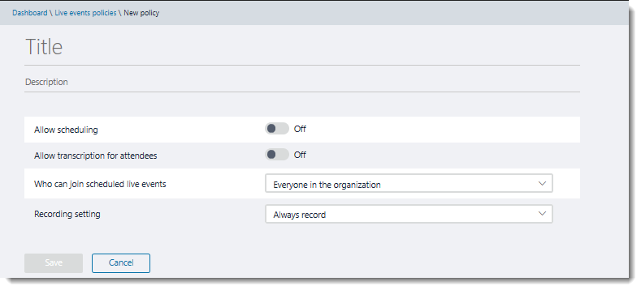

# Manage live events policies in Teams

Teams live events policies are used to control who in your organization can hold live events and the features that are available in the events that they create. You can use the default policy or create one or more custom live events policies. After you create a policy, assign it to a user or groups of users in your organization. 

## Create or edit a live events policy

 Using the Microsoft Teams & Skype for Business admin center

1. In the left navigation, go to **Meetings** > **Live events policies**. 
2. Do one of the following:
- If you want to edit the existing default policy, choose **Global (Org-wide default)**. 
- If you want to create a new custom policy, choose **New policy**. 
- If you want to edit a custom policy, select the policy, and then choose **Edit**. 

    Here are the settings you can change to fit the needs of your organization.

    

  
|Setting  |Description  |
|---------|---------|
|**Name**     |This is the name of the policy that appears on the live events policies page. It can't be longer than 64 characters or have any special characters.          |
|**Description**    |Use this to add a friendly description for the policy.         |
|**Allow scheduling**     |Turning this on lets users in your organization create and schedule live events in Teams.           |
|**Allow transcription for attendees**  |Turning this on enables live event attendees to see real-time captions and translation during the event.         |
|**Who can join scheduled live events**    |Choose one of the following.   **Everyone** Users can create live events that everyone, including people outside your organization, can attend.   **Everyone in the organization** Users can create live events that only people in your organization can attend.   **Specific users or groups** Users can create live events that only specific users or groups in your organization can attend.         |
|**Recording setting**        | This setting can only be applied to live events that are produced using Teams meetings, also known as quick start live events. Choose one of the following.   **Always record** The live events created by users are always recorded. After the event is over, event team members can download the recording and attendees can watch the event.   **Never record** The live events created by users are never recorded.  **Organizer can record or not** Users can decide whether to record the live event. If it is recorded, after the event is over, event team members can download the recording and attendees can watch the event.          |
  

- **Name** This is the name of the policy that appears on the live events policies page. It can't be longer than 64 characters or have any special characters.  
- **Description** Use this to add a friendly description for the policy. 
- **Allow scheduling** Turning this on lets users in your organization create and schedule live events in Teams.  
- **Allow transcription for attendees** Turning this on enables live event attendees to see real-time captions and translation during the event. 
- **Who can join scheduled live events**
    - **Everyone** Users can create live events that everyone, including people outside your organization, can attend.  
    - **Everyone in the organization** Users can create live events that only people in your organization can attend. 
    - **Specific users or groups** Users can create live events that only specific users or groups in your organization can attend. 
- **Recording setting**
This setting can only be applied to live events that are produced using Teams meetings, also known as quick start live events.  
    - **Always record** The live events created by users are always recorded. After the event is over, event team members can download the recording and attendees can watch the event. 
    - **Never record** The live events created by users are never recorded.
    - **Organizer can record or not** Users can decide whether to record the live event. If it is recorded, after the event is over, event team members can download the recording and attendees can watch the event. 

## Assign a live events policy to users 

If you created a custom live events policy, assign it to users for the policy to be active. 

 Using the Microsoft Teams & Skype for Business admin center

1. In the left navigation, go to **Users**, and then select the user.
2. Next to **Assigned policies**, choose **Edit**. 
3. Select the live events policy you want to assign, and then choose **Save**. 

 ### Related topics
- [What are Teams live events?](what-are-teams-live-events.md)
- [Plan for Teams live events](plan-for-teams-live-events.md)
- [Set up for Teams live events](set-up-for-teams-live-events.md)
- [Configure Teams live events](configure-teams-live-events.md)
