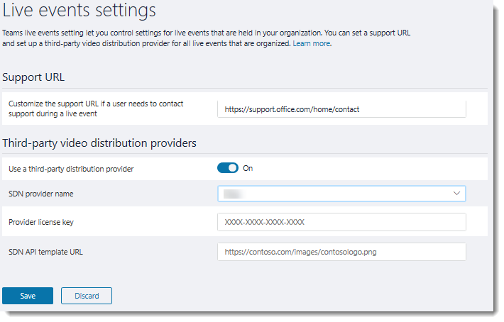

# Manage live events settings in Teams

Teams live events settings let you control settings for live events held in your organization. You can set a support URL and configure a third-party video distribution provider. These settings apply to all live events that are created in your organization.  

You can easily manage these settings in the Microsoft Teams & Skype for Business admin center. In the left navigation, go to **Meetings** > **Live events settings**. 

 

From here, you can set the following to fit your organization's needs. 

- **Support URL** This URL is shown to live event attendees. Add the support URL for your organization to give attendees a way to contact support during a live event.   
- **Third-party video distribution providers**  If you purchased and set up a software defined network (SDN) solution or enterprise content delivery network (eCDN) solution through a Microsoft video delivery partner, configure the provider for live events in Teams.  
    - **Use a third-party distribution provider** Turn this on to enable the third-party video distribution provider.
    - **SDN provider name** Choose the provider you're using.
    - **Provider license key** Enter the license ID that you got from your provider contact.
    - **SDN API template URL** Enter the API template URL that you got from your provider contact.

 ### Related topics
- [What are Teams live events?](what-are-teams-live-events.md)
- [Plan for Teams live events](plan-for-teams-live-events.md)
- [Set up for Teams live events](set-up-for-teams-live-events.md)
- [Configure Teams live events](configure-teams-live-events.md)
