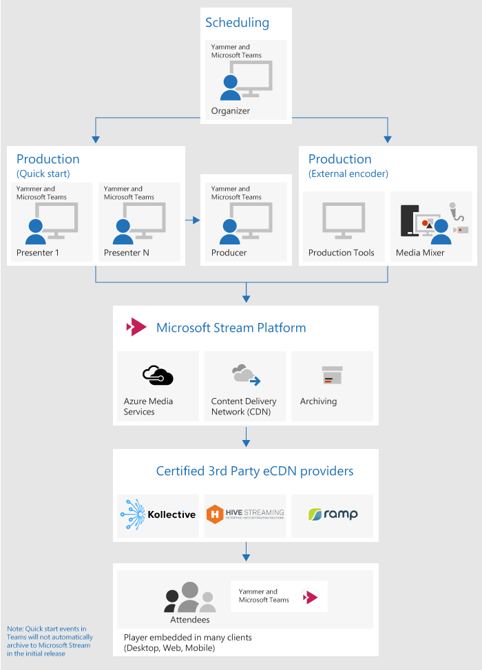
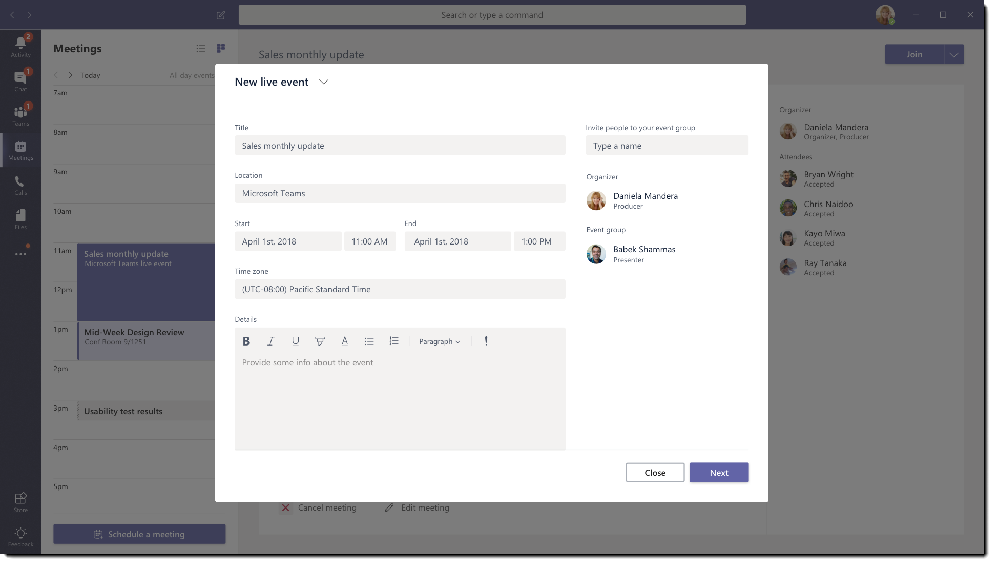
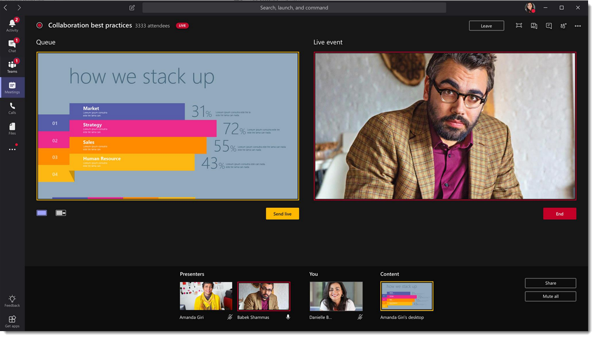
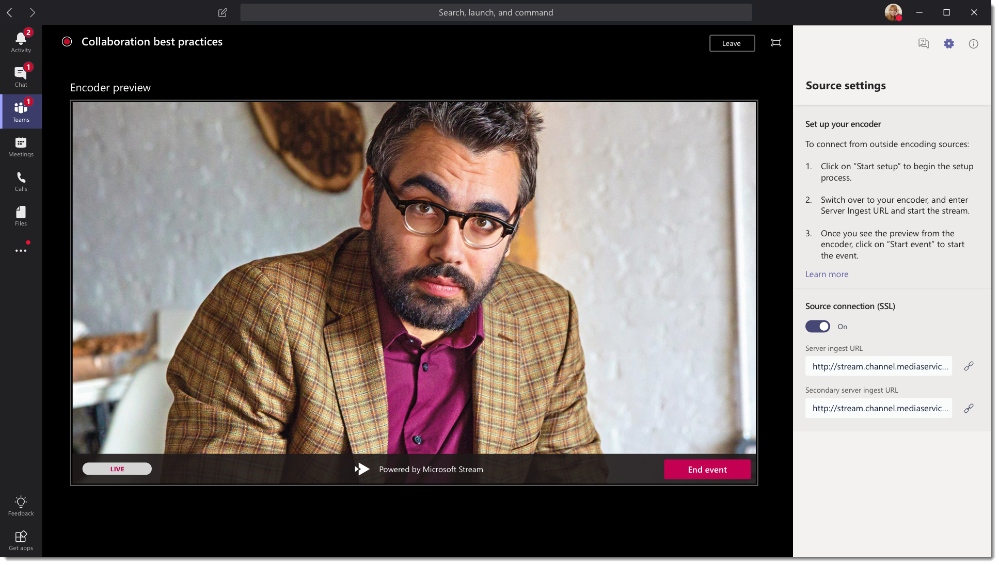
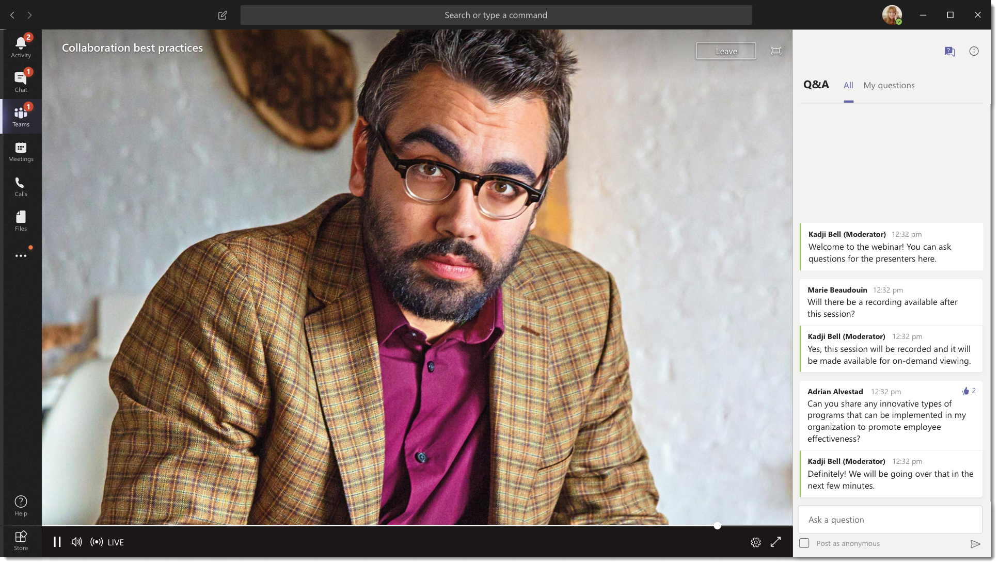

# What are Microsoft Teams live events?

## Overview

With Microsoft Teams live events, users in your organization can broadcast video and meeting content to large online audiences. 

Microsoft 365 live events bring live video streaming to a new level, encouraging connection throughout the entire engagement lifecycle with attendees before, during, and after live events. You can create a live event wherever your audience, team, or community resides, using Microsoft Stream, Microsoft Teams, or Yammer.  

Teams delivers chat-based collaboration, calling, meetings, and with live events, so you can expand the audience of your meetings. Teams live events is an extension of Teams meetings, enabling users to broadcast video and meeting content to a large online audience. These are meant for one-to-many communications where the host of the event is leading the interactions and audience participation is primarily to view the content shared by host. The attendees can watch the live or recorded event in Yammer, Teams, and/or Microsoft Stream, and can interact with the presenters using moderated Q & A or a Yammer conversation. 

Teams live events are considered the next version of Skype Meeting Broadcast and will eventually replace the capabilities provided in Skype Meeting Broadcast. At this point, Microsoft will continue to support Skype Meeting Broadcast for users who are using Skype for Business in their organizations, with no disruption in service for new or future events. However, we encourage you to try out Teams live events to leverage all the new and exciting features including screen sharing and support for external hardware/software encoders. 

So, let's get started. First, take a look at the following diagram that shows high level components involved in Microsoft 365 live events and how they are connected. 

## Key components
So, you can see from the picture above, there are four key components that are used with live events in Teams.

### Scheduling
Teams provides the ability for the organizers to create an event with the appropriate attendee permissions, designate event team members, select production method, and invite attendees. If the live event was created from within a Yammer group, the live event attendees will be able to use Yammer conversation for interacting with people in the event. 

### Production
The video input is the foundation of the Live events and it can vary from a single webcam to a multi-camera professional video production. The live events in Microsoft 365 support a spectrum of production scenarios, include a quick start event using web cams or an event produced in an external device or application. You can choose these options depending on their project requirements and budget. There are two ways to produce events:

- **Microsoft Teams**: This production method allows users to produce their live events in Microsoft Teams using their webcam or using A/V input from Teams room systems. This option is best and quickest option if you want to use the audio and video devices connected to the PC or are inviting remote presenters for participating in the event. This option allows users to easily use their web cams and share their screen as input into the event. 

    

- **External application or device**: External encoders allow users to produce their live events directly from an external hardware or a software-based encoder with [Microsoft Stream](https://stream.microsoft.com). This option is best if you already have studio quality equipment (for example, media mixers) which support streaming to an Real-time Messaging Protocol (RTMP) service. This type of production is typically used in large scale events such as executive town halls – where a single stream from a media mixer is broadcasted to the audience. 

    

### Streaming platform
The live event streaming platform is made up of the following pieces:

- **Azure Media Services**:  [Azure Media Services](https://docs.microsoft.com/azure/media-services/previous/) gives you broadcast-quality video streaming services to reach larger audiences on today’s most popular mobile devices. Media Services enhances accessibility, distribution, and scalability, and makes it easy and cost-effective to stream content to your local or worldwide audiences — all while protecting your content.
- **Azure Content Delivery Network (CDN)**:  Once your stream goes live, it's delivered through the [Azure Content Delivery Network (CDN)](https://docs.microsoft.com/azure/cdn/). Azure Media Services provides integrated CDN for streaming endpoints. This allows for the streams to be viewed worldwide with no buffering.

### Enterprise Content Delivery Network (eCDN)
The goal of eCDN is to take the video content from the internet and distribute the content throughout your enterprise without impacting the network performance. You can use one of the following certified eCDN partners to optimize your network for live events held within your organization:
- [Hive](https://www.hivestreaming.com/partners/integration-partners/microsoft/)
- [Kollective](http://www.kollective.com)
- [Ramp](http://www.ramp.com)

### Attendee experience 
The attendee experience is the most important aspect of live events and it's critical that the attendees can participate in the live event without having any issues. The attendee experience uses Azure Media Player (for events produced in Microsoft Teams) and Stream Player (for events produced in an external enccoder) works across desktop, browser, and mobile (iOS, Android). Office 365 provides Yammer and Teams as two collaboration hubs and the live attendee experience is integrated into these collaboration tools. 

## Next steps
Go to [Plan for Teams live events](plan-for-teams-live-events.md).

### Related topics
- [Live events across Microsoft 365 in Yammer, Microsoft Teams, and Microsoft Stream](https://docs.microsoft.com/stream/live-event-m365)
- [Live events in Microsoft Teams](https://support.office.com/article/microsoft-teams-live-event-overview-d077fec2-a058-483e-9ab5-1494afda578a)
- [Live events in Yammer](https://support.office.com/article/live-events-in-yammer-4ece0ee2-c268-4636-bf2a-16e454befe57)
- [Live events in Microsoft Stream](https://docs.microsoft.com/stream/live-event-overview)

 
