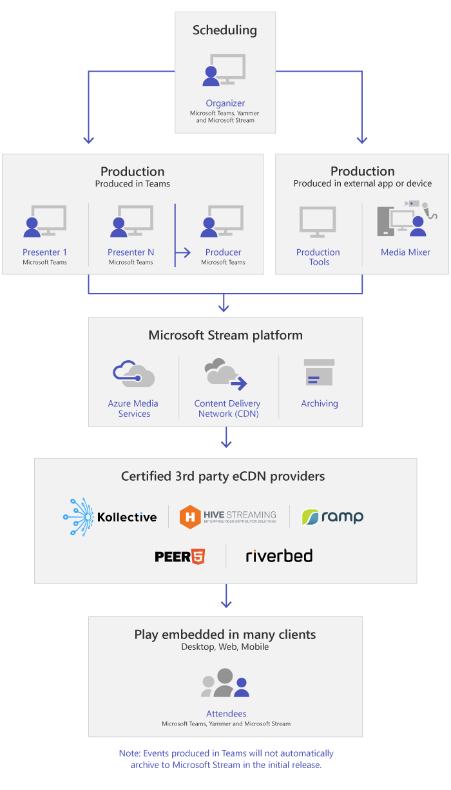

# What are Microsoft Teams live events

## Overview

With Teams lives events, users in your organization can broadcast video and meeting content to large online audiences.

Microsoft 365 live events bring live video streaming to a new level. Live events encourage connection throughout the entire engagement lifecycle with attendees before, during, and after live events. You can create a live event wherever your audience, team, or community resides, using Microsoft Stream, Teams, or Yammer.  

Teams delivers chat-based collaboration, calling, meetings, and live events, so you can expand the audience of your meetings. Teams live events is an extension of Teams meetings, enabling users to broadcast video and meeting content to a large online audience. Live events are meant for one-to-many communications where the host of the event is leading the interactions and audience participation is primarily to view the content shared by host. The attendees can watch the live or recorded event in Yammer, Teams, or Stream and can interact with the presenters using moderated Q & A or a Yammer conversation.

Teams live events are considered the next version of Skype Meeting Broadcast and will eventually replace the capabilities provided in Skype Meeting Broadcast. At this point, Microsoft will continue to support Skype Meeting Broadcast for users who are using Skype for Business in their organizations, with no disruption in service for new or future events. However, we encourage you to try out Teams live events to use all the new and exciting features including screen sharing and support for external hardware/software encoders.

So, let's get started. First, take a look at the following diagram that shows high level components involved in Microsoft 365 live events and how they're connected.

> [!Note]
> We would like to emphasize that Teams Live Events, given the nature of broadcast technology, often exceed normal (internal) meeting populations.
>
> As is the case with other larger reaching media broadcasting services, we rely on Content Delivery Networks to deliver the content for your live event to recipients. This content is protected by encryption methods and subject to authorization by access tokens that are only issued to recipients based on your live event meeting configuration.
>
> Extra care should be given to ensuring that either the meeting content is appropriate for such a large audience, or that the audience is appropriately reduced for sensitive content.  
>
> As is common in the industry, compromises to other elements of your security such as personnel or infrastructure, could impact the security of your live events. Organizations should consider including Live Events and other broadcast service in their security planning and exercises.

### Event group roles

Live events in Teams empower multiple roles (organizer, producer, presenter, and attendee) to successfully broadcast and participate in an event. To learn more, see [Event group roles](https://support.office.com/article/get-started-with-microsoft-teams-live-events-d077fec2-a058-483e-9ab5-1494afda578a?ui=en-US&rs=en-US&ad=US#bkmk_roles).

## Key components

You can see from the picture above that there are five key components that are used with live events in Teams.

> [!NOTE]
> For an overview of how to set up live events and the attendee experience, check out these short [videos](https://support.office.com/article/video-plan-and-schedule-a-live-event-f92363a0-6d98-46d2-bdd9-f2248075e502).

### Scheduling

Teams provides the ability for the organizers to create an event with the appropriate attendee permissions, designate event team members, select a production method, and invite attendees. If the live event was created from within a Yammer group, the live event attendees will be able to use Yammer conversation for interacting with people in the event.

> [!IMPORTANT]
> Teams won't let users schedule meetings or live events when they're offline or running with limited bandwidth.

### Production

The video input is the foundation of the live event and it can vary from a single webcam to a multi-camera professional video production. The live events in Microsoft 365 support a spectrum of production scenarios, include an event produced in Teams using a webcam or an event produced in an external app or device. You can choose these options depending on their project requirements and budget. There are two ways to produce events:

- **Teams**: This production method allows users to produce their live events in Teams using their webcam or using A/V input from Teams room systems. This option is the best and quickest option if you want to use the audio and video devices connected to the PC or are inviting remote presenters to participate in the event. This option allows users to easily use their webcams and share their screen as input in the event.

- **External app or device**: External encoders allow users to produce their live events directly from an external hardware or software-based encoder with [Stream](https://stream.microsoft.com). This option is best if you already have studio quality equipment (for example, media mixers) which support streaming to a Real-time Messaging Protocol (RTMP) service. This type of production is typically used in large-scale events such as executive town halls – where a single stream from a media mixer is broadcasted to the audience.

    

>[!Note]
> The change from using Microsoft Stream to [OneDrive for Business and SharePoint for meeting recordings](../tmr-meeting-recording-change.md) will be a phased approach. At launch you'll be able to opt-in to this experience, in November you'll have to opt-out if you want to continue using Stream, and some time in early 2021 we'll require all customers to use OneDrive for Business and SharePoint for new meeting recordings.

### Streaming platform

The live event streaming platform is made up of the following pieces:

- **Azure Media Services**:  [Azure Media Services](/azure/media-services/previous/) gives you broadcast-quality video streaming services to reach larger audiences on today’s most popular mobile devices. Media Services enhances accessibility, distribution, and scalability, and makes it easy and cost-effective to stream content to your local or worldwide audiences—all while protecting your content.
- **Azure Content Delivery Network (CDN)**:  Once your stream goes live, it's delivered through the [Azure Content Delivery Network (CDN)](/azure/cdn/). Azure Media Services provides integrated CDN for streaming endpoints. This allows the streams to be viewed worldwide with no buffering.

### Enterprise Content Delivery Network (eCDN)

The goal of eCDN is to take the video content from the internet and distribute the content throughout your enterprise without impacting network performance. You can use one of the following certified eCDN partners to optimize your network for live events held within your organization:

- [Hive](https://www.hivestreaming.com/partners/integration-partners/microsoft/)
- [Kollective](https://kollective.com/ecdn-solutions/microsoft-live-events/)
- [Ramp](https://rampecdn.com)
- [Riverbed](https://www.riverbed.com/solutions/office-365.html)
- [Peer5](https://www.peer5.com/)

### Attendee experience

The attendee experience is the most important aspect of live events and it's critical that the attendees can participate in the live event without having any issues. The attendee experience uses Stream Player (for events produced in Teams) and Azure Media Player (for events produced in an external app or device) and works across desktop, browser, and mobile (iOS, Android). Microsoft 365 and Office 365 provide Yammer and Teams as two collaboration hubs, and the live attendee experience is integrated into these collaboration tools.

### Live event usage report

Tenant admins can view real-time usage analytics for live events in Microsoft Teams admin center.  The [live event usage report](../teams-analytics-and-reports/teams-live-event-usage-report.md) shows the activity overview of the live events held in the organization.  Admins can view event usage information, including event status, start time, views, and production type.  

## Next steps

Go to [Plan for Teams live events](plan-for-teams-live-events.md).

### Related topics

- [Live events across Microsoft 365 in Yammer, Microsoft Teams, and Microsoft Stream](/stream/live-event-m365)
- [Get started with Microsoft Teams live events](https://support.office.com/article/d077fec2-a058-483e-9ab5-1494afda578a)
- [Live events in Yammer](https://support.office.com/article/live-events-in-yammer-4ece0ee2-c268-4636-bf2a-16e454befe57)
- [Live events in Microsoft Stream](/stream/live-event-overview)
